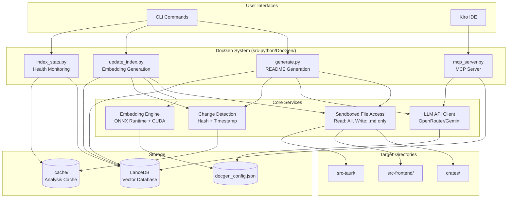

# Design Document: Automated README Generation System

## Overview

The Automated README Generation System is an AI-powered documentation tool that generates and maintains README.md files throughout the K_OS DCC Suite codebase. The system combines LLM-powered code analysis with GPU-accelerated semantic search to produce high-quality, architecturally-focused documentation.

The system consists of four main components:

1. **Documentation Generator** (`generate.py`) - LLM-powered README generation with sandboxed file access
2. **Index Manager** (`update_index.py`) - GPU-accelerated embedding generation and vector database updates
3. **Index Statistics** (`index_stats.py`) - Health monitoring and staleness detection
4. **MCP Server** (`mcp_server.py`) - Kiro integration for interactive documentation queries

The design follows K_OS principles: data-driven configuration, library-first approach (LanceDB, ONNX Runtime, sentence-transformers), and GPU-first performance (CUDA acceleration on Quadro RTX 4000).

## Architecture

### System Architecture



### Data Flow

**README Generation Flow:**
1. User runs `python src-python/DocGen/generate.py --path crates/k-os-engine`
2. Change Detector scans directory, computes file hashes, compares against cache
3. For changed directories: File Access reads source files, Cargo.toml, etc.
4. LLM Client sends code context + system prompt to OpenRouter/Gemini
5. AI agent analyzes code structure, queries LanceDB for semantic connections
6. README Generator writes markdown file (sandboxed to .md only)
7. Cache updated with new hashes and generation timestamp

**Indexing Flow:**
1. User runs `python src-python/DocGen/update_index.py`
2. Change Detector identifies modified files via timestamps + hashes
3. File Access reads changed files in batches
4. Embedding Engine loads ONNX model, initializes CUDA execution provider
5. Files embedded in parallel batches (FP16 precision for speed)
6. LanceDB upserts new embeddings with metadata (file_path, hash, timestamp)
7. GPU memory released, stats logged
8. REPO_MAP.md updated incrementally with new connections

**Query Flow (via MCP):**
1. Kiro user invokes `query_docs` tool: "how does GPU pipeline work"
2. MCP Server embeds query using cached ONNX model (CPU-only, no GPU)
3. LanceDB vector search returns top-k similar code chunks
4. MCP Server passes chunks to LLM for synthesis
5. Response returned to Kiro with citations (file paths, line numbers)

### Component Responsibilities

**generate.py** - README generation orchestrator
- CLI argument parsing (--path, --provider, --model, --dry-run, --review-mode, --watch)
- Directory traversal and filtering (skip empty dirs, test-only dirs)
- Change detection coordination
- LLM API request management with rate limiting
- Sandboxed file writing (enforce .md only)
- Progress logging and cost tracking
- Parallel directory processing (respects API limits)

**update_index.py** - Embedding generation and indexing
- File change detection (timestamps + SHA-256 hashes)
- Batch file reading and preprocessing
- ONNX Runtime initialization with CUDA provider
- GPU-accelerated embedding generation (FP16, batched)
- LanceDB upsert operations
- GPU memory management and release
- Performance logging (files/sec, GPU time)

**index_stats.py** - Index health monitoring
- LanceDB statistics queries (total embeddings, index size)
- Staleness detection (files modified but not re-indexed)
- Semantic coverage calculation (% of codebase indexed)
- Formatted terminal output (tables)
- JSON export for programmatic access

**mcp_server.py** - Kiro integration server
- MCP protocol implementation (JSON-RPC 2.0, stdio transport)
- Tool definitions: generate_readme, query_docs, search_code, get_quality_metrics, get_index_stats
- Lightweight CPU-only operation (no GPU usage)
- LanceDB query interface
- LLM API client for RAG synthesis
- Error handling and logging

## Components and Interfaces

### Sandboxed File Access Layer

**Purpose:** Enforce security constraints - AI agent can read any file but only write .md files.

**Interface:**
```python
class SandboxedFileAccess:
    def __init__(self, root_path: Path, allowed_write_extensions: list[str]):
        """Initialize with root path and allowed write extensions."""
        
    def read_file(self, path: Path) -> str:
        """Read any file within root_path. Raises if outside root."""
        
    def write_file(self, path: Path, content: str) -> None:
        """Write file only if extension in allowed list. Raises otherwise."""
        
    def list_directory(self, path: Path, recursive: bool = False) -> list[Path]:
        """List directory contents. Returns relative paths."""
        
    def file_exists(self, path: Path) -> bool:
        """Check if file exists within root_path."""
```

**Implementation Notes:**
- Use `pathlib.Path.resolve()` to prevent path traversal attacks
- Validate all paths are within `M:\K_OS\`
- Log all write attempts (approved and rejected)
- Raise `SecurityError` for violations

### LLM API Client

**Purpose:** Unified interface for OpenRouter and Gemini APIs with rate limiting and cost tracking.

**Interface:**
```python
class LLMClient:
    def __init__(self, provider: str, model: str, api_key: str):
        """Initialize with provider (openrouter/gemini), model name, API key."""
        
    async def generate(self, system_prompt: str, user_prompt: str, 
                      max_tokens: int = 4000) -> LLMResponse:
        """Generate completion. Handles rate limiting with exponential backoff."""
        
    def estimate_cost(self, prompt_tokens: int, completion_tokens: int) -> float:
        """Estimate cost in USD based on provider pricing."""
        
    def get_usage_stats(self) -> dict:
        """Return cumulative token usage and costs."""
```

**LLMResponse:**
```python
@dataclass
class LLMResponse:
    content: str
    prompt_tokens: int
    completion_tokens: int
    model: str
    cost_usd: float
```

**Implementation Notes:**
- Use `aiohttp` for async HTTP requests
- Implement exponential backoff: 1s, 2s, 4s, 8s, 16s (max 5 retries)
- Load pricing from `docgen_config.json` (tokens per dollar)
- Support streaming responses for watch mode

### Embedding Engine

**Purpose:** GPU-accelerated embedding generation using ONNX Runtime with CUDA.

**Interface:**
```python
class EmbeddingEngine:
    def __init__(self, model_name: str = "all-MiniLM-L6-v2", use_gpu: bool = True):
        """Initialize ONNX model with CUDA provider if available."""
        
    def embed_texts(self, texts: list[str], batch_size: int = 32) -> np.ndarray:
        """Generate embeddings for text list. Returns (N, 384) array."""
        
    def embed_single(self, text: str) -> np.ndarray:
        """Generate embedding for single text. Returns (384,) array."""
        
    def get_device_info(self) -> dict:
        """Return device info (cuda/cpu, GPU name, memory)."""
        
    def release_gpu(self) -> None:
        """Explicitly release GPU resources."""
```

**Implementation Notes:**
- Use `optimum[onnxruntime-gpu]` for ONNX model conversion
- Initialize with `CUDAExecutionProvider` first, fallback to `CPUExecutionProvider`
- Use FP16 precision for 2x speedup on RTX 4000
- Batch size 32 for optimal GPU utilization (8GB VRAM)
- Tokenize with `transformers.AutoTokenizer`
- Mean pooling over token embeddings
- Normalize embeddings to unit length

**Model Selection:**
- Primary: `sentence-transformers/all-MiniLM-L6-v2` (384 dims, fast, good quality)
- Alternative: `sentence-transformers/all-mpnet-base-v2` (768 dims, slower, better quality)
- Store model name in LanceDB metadata for version tracking

### LanceDB Interface

**Purpose:** Vector database for semantic code search and embedding storage.

**Schema:**
```python
class CodeEmbedding(LanceModel):
    file_path: str  # Relative path from K_OS root
    content_hash: str  # SHA-256 of file content
    last_modified: float  # Unix timestamp
    embedding: Vector(384)  # Embedding vector
    file_type: str  # rust, typescript, python, wgsl, etc.
    module_name: str  # Extracted module/component name
    chunk_index: int  # For large files split into chunks
    metadata: dict  # Additional context (imports, exports, etc.)
```

**Interface:**
```python
class LanceDBManager:
    def __init__(self, db_path: Path):
        """Initialize LanceDB connection."""
        
    def upsert_embeddings(self, embeddings: list[CodeEmbedding]) -> None:
        """Insert or update embeddings. Uses file_path as key."""
        
    def search_similar(self, query_embedding: np.ndarray, k: int = 10, 
                      filter_expr: str = None) -> list[SearchResult]:
        """Vector similarity search. Returns top-k results with scores."""
        
    def get_by_path(self, file_path: str) -> CodeEmbedding | None:
        """Retrieve embedding by file path."""
        
    def delete_by_path(self, file_path: str) -> None:
        """Delete embedding (for deleted files)."""
        
    def get_stats(self) -> dict:
        """Return database statistics (count, size, last_update)."""
```

**SearchResult:**
```python
@dataclass
class SearchResult:
    file_path: str
    similarity_score: float  # 0.0 to 1.0
    content_hash: str
    module_name: str
    metadata: dict
```

**Implementation Notes:**
- Use `lancedb.connect()` with path `src-python/DocGen/.lancedb/`
- Create index on embedding column for fast ANN search
- Use cosine similarity metric
- Implement connection pooling for concurrent access
- Handle schema migrations when embedding dimensions change

### Change Detection System

**Purpose:** Detect file changes and determine if documentation regeneration is needed.

**Interface:**
```python
class ChangeDetector:
    def __init__(self, cache_dir: Path):
        """Initialize with cache directory path."""
        
    def scan_directory(self, dir_path: Path) -> ChangeReport:
        """Scan directory and detect changes since last run."""
        
    def compute_file_hash(self, file_path: Path) -> str:
        """Compute SHA-256 hash of file content."""
        
    def classify_change(self, old_content: str, new_content: str) -> ChangeType:
        """Classify change as structural, behavioral, or cosmetic."""
        
    def update_cache(self, file_path: Path, content_hash: str) -> None:
        """Update cache with new hash and timestamp."""
```

**ChangeReport:**
```python
@dataclass
class ChangeReport:
    added_files: list[Path]
    modified_files: list[Path]
    deleted_files: list[Path]
    unchanged_files: list[Path]
    change_classifications: dict[Path, ChangeType]  # For modified files
```

**ChangeType:**
```python
class ChangeType(Enum):
    STRUCTURAL = "structural"  # New functions, classes, modules
    BEHAVIORAL = "behavioral"  # Logic changes, algorithm updates
    COSMETIC = "cosmetic"  # Comments, formatting, whitespace
```

**Implementation Notes:**
- Cache stored as JSON: `{file_path: {hash, timestamp, last_analyzed}}`
- Use `hashlib.sha256()` for content hashing
- Classify changes using simple heuristics:
  - Structural: `def `, `class `, `fn `, `interface `, `export ` added/removed
  - Behavioral: Changes inside function bodies
  - Cosmetic: Only whitespace/comment changes
- Skip README regeneration for cosmetic-only changes

### README Generator

**Purpose:** Orchestrate LLM-powered README generation with template management.

**Interface:**
```python
class READMEGenerator:
    def __init__(self, llm_client: LLMClient, file_access: SandboxedFileAccess,
                 lance_db: LanceDBManager):
        """Initialize with dependencies."""
        
    async def generate_readme(self, dir_path: Path, context: DirectoryContext) -> str:
        """Generate README content for directory."""
        
    def build_system_prompt(self) -> str:
        """Build system prompt with K_OS conventions and constraints."""
        
    def build_user_prompt(self, context: DirectoryContext) -> str:
        """Build user prompt with directory-specific context."""
        
    def extract_manual_sections(self, existing_readme: str) -> list[str]:
        """Extract sections marked with preservation tags."""
        
    def merge_content(self, generated: str, manual_sections: list[str]) -> str:
        """Merge generated content with preserved manual sections."""
```

**DirectoryContext:**
```python
@dataclass
class DirectoryContext:
    dir_path: Path
    file_tree: list[Path]  # Files in directory
    cargo_toml: str | None  # For Rust crates
    package_json: str | None  # For frontend
    key_files: dict[str, str]  # {filename: content} for important files
    related_modules: list[SearchResult]  # From semantic search
    directory_type: str  # rust_crate, react_app, tauri_backend, etc.
```

**System Prompt Template:**
```
You are an AI documentation agent for the K_OS DCC Suite. Your role is to generate 
high-quality README.md files that provide architectural overviews of code directories.

CONSTRAINTS:
- You have READ access to all files in the codebase
- You have WRITE access ONLY to .md files
- You MUST include the staleness disclaimer at the top of every README
- Focus on ARCHITECTURE and PATTERNS, not file-by-file listings
- Keep READMEs concise (500-1000 words)
- Use proper markdown formatting with code blocks

K_OS PRINCIPLES:
- Data-driven: Prefer configuration over hardcoding
- Library-first: Use battle-tested libraries (wgpu, Three.js, LanceDB, etc.)
- GPU-first: Leverage CUDA and GPU compute for performance

STALENESS DISCLAIMER (required):
*This README may be out of date and inspecting the current code is the best way. 
NEVER ASSUME THIS README IS CURRENT ARCHITECTURE, BUT RATHER TREAT IT AS A BASELINE 
FOR what's in this folder*

OUTPUT FORMAT:
# [Directory Name]

[Staleness Disclaimer]

## Overview
[High-level purpose and role in K_OS]

## Architecture
[Key patterns, abstractions, system boundaries]

## Key Components
[Major modules/classes/functions with brief descriptions]

## Usage Patterns
[Typical usage examples, integration points]

## Related Modules
[Semantically similar modules from vector search]
```

### MCP Server

**Purpose:** Expose documentation tools to Kiro via Model Context Protocol.

**Tools Exposed:**
1. `generate_readme` - Generate README for specified directory
2. `query_docs` - Semantic search + RAG synthesis for codebase questions
3. `search_code` - Vector search for similar code sections
4. `get_quality_metrics` - Retrieve documentation quality scores
5. `get_index_stats` - Get index health and staleness info

**MCP Tool Schema Example:**
```json
{
  "name": "query_docs",
  "description": "Answer questions about the K_OS codebase using semantic search and LLM synthesis",
  "inputSchema": {
    "type": "object",
    "properties": {
      "query": {
        "type": "string",
        "description": "Natural language question about the codebase"
      },
      "max_results": {
        "type": "integer",
        "default": 5,
        "description": "Maximum number of code chunks to retrieve"
      },
      "filter_path": {
        "type": "string",
        "description": "Optional path filter (e.g., 'crates/k-os-engine')"
      }
    },
    "required": ["query"]
  }
}
```

**Implementation Notes:**
- Use `mcp` Python package for protocol implementation
- Run as stdio server: `python src-python/DocGen/mcp_server.py`
- No GPU usage - query pre-computed embeddings only
- Cache LLM responses for repeated queries (5 min TTL)
- Log all tool invocations to `mcp_server.log`

### Repository Map Generator

**Purpose:** Generate REPO_MAP.md with hierarchical structure and semantic connections.

**Interface:**
```python
class RepoMapGenerator:
    def __init__(self, lance_db: LanceDBManager, file_access: SandboxedFileAccess):
        """Initialize with dependencies."""
        
    def generate_full_map(self) -> str:
        """Generate complete repository map."""
        
    def update_incremental(self, changed_files: list[Path]) -> None:
        """Update only affected sections of existing REPO_MAP.md."""
        
    def build_directory_tree(self) -> str:
        """Build hierarchical tree of directories and key files."""
        
    def build_dependency_graph(self) -> str:
        """Build mermaid diagram of module dependencies."""
        
    def build_semantic_clusters(self) -> str:
        """Group modules by semantic similarity."""
        
    def identify_entry_points(self) -> list[str]:
        """Find main apps, commands, and API entry points."""
```

**REPO_MAP.md Structure:**
```markdown
# K_OS Repository Map

*Generated: 2024-01-15 14:30:00*

## Directory Structure

[Hierarchical tree with key files]

## Key Entry Points

- **KSculpt**: `src-frontend/features/sculpting/KSculpt.tsx`
- **GPU Pipelines**: `crates/k-os-engine/src/gpu/pipelines/`
- **Tauri Commands**: `src-tauri/src/main.rs`

## Module Dependencies

[Mermaid diagram showing imports/exports]

## Semantic Clusters

### Cluster 1: GPU Compute (similarity > 0.75)
- `crates/k-os-engine/src/gpu/pipelines/mesh_deform.rs`
- `crates/k-os-engine/src/gpu/pipelines/particle_sim.rs`
- `crates/k-os-engine/src/gpu/compute.rs`

### Cluster 2: React UI Components (similarity > 0.70)
- `src-frontend/features/sculpting/ui/BrushPanel.tsx`
- `src-frontend/features/painting/ui/ColorPicker.tsx`
- `src-frontend/ui/components/Panel.tsx`

## Data Flow

[Description of how data moves through the system]
```

## Data Models

### Configuration Schema

**docgen_config.json:**
```json
{
  "llm": {
    "provider": "openrouter",
    "model": "anthropic/claude-3.5-sonnet",
    "api_key_env": "OPENROUTER_API_KEY",
    "max_tokens": 4000,
    "temperature": 0.3,
    "pricing": {
      "prompt_tokens_per_dollar": 3333333,
      "completion_tokens_per_dollar": 666666
    }
  },
  "embedding": {
    "model": "sentence-transformers/all-MiniLM-L6-v2",
    "use_gpu": true,
    "batch_size": 32,
    "precision": "fp16"
  },
  "indexing": {
    "target_directories": ["crates", "src-frontend", "src-tauri"],
    "excluded_patterns": ["**/node_modules/**", "**/target/**", "**/.git/**"],
    "file_extensions": [".rs", ".ts", ".tsx", ".py", ".wgsl", ".json"],
    "max_file_size_kb": 500
  },
  "generation": {
    "staleness_disclaimer": "*This README may be out of date...*",
    "max_readme_words": 1000,
    "include_examples": true,
    "cross_reference_count": 5
  },
  "performance": {
    "max_concurrent_requests": 3,
    "rate_limit_delay_ms": 1000,
    "cache_ttl_hours": 24
  },
  "costs": {
    "max_cost_per_run_usd": 5.0,
    "warn_threshold_usd": 3.0
  }
}
```

### Cache Schema

**.cache/analysis_cache.json:**
```json
{
  "crates/k-os-engine/src/gpu/pipelines": {
    "files": {
      "mesh_deform.rs": {
        "hash": "a1b2c3d4...",
        "timestamp": 1705334400.0,
        "last_analyzed": 1705334500.0,
        "change_type": "behavioral"
      }
    },
    "readme_generated": 1705334600.0,
    "quality_score": 0.85
  }
}
```

### Quality Metrics Schema

**metrics_history.json:**
```json
{
  "crates/k-os-engine": {
    "timestamp": 1705334600.0,
    "completeness_score": 0.90,
    "clarity_score": 0.85,
    "example_coverage": 0.80,
    "cross_reference_density": 0.75,
    "overall_score": 0.825,
    "flags": []
  },
  "src-frontend/features/sculpting": {
    "timestamp": 1705334700.0,
    "completeness_score": 0.65,
    "clarity_score": 0.70,
    "example_coverage": 0.50,
    "cross_reference_density": 0.60,
    "overall_score": 0.6125,
    "flags": ["below_threshold", "missing_examples"]
  }
}
```

### Cost Tracking Schema

**cost_log.json:**
```json
{
  "runs": [
    {
      "timestamp": 1705334600.0,
      "command": "generate.py --path crates/",
      "provider": "openrouter",
      "model": "claude-3.5-sonnet",
      "prompt_tokens": 125000,
      "completion_tokens": 45000,
      "cost_usd": 0.75,
      "directories_processed": 15,
      "readmes_generated": 12
    }
  ],
  "cumulative_cost_usd": 12.50,
  "last_reset": 1704729600.0
}
```

