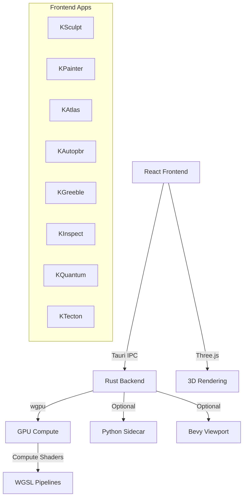
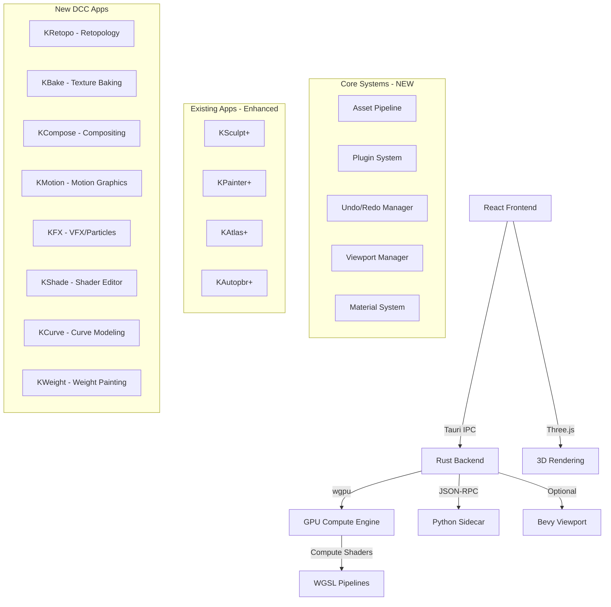
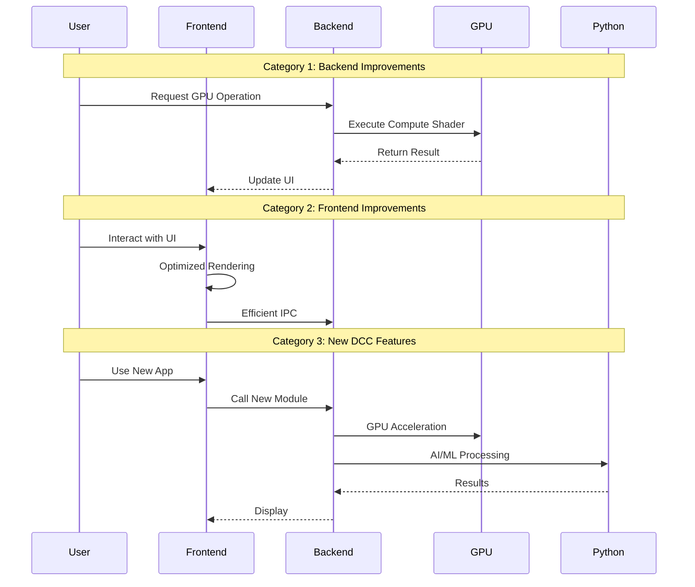

# Design Document: K_OS DCC Suite Comprehensive Enhancement

## Overview

This design document outlines a comprehensive enhancement plan to make the K_OS DCC Suite "1000x better" by addressing missing features, architectural improvements, and new DCC applications. The enhancements span across the Rust backend (GPU compute, IPC, modules), React frontend (UI/UX, performance, patterns), and new DCC features that bring K_OS to feature parity with industry tools like Blender, Maya, Houdini, Substance, and ZBrush.

The design follows K_OS's core philosophy: data-driven architecture, library-first approach, GPU-accelerated compute, and creative/experimental features. All improvements maintain the existing Tauri v2 + React + Rust + wgpu architecture while introducing new capabilities.

## Architecture

### Current System Architecture



### Enhanced System Architecture



## Main Workflow: Enhancement Categories



## Components and Interfaces

### Category 1: Backend Improvements (Rust/Tauri/wgpu)

#### Component 1.1: Enhanced GPU Compute Pipeline Manager

**Purpose**: Centralized management of GPU compute pipelines with automatic resource pooling, pipeline caching, and performance monitoring.

**Interface**:
```rust
pub struct GPUPipelineManager {
    device: Arc<Device>,
    queue: Arc<Queue>,
    pipeline_cache: HashMap<String, ComputePipeline>,
    buffer_pool: BufferPool,
    performance_monitor: PerformanceMonitor,
}

impl GPUPipelineManager {
    pub fn new(device: Arc<Device>, queue: Arc<Queue>) -> Self;
    pub fn get_or_create_pipeline(&mut self, shader_name: &str) -> Result<&ComputePipeline>;
    pub fn execute_compute(&self, pipeline: &ComputePipeline, workgroups: (u32, u32, u32)) -> Result<()>;
    pub fn get_buffer(&mut self, size: u64, usage: BufferUsages) -> Result<Buffer>;
    pub fn return_buffer(&mut self, buffer: Buffer);
    pub fn get_performance_stats(&self) -> PerformanceStats;
}
```

**Responsibilities**:
- Lazy pipeline compilation and caching
- Buffer pooling to reduce allocations
- Performance monitoring (GPU time, memory usage)
- Automatic resource cleanup
- Pipeline hot-reloading for development

#### Component 1.2: Universal Undo/Redo System

**Purpose**: Centralized undo/redo system that works across all DCC apps with efficient memory management.

**Interface**:
```rust
pub trait UndoableAction: Send + Sync {
    fn execute(&mut self, state: &mut AppState) -> Result<()>;
    fn undo(&mut self, state: &mut AppState) -> Result<()>;
    fn redo(&mut self, state: &mut AppState) -> Result<()>;
    fn memory_size(&self) -> usize;
    fn can_merge(&self, other: &dyn UndoableAction) -> bool;
}

pub struct UndoManager {
    undo_stack: Vec<Box<dyn UndoableAction>>,
    redo_stack: Vec<Box<dyn UndoableAction>>,
    max_memory: usize,
    current_memory: usize,
}

impl UndoManager {
    pub fn new(max_memory_mb: usize) -> Self;
    pub fn execute(&mut self, action: Box<dyn UndoableAction>, state: &mut AppState) -> Result<()>;
    pub fn undo(&mut self, state: &mut AppState) -> Result<()>;
    pub fn redo(&mut self, state: &mut AppState) -> Result<()>;
    pub fn clear(&mut self);
    pub fn can_undo(&self) -> bool;
    pub fn can_redo(&self) -> bool;
}
```

**Responsibilities**:
- Execute, undo, redo actions
- Memory-aware history management
- Action merging for continuous operations
- Compression for large state changes
- Cross-app undo support


#### Component 1.3: Asset Pipeline System

**Purpose**: Unified asset import/export/processing pipeline with format conversion, optimization, and caching.

**Interface**:
```rust
pub struct AssetPipeline {
    cache_dir: PathBuf,
    importers: HashMap<String, Box<dyn AssetImporter>>,
    exporters: HashMap<String, Box<dyn AssetExporter>>,
    processors: Vec<Box<dyn AssetProcessor>>,
}

pub trait AssetImporter: Send + Sync {
    fn supported_extensions(&self) -> Vec<&str>;
    fn import(&self, path: &Path) -> Result<Asset>;
}

pub trait AssetExporter: Send + Sync {
    fn supported_formats(&self) -> Vec<&str>;
    fn export(&self, asset: &Asset, path: &Path) -> Result<()>;
}

pub trait AssetProcessor: Send + Sync {
    fn process(&self, asset: &mut Asset) -> Result<()>;
}

impl AssetPipeline {
    pub fn new(cache_dir: PathBuf) -> Self;
    pub fn register_importer(&mut self, importer: Box<dyn AssetImporter>);
    pub fn register_exporter(&mut self, exporter: Box<dyn AssetExporter>);
    pub fn register_processor(&mut self, processor: Box<dyn AssetProcessor>);
    pub fn import(&self, path: &Path) -> Result<Asset>;
    pub fn export(&self, asset: &Asset, path: &Path, format: &str) -> Result<()>;
    pub fn process(&self, asset: &mut Asset) -> Result<()>;
}
```

**Responsibilities**:
- Multi-format import (GLTF, FBX, OBJ, USD, Alembic)
- Multi-format export with optimization
- Asset processing pipeline (LOD generation, compression, validation)
- Thumbnail generation and caching
- Metadata extraction and storage

#### Component 1.4: Plugin System

**Purpose**: Dynamic plugin loading system for extending K_OS functionality without recompilation.

**Interface**:
```rust
pub trait Plugin: Send + Sync {
    fn name(&self) -> &str;
    fn version(&self) -> &str;
    fn initialize(&mut self, context: &mut PluginContext) -> Result<()>;
    fn shutdown(&mut self) -> Result<()>;
}

pub struct PluginManager {
    plugins: HashMap<String, Box<dyn Plugin>>,
    plugin_dir: PathBuf,
}

impl PluginManager {
    pub fn new(plugin_dir: PathBuf) -> Self;
    pub fn load_plugin(&mut self, path: &Path) -> Result<()>;
    pub fn unload_plugin(&mut self, name: &str) -> Result<()>;
    pub fn get_plugin(&self, name: &str) -> Option<&dyn Plugin>;
    pub fn list_plugins(&self) -> Vec<&str>;
}
```

**Responsibilities**:
- Dynamic library loading (.dll/.so/.dylib)
- Plugin lifecycle management
- API versioning and compatibility checks
- Sandboxed plugin execution
- Plugin marketplace integration (future)


#### Component 1.5: Advanced Material System

**Purpose**: Unified material system with PBR, node-based shaders, and GPU-accelerated evaluation.

**Interface**:
```rust
pub struct MaterialSystem {
    materials: HashMap<Uuid, Material>,
    shader_cache: HashMap<String, CompiledShader>,
    gpu_evaluator: GPUMaterialEvaluator,
}

pub struct Material {
    pub id: Uuid,
    pub name: String,
    pub shader_graph: ShaderGraph,
    pub parameters: HashMap<String, MaterialParameter>,
    pub textures: HashMap<String, TextureHandle>,
}

pub struct ShaderGraph {
    pub nodes: Vec<ShaderNode>,
    pub connections: Vec<Connection>,
    pub output_node: NodeId,
}

impl MaterialSystem {
    pub fn new(device: Arc<Device>) -> Self;
    pub fn create_material(&mut self, name: &str) -> Uuid;
    pub fn compile_material(&mut self, id: Uuid) -> Result<CompiledShader>;
    pub fn evaluate_material_gpu(&self, id: Uuid, uv: Vec2) -> Result<MaterialOutput>;
    pub fn bake_material(&self, id: Uuid, resolution: u32) -> Result<BakedTextures>;
}
```

**Responsibilities**:
- Node-based shader graph system
- Real-time shader compilation (WGSL generation)
- GPU-accelerated material evaluation
- Material baking to textures
- Preset material library

#### Component 1.6: Mesh Processing Module Enhancements

**Purpose**: Extended mesh processing capabilities with GPU acceleration.

**Interface**:
```rust
pub mod mesh_processing {
    // Existing: subdivide, remesh, optimize
    
    // NEW: Retopology
    pub fn auto_retopo(mesh: &Mesh, target_poly_count: u32) -> Result<Mesh>;
    pub fn quad_remesh(mesh: &Mesh, target_edge_length: f32) -> Result<Mesh>;
    
    // NEW: Mesh Analysis
    pub fn analyze_topology(mesh: &Mesh) -> TopologyReport;
    pub fn detect_non_manifold(mesh: &Mesh) -> Vec<VertexIndex>;
    pub fn detect_self_intersections(mesh: &Mesh) -> Vec<TrianglePair>;
    
    // NEW: Mesh Repair
    pub fn fix_non_manifold(mesh: &mut Mesh) -> Result<()>;
    pub fn fill_holes(mesh: &mut Mesh, max_hole_size: usize) -> Result<()>;
    pub fn remove_duplicates(mesh: &mut Mesh, threshold: f32) -> Result<()>;
    
    // NEW: Mesh Deformation
    pub fn lattice_deform(mesh: &mut Mesh, lattice: &Lattice) -> Result<()>;
    pub fn cage_deform(mesh: &mut Mesh, cage: &Mesh, deformed_cage: &Mesh) -> Result<()>;
    
    // NEW: Mesh Boolean (GPU-accelerated)
    pub fn boolean_union_gpu(mesh_a: &Mesh, mesh_b: &Mesh) -> Result<Mesh>;
    pub fn boolean_difference_gpu(mesh_a: &Mesh, mesh_b: &Mesh) -> Result<Mesh>;
    pub fn boolean_intersection_gpu(mesh_a: &Mesh, mesh_b: &Mesh) -> Result<Mesh>;
}
```


#### Component 1.7: Texture Baking System

**Purpose**: High-performance texture baking for normal maps, AO, curvature, and custom maps.

**Interface**:
```rust
pub struct BakingSystem {
    device: Arc<Device>,
    queue: Arc<Queue>,
    ray_tracer: GPURayTracer,
}

pub struct BakeSettings {
    pub resolution: u32,
    pub samples: u32,
    pub max_distance: f32,
    pub cage_mesh: Option<Mesh>,
    pub output_space: BakeSpace,
}

pub enum BakeSpace {
    Tangent,
    Object,
    World,
}

impl BakingSystem {
    pub fn new(device: Arc<Device>, queue: Arc<Queue>) -> Self;
    
    // High-poly to low-poly baking
    pub fn bake_normal_map(&self, high: &Mesh, low: &Mesh, settings: &BakeSettings) -> Result<Image>;
    pub fn bake_ao_map(&self, mesh: &Mesh, settings: &BakeSettings) -> Result<Image>;
    pub fn bake_curvature_map(&self, mesh: &Mesh, settings: &BakeSettings) -> Result<Image>;
    pub fn bake_thickness_map(&self, mesh: &Mesh, settings: &BakeSettings) -> Result<Image>;
    pub fn bake_position_map(&self, mesh: &Mesh, settings: &BakeSettings) -> Result<Image>;
    pub fn bake_id_map(&self, mesh: &Mesh, material_ids: &[u32]) -> Result<Image>;
    
    // Material baking
    pub fn bake_material(&self, material: &Material, resolution: u32) -> Result<BakedMaterial>;
    
    // Custom shader baking
    pub fn bake_custom_shader(&self, shader: &str, mesh: &Mesh, settings: &BakeSettings) -> Result<Image>;
}
```

**Responsibilities**:
- GPU-accelerated ray tracing for baking
- Multi-threaded CPU fallback
- Cage-based baking for better control
- Anti-aliasing and filtering
- Batch baking for multiple objects


### Category 2: Frontend Improvements (React/TypeScript/Three.js)

#### Component 2.1: Universal Viewport Manager

**Purpose**: Centralized viewport management with consistent camera controls, gizmos, and rendering across all apps.

**Interface**:
```typescript
interface ViewportManager {
  // Camera management
  setCamera(camera: Camera): void;
  getCameraState(): CameraState;
  setCameraState(state: CameraState): void;
  fitToView(objects: Object3D[]): void;
  
  // Gizmo system
  enableGizmo(type: 'translate' | 'rotate' | 'scale'): void;
  disableGizmo(): void;
  setGizmoSpace(space: 'local' | 'world'): void;
  
  // Grid and helpers
  showGrid(visible: boolean): void;
  showAxes(visible: boolean): void;
  setGridSize(size: number): void;
  
  // Rendering modes
  setRenderMode(mode: 'solid' | 'wireframe' | 'xray' | 'matcap'): void;
  setMatcap(texture: Texture): void;
  
  // Selection
  setSelection(objects: Object3D[]): void;
  getSelection(): Object3D[];
  
  // Viewport settings
  setBackgroundColor(color: Color): void;
  setHDRI(hdri: Texture): void;
  setExposure(exposure: number): void;
}

class UniversalViewport implements ViewportManager {
  private scene: Scene;
  private camera: Camera;
  private controls: OrbitControls;
  private gizmo: TransformControls | null;
  private grid: GridHelper;
  private selection: Set<Object3D>;
  
  constructor(canvas: HTMLCanvasElement);
  
  // Implementation of ViewportManager interface
  // ...
}
```

**Responsibilities**:
- Consistent camera behavior across apps
- Unified gizmo system (move/rotate/scale)
- Grid, axes, and visual helpers
- Selection highlighting
- Viewport rendering modes
- Performance optimization (frustum culling, LOD)

#### Component 2.2: Enhanced UI Component Library

**Purpose**: Extended Radix UI components with K_OS-specific widgets and patterns.

**Interface**:
```typescript
// Numeric input with drag-to-change
export function NumericInput(props: {
  value: number;
  onChange: (value: number) => void;
  min?: number;
  max?: number;
  step?: number;
  precision?: number;
  label?: string;
}): JSX.Element;

// Vector input (Vec2, Vec3, Vec4)
export function VectorInput(props: {
  value: number[];
  onChange: (value: number[]) => void;
  labels?: string[];
  min?: number;
  max?: number;
}): JSX.Element;

// Color picker with swatches
export function ColorPicker(props: {
  value: Color;
  onChange: (color: Color) => void;
  showAlpha?: boolean;
  swatches?: Color[];
}): JSX.Element;

// Curve editor
export function CurveEditor(props: {
  curve: Curve;
  onChange: (curve: Curve) => void;
  width: number;
  height: number;
}): JSX.Element;

// Gradient editor
export function GradientEditor(props: {
  gradient: Gradient;
  onChange: (gradient: Gradient) => void;
}): JSX.Element;

// Node graph editor
export function NodeGraph(props: {
  nodes: Node[];
  connections: Connection[];
  onNodesChange: (nodes: Node[]) => void;
  onConnectionsChange: (connections: Connection[]) => void;
}): JSX.Element;
```


#### Component 2.3: Performance Optimization System

**Purpose**: Frontend performance monitoring and optimization utilities.

**Interface**:
```typescript
interface PerformanceMonitor {
  // FPS tracking
  getFPS(): number;
  getFrameTime(): number;
  
  // Memory tracking
  getMemoryUsage(): MemoryStats;
  
  // Render stats
  getRenderStats(): RenderStats;
  
  // Performance warnings
  onPerformanceWarning(callback: (warning: PerformanceWarning) => void): void;
}

interface RenderStats {
  drawCalls: number;
  triangles: number;
  vertices: number;
  textures: number;
  programs: number;
}

// Virtualized list for large datasets
export function VirtualizedList<T>(props: {
  items: T[];
  itemHeight: number;
  renderItem: (item: T, index: number) => JSX.Element;
  overscan?: number;
}): JSX.Element;

// Lazy loading for heavy components
export function LazyComponent(props: {
  loader: () => Promise<React.ComponentType>;
  fallback?: JSX.Element;
}): JSX.Element;

// Debounced input for expensive operations
export function useDebouncedValue<T>(value: T, delay: number): T;

// Throttled callback
export function useThrottledCallback<T extends (...args: any[]) => any>(
  callback: T,
  delay: number
): T;
```

**Responsibilities**:
- Real-time performance monitoring
- Automatic performance optimization
- Memory leak detection
- Render optimization (virtualization, lazy loading)
- Performance profiling tools

#### Component 2.4: State Management Improvements

**Purpose**: Enhanced state management with better TypeScript support and devtools integration.

**Interface**:
```typescript
// Typed Zustand store factory
export function createTypedStore<T>(
  initialState: T,
  actions: (set: SetState<T>, get: GetState<T>) => Actions
): UseStore<T & Actions>;

// Persistent store with IndexedDB
export function createPersistentStore<T>(
  name: string,
  initialState: T,
  actions: Actions
): UseStore<T & Actions>;

// Undo/redo store wrapper
export function withUndoRedo<T>(
  store: UseStore<T>,
  maxHistory?: number
): UseStore<T & UndoRedoActions>;

// Store devtools
export function useStoreDevtools<T>(store: UseStore<T>): void;

// Cross-app state synchronization
export function useSyncedState<T>(
  key: string,
  initialValue: T
): [T, (value: T) => void];
```


### Category 3: New DCC Applications

#### Component 3.1: KRetopo - Retopology Tool

**Purpose**: Dedicated retopology tool for creating clean, quad-based topology from high-poly sculpts.

**Interface**:
```typescript
interface KRetopoEngine {
  // Retopo modes
  setMode(mode: 'draw' | 'select' | 'move' | 'extrude' | 'loop'): void;
  
  // Drawing tools
  drawQuad(points: Vector3[]): void;
  drawStrip(points: Vector3[]): void;
  fillHole(boundary: Edge[]): void;
  
  // Topology tools
  insertEdgeLoop(edge: Edge, position: number): void;
  dissolveEdge(edge: Edge): void;
  collapseEdge(edge: Edge): void;
  subdivideQuad(face: Face): void;
  
  // Snapping
  enableSurfaceSnapping(enabled: boolean): void;
  setSnapDistance(distance: number): void;
  
  // Symmetry
  enableSymmetry(axis: 'x' | 'y' | 'z'): void;
  
  // Auto-retopo
  autoRetopo(targetPolyCount: number): Promise<Mesh>;
  
  // Export
  exportMesh(): Mesh;
}
```

**Features**:
- Surface-snapped drawing
- Quad strip drawing
- Edge loop tools
- Symmetry support
- Auto-retopo with InstantMeshes integration
- Topology analysis and validation
- UV preservation

**UI Structure**:
```
src-frontend/features/retopo/
├── KRetopo.tsx              # Main component
├── engine/
│   ├── retopoEngine.ts      # Core retopo logic
│   ├── drawingTools.ts      # Drawing tools
│   ├── topologyTools.ts     # Topology manipulation
│   └── snapping.ts          # Surface snapping
└── ui/
    ├── TopBar.tsx           # Mode selector, tools
    ├── LeftPanel.tsx        # Tool settings
    └── RightPanel.tsx       # Topology stats
```

#### Component 3.2: KBake - Texture Baking Tool

**Purpose**: Professional texture baking tool for transferring details from high-poly to low-poly meshes.

**Interface**:
```typescript
interface KBakeEngine {
  // Mesh setup
  setHighPolyMesh(mesh: Mesh): void;
  setLowPolyMesh(mesh: Mesh): void;
  setCageMesh(cage: Mesh | null): void;
  
  // Bake settings
  setBakeSettings(settings: BakeSettings): void;
  
  // Map types
  bakeNormalMap(): Promise<Texture>;
  bakeAOMap(): Promise<Texture>;
  bakeCurvatureMap(): Promise<Texture>;
  bakeThicknessMap(): Promise<Texture>;
  bakePositionMap(): Promise<Texture>;
  bakeIDMap(materialIDs: number[]): Promise<Texture>;
  
  // Batch baking
  bakeAllMaps(): Promise<BakedMaps>;
  
  // Preview
  previewBake(mapType: string): void;
  
  // Export
  exportMaps(format: 'png' | 'exr' | 'tga'): Promise<void>;
}

interface BakeSettings {
  resolution: number;
  samples: number;
  maxDistance: number;
  cageExtrusion: number;
  outputSpace: 'tangent' | 'object' | 'world';
  antiAliasing: boolean;
}
```

**Features**:
- GPU-accelerated ray tracing
- Multiple map types (normal, AO, curvature, thickness, position, ID)
- Cage-based baking
- Real-time preview
- Batch baking
- Multi-resolution output
- Format support (PNG, EXR, TGA)

**UI Structure**:
```
src-frontend/features/bake/
├── KBake.tsx                # Main component
├── engine/
│   ├── bakeEngine.ts        # Core baking logic
│   ├── rayTracer.ts         # GPU ray tracing
│   └── cageGenerator.ts     # Auto cage generation
└── ui/
    ├── TopBar.tsx           # Bake controls
    ├── LeftPanel.tsx        # Map type selector
    └── RightPanel.tsx       # Settings, preview
```


#### Component 3.3: KCompose - Compositing Tool

**Purpose**: Node-based compositing tool for combining renders, textures, and effects.

**Interface**:
```typescript
interface KComposeEngine {
  // Node graph
  addNode(type: string): NodeId;
  removeNode(id: NodeId): void;
  connectNodes(from: NodeId, to: NodeId, fromSocket: string, toSocket: string): void;
  disconnectNodes(connection: ConnectionId): void;
  
  // Evaluation
  evaluateGraph(): Promise<Texture>;
  evaluateNode(id: NodeId): Promise<Texture>;
  
  // Layers
  addLayer(name: string): LayerId;
  setLayerBlendMode(id: LayerId, mode: BlendMode): void;
  setLayerOpacity(id: LayerId, opacity: number): void;
  
  // Effects
  applyBlur(input: Texture, radius: number): Promise<Texture>;
  applyColorGrade(input: Texture, settings: ColorGradeSettings): Promise<Texture>;
  applyGlow(input: Texture, threshold: number, intensity: number): Promise<Texture>;
  
  // Export
  exportComposite(format: 'png' | 'exr' | 'tiff'): Promise<void>;
}

type NodeType = 
  | 'input'           // Image input
  | 'output'          // Final output
  | 'mix'             // Blend two images
  | 'blur'            // Gaussian blur
  | 'sharpen'         // Sharpen
  | 'colorGrade'      // Color grading
  | 'levels'          // Levels adjustment
  | 'curves'          // Curves adjustment
  | 'hsl'             // Hue/Saturation/Lightness
  | 'glow'            // Glow effect
  | 'vignette'        // Vignette
  | 'chromatic'       // Chromatic aberration
  | 'distort'         // Distortion
  | 'transform'       // Transform (scale, rotate, translate)
  | 'mask'            // Masking
  | 'gradient'        // Gradient generator
  | 'noise'           // Noise generator
  | 'text'            // Text overlay
  | 'math';           // Math operations
```

**Features**:
- Node-based compositing graph
- Real-time preview
- Layer-based workflow
- Blend modes (normal, multiply, screen, overlay, etc.)
- Color grading tools
- Effects library (blur, glow, vignette, etc.)
- Mask support
- HDR support (EXR)
- GPU-accelerated processing

**UI Structure**:
```
src-frontend/features/compose/
├── KCompose.tsx             # Main component
├── engine/
│   ├── composeEngine.ts     # Core compositing logic
│   ├── nodeGraph.ts         # Node graph system
│   ├── effects.ts           # Effect implementations
│   └── blendModes.ts        # Blend mode shaders
└── ui/
    ├── TopBar.tsx           # File, render controls
    ├── NodeEditor.tsx       # Node graph editor
    ├── LayerPanel.tsx       # Layer stack
    └── PropertiesPanel.tsx  # Node properties
```

#### Component 3.4: KMotion - Motion Graphics Tool

**Purpose**: Motion graphics and procedural animation tool inspired by Cinema 4D's MoGraph.

**Interface**:
```typescript
interface KMotionEngine {
  // Cloner system
  createCloner(source: Object3D, count: number): ClonerId;
  setClonerMode(id: ClonerId, mode: 'linear' | 'grid' | 'radial' | 'object'): void;
  setClonerDistribution(id: ClonerId, distribution: Distribution): void;
  
  // Effectors
  addEffector(cloner: ClonerId, type: EffectorType): EffectorId;
  setEffectorStrength(id: EffectorId, strength: number): void;
  setEffectorFalloff(id: EffectorId, falloff: Falloff): void;
  
  // Animation
  animateProperty(object: Object3D, property: string, keyframes: Keyframe[]): AnimationId;
  setAnimationCurve(id: AnimationId, curve: AnimationCurve): void;
  
  // Fields
  createField(type: 'sphere' | 'box' | 'cylinder' | 'torus'): FieldId;
  setFieldStrength(id: FieldId, strength: number): void;
  
  // Dynamics
  enableDynamics(objects: Object3D[]): void;
  setGravity(gravity: Vector3): void;
  
  // Export
  exportAnimation(format: 'gltf' | 'fbx' | 'alembic'): Promise<void>;
}

type EffectorType =
  | 'random'          // Random transform
  | 'step'            // Step animation
  | 'delay'           // Delay propagation
  | 'shader'          // Shader-based
  | 'sound'           // Audio reactive
  | 'spline'          // Follow spline
  | 'target'          // Look at target
  | 'time'            // Time-based
  | 'formula';        // Math formula
```

**Features**:
- Cloner system (linear, grid, radial, object surface)
- Effector system (random, step, delay, shader, sound, spline)
- Field system for spatial control
- Procedural animation
- Audio reactivity
- Dynamics integration
- Timeline and keyframe editor
- Export to animation formats

**UI Structure**:
```
src-frontend/features/motion/
├── KMotion.tsx              # Main component
├── engine/
│   ├── motionEngine.ts      # Core motion graphics logic
│   ├── cloner.ts            # Cloner system
│   ├── effectors.ts         # Effector implementations
│   ├── fields.ts            # Field system
│   └── timeline.ts          # Animation timeline
└── ui/
    ├── TopBar.tsx           # Playback controls
    ├── LeftPanel.tsx        # Cloner/effector settings
    ├── RightPanel.tsx       # Object hierarchy
    └── Timeline.tsx         # Animation timeline
```


#### Component 3.5: KFX - VFX and Particle System

**Purpose**: Advanced particle system and VFX tool for creating fire, smoke, explosions, and custom effects.

**Interface**:
```typescript
interface KFXEngine {
  // Particle system
  createEmitter(type: EmitterType): EmitterId;
  setEmissionRate(id: EmitterId, rate: number): void;
  setParticleLifetime(id: EmitterId, lifetime: number): void;
  setParticleSize(id: EmitterId, size: number | SizeCurve): void;
  setParticleColor(id: EmitterId, color: Color | ColorGradient): void;
  
  // Forces
  addForce(type: ForceType): ForceId;
  setForceStrength(id: ForceId, strength: number): void;
  setForceRadius(id: ForceId, radius: number): void;
  
  // Collision
  enableCollision(emitter: EmitterId, colliders: Object3D[]): void;
  setBounciness(emitter: EmitterId, bounciness: number): void;
  
  // Rendering
  setRenderMode(emitter: EmitterId, mode: 'billboard' | 'mesh' | 'trail'): void;
  setBlendMode(emitter: EmitterId, mode: BlendMode): void;
  
  // Presets
  loadPreset(name: 'fire' | 'smoke' | 'explosion' | 'sparks' | 'rain' | 'snow'): EmitterId;
  
  // Simulation
  play(): void;
  pause(): void;
  reset(): void;
  setTimeScale(scale: number): void;
  
  // Export
  exportCache(format: 'alembic' | 'vdb'): Promise<void>;
}

type EmitterType = 'point' | 'sphere' | 'box' | 'mesh' | 'curve';
type ForceType = 'gravity' | 'wind' | 'vortex' | 'turbulence' | 'drag' | 'attractor';
```

**Features**:
- GPU-accelerated particle simulation (1M+ particles)
- Multiple emitter types
- Force fields (gravity, wind, vortex, turbulence)
- Collision detection
- Particle trails
- Sprite and mesh particles
- Color and size curves
- Preset effects library
- Real-time preview
- Cache export (Alembic, VDB)

**UI Structure**:
```
src-frontend/features/fx/
├── KFX.tsx                  # Main component
├── engine/
│   ├── fxEngine.ts          # Core VFX logic
│   ├── particleSystem.ts    # GPU particle system
│   ├── forces.ts            # Force field implementations
│   ├── collision.ts         # Collision detection
│   └── presets.ts           # Effect presets
└── ui/
    ├── TopBar.tsx           # Playback, simulation controls
    ├── LeftPanel.tsx        # Emitter settings
    ├── RightPanel.tsx       # Forces, collision
    └── CurveEditor.tsx      # Size/color curves
```

#### Component 3.6: KShade - Shader Editor

**Purpose**: Node-based shader editor for creating custom materials and effects.

**Interface**:
```typescript
interface KShadeEngine {
  // Node graph
  addNode(type: ShaderNodeType): NodeId;
  removeNode(id: NodeId): void;
  connectNodes(from: NodeId, to: NodeId, fromSocket: string, toSocket: string): void;
  
  // Compilation
  compileShader(): Promise<CompiledShader>;
  validateGraph(): ValidationResult;
  
  // Preview
  setPreviewMesh(mesh: Mesh): void;
  setPreviewEnvironment(hdri: Texture): void;
  
  // Code generation
  generateWGSL(): string;
  generateGLSL(): string;
  
  // Library
  saveShader(name: string): void;
  loadShader(name: string): void;
  
  // Export
  exportShader(format: 'wgsl' | 'glsl' | 'hlsl'): string;
}

type ShaderNodeType =
  // Input nodes
  | 'position' | 'normal' | 'uv' | 'tangent' | 'color' | 'time'
  // Texture nodes
  | 'texture' | 'normalMap' | 'cubeMap'
  // Math nodes
  | 'add' | 'subtract' | 'multiply' | 'divide' | 'power' | 'sqrt'
  | 'sin' | 'cos' | 'tan' | 'abs' | 'floor' | 'ceil' | 'fract'
  | 'min' | 'max' | 'clamp' | 'mix' | 'smoothstep'
  // Vector nodes
  | 'dot' | 'cross' | 'normalize' | 'length' | 'distance'
  | 'reflect' | 'refract' | 'fresnel'
  // Color nodes
  | 'rgb' | 'hsv' | 'colorRamp' | 'invert' | 'brightness'
  // Noise nodes
  | 'perlin' | 'simplex' | 'voronoi' | 'cellular'
  // Utility nodes
  | 'split' | 'combine' | 'remap' | 'switch'
  // Output nodes
  | 'output';
```

**Features**:
- Node-based shader graph
- Real-time preview with PBR lighting
- WGSL/GLSL/HLSL code generation
- Shader library and presets
- Custom node creation
- Hot-reload for development
- Performance profiling
- Export to multiple formats

**UI Structure**:
```
src-frontend/features/shade/
├── KShade.tsx               # Main component
├── engine/
│   ├── shadeEngine.ts       # Core shader logic
│   ├── nodeGraph.ts         # Node graph system
│   ├── compiler.ts          # Shader compilation
│   └── codeGen.ts           # Code generation
└── ui/
    ├── TopBar.tsx           # File, compile controls
    ├── NodeEditor.tsx       # Node graph editor
    ├── PreviewPanel.tsx     # Material preview
    ├── CodePanel.tsx        # Generated code view
    └── LibraryPanel.tsx     # Shader library
```


#### Component 3.7: KCurve - Curve Modeling Tool

**Purpose**: Bezier and NURBS curve modeling tool for creating curves, surfaces, and procedural shapes.

**Interface**:
```typescript
interface KCurveEngine {
  // Curve creation
  createBezierCurve(points: Vector3[]): CurveId;
  createNURBSCurve(controlPoints: Vector3[], degree: number): CurveId;
  createCircle(radius: number): CurveId;
  createSpiral(turns: number, radius: number): CurveId;
  
  // Curve editing
  addControlPoint(id: CurveId, position: Vector3): void;
  moveControlPoint(id: CurveId, index: number, position: Vector3): void;
  removeControlPoint(id: CurveId, index: number): void;
  setHandleType(id: CurveId, index: number, type: 'auto' | 'vector' | 'aligned' | 'free'): void;
  
  // Curve operations
  subdivideCurve(id: CurveId, segments: number): CurveId;
  joinCurves(curves: CurveId[]): CurveId;
  trimCurve(id: CurveId, start: number, end: number): CurveId;
  offsetCurve(id: CurveId, distance: number): CurveId;
  
  // Surface generation
  extrudeCurve(id: CurveId, distance: number): Mesh;
  revolveCurve(id: CurveId, axis: Vector3, angle: number): Mesh;
  loftCurves(curves: CurveId[]): Mesh;
  sweepCurve(profile: CurveId, path: CurveId): Mesh;
  
  // Curve modifiers
  addArrayModifier(id: CurveId, count: number, offset: Vector3): void;
  addTaperModifier(id: CurveId, start: number, end: number): void;
  addNoiseModifier(id: CurveId, strength: number, scale: number): void;
  
  // Export
  exportCurve(id: CurveId, format: 'svg' | 'dxf' | 'iges'): Promise<void>;
}
```

**Features**:
- Bezier and NURBS curves
- Curve editing with handles
- Curve operations (join, trim, offset, subdivide)
- Surface generation (extrude, revolve, loft, sweep)
- Curve modifiers (array, taper, noise)
- Snapping and alignment tools
- Curve analysis (length, curvature)
- Export to vector formats

**UI Structure**:
```
src-frontend/features/curve/
├── KCurve.tsx               # Main component
├── engine/
│   ├── curveEngine.ts       # Core curve logic
│   ├── bezier.ts            # Bezier curve implementation
│   ├── nurbs.ts             # NURBS curve implementation
│   ├── surfaceGen.ts        # Surface generation
│   └── modifiers.ts         # Curve modifiers
└── ui/
    ├── TopBar.tsx           # Tool selector
    ├── LeftPanel.tsx        # Curve settings
    └── RightPanel.tsx       # Modifiers, operations
```

#### Component 3.8: KWeight - Weight Painting Tool

**Purpose**: Vertex weight painting tool for rigging and deformation control.

**Interface**:
```typescript
interface KWeightEngine {
  // Weight painting
  paintWeight(vertices: number[], weight: number, strength: number): void;
  smoothWeights(vertices: number[], iterations: number): void;
  normalizeWeights(vertices: number[]): void;
  
  // Vertex groups
  createVertexGroup(name: string): GroupId;
  deleteVertexGroup(id: GroupId): void;
  setActiveGroup(id: GroupId): void;
  assignToGroup(vertices: number[], weight: number): void;
  removeFromGroup(vertices: number[]): void;
  
  // Selection
  selectByWeight(threshold: number): number[];
  selectByGroup(id: GroupId): number[];
  growSelection(): void;
  shrinkSelection(): void;
  
  // Visualization
  setWeightVisualization(mode: 'gradient' | 'solid' | 'wireframe'): void;
  setGradientColors(colors: Color[]): void;
  
  // Transfer
  transferWeights(source: Mesh, target: Mesh): void;
  
  // Export
  exportWeights(format: 'json' | 'binary'): Promise<void>;
}
```

**Features**:
- Brush-based weight painting
- Multiple vertex groups
- Weight smoothing and normalization
- Gradient visualization
- Weight transfer between meshes
- Symmetry support
- Undo/redo
- Export weight maps

**UI Structure**:
```
src-frontend/features/weight/
├── KWeight.tsx              # Main component
├── engine/
│   ├── weightEngine.ts      # Core weight painting logic
│   ├── brushSystem.ts       # Weight painting brushes
│   ├── visualization.ts     # Weight visualization
│   └── transfer.ts          # Weight transfer
└── ui/
    ├── TopBar.tsx           # Brush controls
    ├── LeftPanel.tsx        # Brush settings
    └── RightPanel.tsx       # Vertex groups
```


## Algorithmic Pseudocode

### Algorithm 1: GPU Pipeline Manager - Get or Create Pipeline

```pascal
ALGORITHM getPipelineOrCreate(shaderName: String)
INPUT: shaderName - name of the shader to load
OUTPUT: computePipeline - compiled compute pipeline

BEGIN
  // Check cache first
  IF pipelineCache.contains(shaderName) THEN
    RETURN pipelineCache.get(shaderName)
  END IF
  
  // Load shader source
  shaderPath ← constructPath("gpu/pipelines/", shaderName, ".wgsl")
  shaderSource ← readFile(shaderPath)
  
  IF shaderSource IS NULL THEN
    RETURN Error("Shader not found: " + shaderName)
  END IF
  
  // Create shader module
  shaderModule ← device.createShaderModule({
    label: shaderName,
    code: shaderSource
  })
  
  // Create compute pipeline
  pipeline ← device.createComputePipeline({
    label: shaderName + "_pipeline",
    compute: {
      module: shaderModule,
      entryPoint: "main"
    }
  })
  
  // Cache for reuse
  pipelineCache.insert(shaderName, pipeline)
  
  // Update performance stats
  performanceMonitor.recordPipelineCreation(shaderName)
  
  RETURN pipeline
END
```

**Preconditions:**
- device and queue are initialized
- shaderName is a valid non-empty string
- Shader file exists in gpu/pipelines/ directory

**Postconditions:**
- Returns valid ComputePipeline or error
- Pipeline is cached for future use
- Performance stats are updated

**Loop Invariants:** N/A (no loops)

### Algorithm 2: Undo Manager - Execute Action

```pascal
ALGORITHM executeAction(action: UndoableAction, state: AppState)
INPUT: action - the action to execute, state - current application state
OUTPUT: success - boolean indicating success

BEGIN
  // Check memory constraints
  actionSize ← action.memorySize()
  
  IF currentMemory + actionSize > maxMemory THEN
    // Free memory by removing oldest actions
    WHILE currentMemory + actionSize > maxMemory AND undoStack.length > 0 DO
      ASSERT undoStack.length > 0
      
      oldestAction ← undoStack.removeFirst()
      currentMemory ← currentMemory - oldestAction.memorySize()
    END WHILE
  END IF
  
  // Execute the action
  result ← action.execute(state)
  
  IF result IS Error THEN
    RETURN Error(result)
  END IF
  
  // Check if we can merge with previous action
  IF undoStack.length > 0 THEN
    lastAction ← undoStack.last()
    
    IF action.canMerge(lastAction) THEN
      // Merge actions instead of adding new one
      lastAction.merge(action)
      RETURN Success
    END IF
  END IF
  
  // Add to undo stack
  undoStack.push(action)
  currentMemory ← currentMemory + actionSize
  
  // Clear redo stack (new action invalidates redo)
  FOR each redoAction IN redoStack DO
    currentMemory ← currentMemory - redoAction.memorySize()
  END FOR
  redoStack.clear()
  
  RETURN Success
END
```

**Preconditions:**
- action is a valid UndoableAction
- state is a valid AppState
- maxMemory > 0

**Postconditions:**
- Action is executed and added to undo stack
- Memory constraints are maintained
- Redo stack is cleared
- currentMemory accurately reflects total memory usage

**Loop Invariants:**
- In memory cleanup loop: currentMemory + actionSize ≤ maxMemory OR undoStack is empty
- All actions in undoStack have valid memory sizes


### Algorithm 3: Asset Pipeline - Import with Processing

```pascal
ALGORITHM importAsset(filePath: Path)
INPUT: filePath - path to asset file
OUTPUT: asset - processed Asset object

BEGIN
  // Extract file extension
  extension ← getFileExtension(filePath)
  
  // Find appropriate importer
  importer ← NULL
  FOR each registeredImporter IN importers DO
    IF registeredImporter.supportedExtensions().contains(extension) THEN
      importer ← registeredImporter
      BREAK
    END IF
  END FOR
  
  IF importer IS NULL THEN
    RETURN Error("No importer found for extension: " + extension)
  END IF
  
  // Check cache
  cacheKey ← computeHash(filePath + getFileModificationTime(filePath))
  IF cache.contains(cacheKey) THEN
    RETURN cache.get(cacheKey)
  END IF
  
  // Import asset
  asset ← importer.import(filePath)
  
  IF asset IS Error THEN
    RETURN Error("Import failed: " + asset.error)
  END IF
  
  // Apply processing pipeline
  FOR each processor IN processors DO
    ASSERT asset IS valid
    
    result ← processor.process(asset)
    
    IF result IS Error THEN
      log.warning("Processor failed: " + processor.name() + ", " + result.error)
      // Continue with other processors
    END IF
  END FOR
  
  // Generate thumbnail
  thumbnail ← generateThumbnail(asset, 256, 256)
  asset.setThumbnail(thumbnail)
  
  // Extract metadata
  metadata ← extractMetadata(asset)
  asset.setMetadata(metadata)
  
  // Cache result
  cache.insert(cacheKey, asset)
  
  RETURN asset
END
```

**Preconditions:**
- filePath exists and is readable
- At least one importer is registered
- processors list is valid (may be empty)

**Postconditions:**
- Returns valid Asset or error
- Asset is processed through all processors
- Asset is cached for future use
- Thumbnail and metadata are generated

**Loop Invariants:**
- In importer search loop: All previously checked importers don't support the extension
- In processor loop: asset remains valid after each successful processor

### Algorithm 4: Retopology - Auto Retopo with Quad Remesh

```pascal
ALGORITHM autoRetopo(highPolyMesh: Mesh, targetPolyCount: u32)
INPUT: highPolyMesh - high-resolution mesh, targetPolyCount - desired polygon count
OUTPUT: lowPolyMesh - retopologized quad mesh

BEGIN
  // Step 1: Compute target edge length from poly count
  surfaceArea ← computeSurfaceArea(highPolyMesh)
  targetEdgeLength ← sqrt(surfaceArea / targetPolyCount)
  
  // Step 2: Generate isotropic remesh
  remeshedMesh ← isotropicRemesh(highPolyMesh, targetEdgeLength)
  
  // Step 3: Detect and extract feature edges
  featureEdges ← detectFeatureEdges(highPolyMesh, angleThreshold: 30.0)
  
  // Step 4: Project remesh vertices to original surface
  FOR each vertex IN remeshedMesh.vertices DO
    ASSERT vertex.position IS valid
    
    // Find closest point on original mesh
    closestPoint ← raycastToSurface(highPolyMesh, vertex.position)
    
    IF closestPoint IS valid THEN
      vertex.position ← closestPoint.position
      vertex.normal ← closestPoint.normal
    END IF
  END FOR
  
  // Step 5: Snap to feature edges
  FOR each vertex IN remeshedMesh.vertices DO
    FOR each featureEdge IN featureEdges DO
      distance ← distanceToEdge(vertex.position, featureEdge)
      
      IF distance < targetEdgeLength * 0.1 THEN
        snappedPoint ← closestPointOnEdge(vertex.position, featureEdge)
        vertex.position ← snappedPoint
      END IF
    END FOR
  END FOR
  
  // Step 6: Optimize topology for quads
  quadMesh ← convertToQuads(remeshedMesh)
  
  // Step 7: Smooth and relax
  FOR iteration FROM 1 TO 5 DO
    ASSERT quadMesh.isValid()
    
    smoothMesh(quadMesh, strength: 0.5)
    projectToSurface(quadMesh, highPolyMesh)
  END FOR
  
  // Step 8: Validate result
  IF NOT isManifold(quadMesh) THEN
    log.warning("Result is non-manifold, attempting repair")
    quadMesh ← repairNonManifold(quadMesh)
  END IF
  
  RETURN quadMesh
END
```

**Preconditions:**
- highPolyMesh is a valid manifold mesh
- targetPolyCount > 0
- highPolyMesh has at least 3 vertices

**Postconditions:**
- Returns valid quad-dominant mesh
- Mesh is manifold (or repaired to be manifold)
- Polygon count is approximately targetPolyCount (±10%)
- Vertices are projected to original surface
- Feature edges are preserved

**Loop Invariants:**
- In vertex projection loop: All processed vertices lie on original surface
- In smoothing loop: quadMesh remains valid and manifold


### Algorithm 5: Texture Baking - Normal Map Baking with Ray Tracing

```pascal
ALGORITHM bakeNormalMap(highPoly: Mesh, lowPoly: Mesh, settings: BakeSettings)
INPUT: highPoly - high-resolution source mesh, lowPoly - low-resolution target mesh, settings - baking parameters
OUTPUT: normalMap - baked normal map texture

BEGIN
  resolution ← settings.resolution
  samples ← settings.samples
  maxDistance ← settings.maxDistance
  
  // Initialize output texture
  normalMap ← createTexture(resolution, resolution, RGBA16F)
  
  // Build BVH for high-poly mesh (for fast ray tracing)
  bvh ← buildBVH(highPoly)
  
  // Get UV coordinates from low-poly mesh
  uvCoords ← lowPoly.getUVCoordinates()
  
  // For each pixel in the texture
  FOR y FROM 0 TO resolution - 1 DO
    FOR x FROM 0 TO resolution - 1 DO
      ASSERT 0 ≤ x < resolution AND 0 ≤ y < resolution
      
      // Convert pixel to UV coordinates
      u ← (x + 0.5) / resolution
      v ← (y + 0.5) / resolution
      
      // Find triangle containing this UV
      triangle ← findTriangleAtUV(lowPoly, u, v)
      
      IF triangle IS NULL THEN
        // Outside UV bounds, skip
        normalMap[x, y] ← (0.5, 0.5, 1.0, 1.0)  // Neutral normal
        CONTINUE
      END IF
      
      // Get world position and normal at this UV
      worldPos ← interpolatePosition(triangle, u, v)
      lowPolyNormal ← interpolateNormal(triangle, u, v)
      tangent ← interpolateTangent(triangle, u, v)
      bitangent ← cross(lowPolyNormal, tangent)
      
      // Build TBN matrix for tangent space
      TBN ← mat3(tangent, bitangent, lowPolyNormal)
      
      // Multi-sample ray casting
      accumulatedNormal ← vec3(0, 0, 0)
      hitCount ← 0
      
      FOR sample FROM 0 TO samples - 1 DO
        // Generate sample offset (for anti-aliasing)
        offset ← generateSampleOffset(sample, samples)
        samplePos ← worldPos + offset * (1.0 / resolution)
        
        // Cast ray from low-poly surface to high-poly
        rayOrigin ← samplePos + lowPolyNormal * 0.001  // Small offset to avoid self-intersection
        rayDirection ← lowPolyNormal
        
        hit ← raycastBVH(bvh, rayOrigin, rayDirection, maxDistance)
        
        IF hit IS valid THEN
          // Get high-poly normal at hit point
          highPolyNormal ← interpolateNormal(hit.triangle, hit.barycentric)
          
          // Transform to tangent space
          tangentSpaceNormal ← transpose(TBN) * highPolyNormal
          
          accumulatedNormal ← accumulatedNormal + tangentSpaceNormal
          hitCount ← hitCount + 1
        END IF
      END FOR
      
      // Average samples
      IF hitCount > 0 THEN
        finalNormal ← normalize(accumulatedNormal / hitCount)
      ELSE
        // No hit, use low-poly normal
        finalNormal ← vec3(0, 0, 1)  // Straight up in tangent space
      END IF
      
      // Convert from [-1, 1] to [0, 1] range
      encodedNormal ← (finalNormal + 1.0) * 0.5
      
      // Write to texture
      normalMap[x, y] ← (encodedNormal.x, encodedNormal.y, encodedNormal.z, 1.0)
    END FOR
  END FOR
  
  // Apply dilation to fill empty pixels
  normalMap ← dilateTexture(normalMap, iterations: 8)
  
  RETURN normalMap
END
```

**Preconditions:**
- highPoly and lowPoly are valid meshes
- lowPoly has valid UV coordinates (0-1 range)
- settings.resolution is power of 2 and > 0
- settings.samples > 0
- settings.maxDistance > 0

**Postconditions:**
- Returns valid normal map texture
- All pixels within UV bounds contain valid normals
- Normals are in tangent space
- Texture is dilated to avoid seams

**Loop Invariants:**
- In pixel loops: 0 ≤ x < resolution AND 0 ≤ y < resolution
- In sample loop: accumulatedNormal accumulates valid normals
- All written normals are normalized and in [0, 1] range


## Key Functions with Formal Specifications

### Function 1: GPU Buffer Pool - Get Buffer

```rust
fn get_buffer(&mut self, size: u64, usage: BufferUsages) -> Result<Buffer>
```

**Preconditions:**
- `size > 0`
- `usage` is a valid BufferUsages flag combination
- GPU device is initialized

**Postconditions:**
- Returns a valid Buffer of at least `size` bytes
- Buffer has the requested `usage` flags
- If buffer is from pool, it's marked as in-use
- If no suitable buffer in pool, creates new buffer
- Pool statistics are updated

**Loop Invariants:** N/A

### Function 2: Material System - Compile Material

```rust
fn compile_material(&mut self, id: Uuid) -> Result<CompiledShader>
```

**Preconditions:**
- `id` exists in materials HashMap
- Material has valid shader graph
- Shader graph has at least one output node
- All node connections are valid

**Postconditions:**
- Returns compiled WGSL shader or error
- Shader is cached in shader_cache
- Shader is validated by wgpu
- Compilation errors are descriptive

**Loop Invariants:** N/A

### Function 3: Mesh Processing - Boolean Union GPU

```rust
fn boolean_union_gpu(mesh_a: &Mesh, mesh_b: &Mesh) -> Result<Mesh>
```

**Preconditions:**
- `mesh_a` and `mesh_b` are valid manifold meshes
- Both meshes have at least 4 vertices (tetrahedron minimum)
- GPU device is available

**Postconditions:**
- Returns valid manifold mesh representing union of inputs
- Result mesh has no self-intersections
- Result mesh has no duplicate vertices
- Normals are recomputed
- If operation fails, returns descriptive error

**Loop Invariants:** N/A

### Function 4: Viewport Manager - Fit to View

```typescript
function fitToView(objects: Object3D[]): void
```

**Preconditions:**
- `objects` array is not empty
- All objects have valid bounding boxes
- Camera is initialized

**Postconditions:**
- Camera position and target are updated
- All objects are visible in viewport
- Camera distance is optimal (not too close, not too far)
- Camera maintains current up vector
- Animation is smooth (if animated)

**Loop Invariants:** N/A

### Function 5: Retopo Engine - Draw Quad Strip

```typescript
function drawStrip(points: Vector3[]): void
```

**Preconditions:**
- `points.length >= 4` (minimum 2 quads)
- `points.length % 2 === 0` (even number of points)
- All points are valid Vector3 objects
- Surface snapping is enabled

**Postconditions:**
- Quads are created connecting point pairs
- All quads are snapped to reference surface
- Quads are added to retopo mesh
- Mesh topology remains valid
- Undo state is saved

**Loop Invariants:**
- For each pair of points (2i, 2i+1), a quad is created
- All created quads are manifold

## Example Usage

### Example 1: Using GPU Pipeline Manager

```rust
use k_os_engine::gpu::GPUPipelineManager;

// Initialize manager
let device = Arc::new(gpu_device);
let queue = Arc::new(gpu_queue);
let mut manager = GPUPipelineManager::new(device.clone(), queue.clone());

// Get or create pipeline
let pipeline = manager.get_or_create_pipeline("sculpt_crystal")?;

// Get buffer from pool
let vertex_buffer = manager.get_buffer(
    vertices.len() * std::mem::size_of::<Vertex>(),
    BufferUsages::STORAGE | BufferUsages::COPY_DST
)?;

// Execute compute shader
manager.execute_compute(&pipeline, (workgroup_x, workgroup_y, workgroup_z))?;

// Return buffer to pool when done
manager.return_buffer(vertex_buffer);

// Check performance stats
let stats = manager.get_performance_stats();
println!("GPU time: {}ms", stats.total_gpu_time_ms);
```

### Example 2: Using Undo Manager

```rust
use k_os_engine::undo::{UndoManager, UndoableAction};

// Create undo manager with 500MB limit
let mut undo_manager = UndoManager::new(500);

// Define an action
struct MoveVerticesAction {
    vertex_indices: Vec<usize>,
    old_positions: Vec<Vector3>,
    new_positions: Vec<Vector3>,
}

impl UndoableAction for MoveVerticesAction {
    fn execute(&mut self, state: &mut AppState) -> Result<()> {
        for (i, &idx) in self.vertex_indices.iter().enumerate() {
            state.mesh.vertices[idx].position = self.new_positions[i];
        }
        Ok(())
    }
    
    fn undo(&mut self, state: &mut AppState) -> Result<()> {
        for (i, &idx) in self.vertex_indices.iter().enumerate() {
            state.mesh.vertices[idx].position = self.old_positions[i];
        }
        Ok(())
    }
    
    fn redo(&mut self, state: &mut AppState) -> Result<()> {
        self.execute(state)
    }
    
    fn memory_size(&self) -> usize {
        self.vertex_indices.len() * std::mem::size_of::<usize>() +
        self.old_positions.len() * std::mem::size_of::<Vector3>() +
        self.new_positions.len() * std::mem::size_of::<Vector3>()
    }
    
    fn can_merge(&self, other: &dyn UndoableAction) -> bool {
        // Can merge if same vertices are being moved
        false  // Simplified
    }
}

// Execute action
let action = Box::new(MoveVerticesAction { /* ... */ });
undo_manager.execute(action, &mut app_state)?;

// Undo
if undo_manager.can_undo() {
    undo_manager.undo(&mut app_state)?;
}

// Redo
if undo_manager.can_redo() {
    undo_manager.redo(&mut app_state)?;
}
```


### Example 3: Using Asset Pipeline

```rust
use k_os_engine::asset::{AssetPipeline, GLTFImporter, FBXImporter};

// Create pipeline
let cache_dir = PathBuf::from("./cache/assets");
let mut pipeline = AssetPipeline::new(cache_dir);

// Register importers
pipeline.register_importer(Box::new(GLTFImporter::new()));
pipeline.register_importer(Box::new(FBXImporter::new()));

// Register processors
pipeline.register_processor(Box::new(LODGenerator::new()));
pipeline.register_processor(Box::new(MeshOptimizer::new()));

// Import asset
let asset = pipeline.import(Path::new("models/character.gltf"))?;

// Export to different format
pipeline.export(&asset, Path::new("output/character.fbx"), "fbx")?;
```

### Example 4: Using Material System

```typescript
import { MaterialSystem } from '@/engine/materialSystem';

// Create material system
const materialSystem = new MaterialSystem(device);

// Create new material
const materialId = materialSystem.createMaterial("CustomMetal");

// Build shader graph
const material = materialSystem.getMaterial(materialId);
material.shaderGraph.addNode({ type: 'texture', name: 'baseColor' });
material.shaderGraph.addNode({ type: 'texture', name: 'roughness' });
material.shaderGraph.addNode({ type: 'texture', name: 'metallic' });
material.shaderGraph.addNode({ type: 'output', name: 'output' });

material.shaderGraph.connect('baseColor', 'output', 'baseColor', 'baseColor');
material.shaderGraph.connect('roughness', 'output', 'r', 'roughness');
material.shaderGraph.connect('metallic', 'output', 'r', 'metallic');

// Compile material
const shader = await materialSystem.compileMaterial(materialId);

// Bake material to textures
const bakedTextures = await materialSystem.bakeMaterial(materialId, 2048);
```

### Example 5: Using KRetopo Engine

```typescript
import { KRetopoEngine } from '@/features/retopo/engine/retopoEngine';

// Initialize retopo engine
const retopoEngine = new KRetopoEngine(scene, camera);

// Load reference mesh
retopoEngine.setReferenceMesh(highPolyMesh);

// Enable surface snapping
retopoEngine.enableSurfaceSnapping(true);
retopoEngine.setSnapDistance(0.01);

// Enable symmetry
retopoEngine.enableSymmetry('x');

// Draw quad strip
const points = [
  new Vector3(0, 0, 0),
  new Vector3(1, 0, 0),
  new Vector3(0, 1, 0),
  new Vector3(1, 1, 0),
];
retopoEngine.drawStrip(points);

// Or use auto-retopo
const lowPolyMesh = await retopoEngine.autoRetopo(5000);

// Export result
const finalMesh = retopoEngine.exportMesh();
```

### Example 6: Using KBake Engine

```typescript
import { KBakeEngine } from '@/features/bake/engine/bakeEngine';

// Initialize baking engine
const bakeEngine = new KBakeEngine(device, queue);

// Set meshes
bakeEngine.setHighPolyMesh(highPolyMesh);
bakeEngine.setLowPolyMesh(lowPolyMesh);

// Optional: set cage mesh for better control
const cage = generateCageMesh(lowPolyMesh, 0.1);
bakeEngine.setCageMesh(cage);

// Configure settings
bakeEngine.setBakeSettings({
  resolution: 4096,
  samples: 64,
  maxDistance: 0.5,
  cageExtrusion: 0.1,
  outputSpace: 'tangent',
  antiAliasing: true,
});

// Bake individual maps
const normalMap = await bakeEngine.bakeNormalMap();
const aoMap = await bakeEngine.bakeAOMap();
const curvatureMap = await bakeEngine.bakeCurvatureMap();

// Or bake all maps at once
const allMaps = await bakeEngine.bakeAllMaps();

// Export
await bakeEngine.exportMaps('png');
```

## Correctness Properties

*A property is a characteristic or behavior that should hold true across all valid executions of a system—essentially, a formal statement about what the system should do. Properties serve as the bridge between human-readable specifications and machine-verifiable correctness guarantees.*

### Property 1: Pipeline Caching Consistency

For any shader name, requesting the same compute pipeline multiple times returns the same cached pipeline instance.

**Validates: Requirements 1.1, 1.2**

### Property 2: Buffer Pool Size Guarantee

For any buffer request, the returned buffer has size greater than or equal to the requested size and contains the requested usage flags.

**Validates: Requirement 1.3**

### Property 3: Buffer Pool Reuse

For any buffer, returning it to the pool makes it available for subsequent allocation requests.

**Validates: Requirement 1.4**

### Property 4: Undo/Redo Round-Trip Identity

For any undoable action, executing then undoing then redoing produces the exact same state as after the original execution.

**Validates: Requirements 2.2, 2.3, 2.7**

### Property 5: Undo Stack Memory Invariant

For any point in time, the total memory usage of the undo and redo stacks never exceeds the configured maximum.

**Validates: Requirements 2.4, 2.6**

### Property 6: Action Merging Reduces History

For any two consecutive actions that can be merged, merging them results in a single action in the undo stack.

**Validates: Requirement 2.5**

### Property 7: Asset Import Format Detection

For any asset file with a supported extension, the asset pipeline selects the appropriate importer for that format.

**Validates: Requirements 3.1, 3.2**

### Property 8: Asset Import/Export Round-Trip

For any valid asset, exporting then importing produces an equivalent asset (preserving structure and data).

**Validates: Requirements 3.7, 3.9**

### Property 9: Asset Import Caching

For any asset file, importing it twice without modification returns the cached version on the second import.

**Validates: Requirement 3.6**

### Property 10: Asset Processing Pipeline

For any successfully imported asset, all registered processors are applied in sequence.

**Validates: Requirement 3.4**

### Property 11: Plugin API Version Validation

For any plugin, loading it validates API version compatibility before initialization.

**Validates: Requirement 4.1**

### Property 12: Plugin Lifecycle Management

For any loaded plugin, unloading it calls the shutdown method and releases all resources.

**Validates: Requirement 4.4**

### Property 13: Material Default Initialization

For any newly created material, it is initialized with a valid default shader graph.

**Validates: Requirement 5.1**

### Property 14: Shader Graph Type Safety

For any node connection in a shader graph, socket types are compatible (type checking prevents invalid connections).

**Validates: Requirement 5.3**

### Property 15: Shader Graph Acyclicity

For any shader graph, the system detects and prevents circular dependencies.

**Validates: Requirements 5.8, 22.2**

### Property 16: Shader Compilation Validity

For any valid shader graph, compilation produces syntactically valid WGSL code.

**Validates: Requirement 5.4**

### Property 17: Material Baking Resolution

For any material baked at a specified resolution, the output textures have dimensions matching that resolution.

**Validates: Requirement 5.7**

### Property 18: Auto-Retopo Polygon Count

For any mesh and target polygon count, auto-retopology produces a mesh with approximately the target count (±10%).

**Validates: Requirements 6.1, 11.7**

### Property 19: Auto-Retopo Manifold Output

For any input mesh, auto-retopology produces a manifold quad-dominant mesh.

**Validates: Requirements 6.1, 11.8**

### Property 20: Mesh Repair Manifold Guarantee

For any mesh with non-manifold geometry, the repair function produces a manifold mesh.

**Validates: Requirement 6.4**

### Property 21: Boolean Operation Commutativity

For any two manifold meshes A and B, boolean_union(A, B) equals boolean_union(B, A).

**Validates: Requirement 6.8**

### Property 22: Boolean Operation Manifold Preservation

For any two manifold meshes, GPU-accelerated boolean operations produce manifold output meshes.

**Validates: Requirement 6.7**

### Property 23: Texture Baking Resolution Match

For any baking operation with specified resolution, the output texture has dimensions matching that resolution.

**Validates: Requirement 7.1**

### Property 24: Normal Map Tangent Space Encoding

For any baked normal map, all pixels within UV bounds contain normalized vectors in tangent space.

**Validates: Requirement 7.1**

### Property 25: Texture Dilation Completeness

For any baked texture, dilation fills all empty pixels within UV regions to prevent seams.

**Validates: Requirement 7.5**

### Property 26: Viewport Fit-to-View Completeness

For any set of selected objects, fit-to-view adjusts the camera so all objects are visible in the viewport.

**Validates: Requirement 8.2**

### Property 27: Camera State Round-Trip

For any camera state, saving then loading produces the exact same camera position, target, and orientation.

**Validates: Requirement 8.8**

### Property 28: Retopo Surface Snapping

For any drawn point with surface snapping enabled, the point lies on the reference surface.

**Validates: Requirement 11.4**

### Property 29: Retopo Symmetry Mirroring

For any retopo operation with symmetry enabled, mirrored geometry is created across the specified axis.

**Validates: Requirement 11.5**

### Property 30: Compositing Node Evaluation Order

For any compositing node graph, evaluation processes nodes in correct topological dependency order.

**Validates: Requirement 13.4**

### Property 31: Weight Normalization Invariant

For any vertex after weight normalization, the sum of all vertex group weights equals 1.0.

**Validates: Requirement 18.5**

### Property 32: Weight Smoothing Convergence

For any set of vertices, smoothing weights causes neighboring vertex weights to become more uniform.

**Validates: Requirement 18.4**

### Property 33: Cross-App Asset Visibility

For any asset created in one DCC application, it is immediately visible and accessible to all other DCC applications.

**Validates: Requirements 19.4, 19.5**

### Property 34: Mesh Topology Validation

For any imported mesh, the system validates that it has valid topology (no degenerate faces, valid indices).

**Validates: Requirement 22.1**

### Property 35: Undo State Consistency

For any undo operation, the resulting state is consistent and valid according to application invariants.

**Validates: Requirement 22.7**


## Data Models

### Model 1: Asset

```rust
pub struct Asset {
    pub id: Uuid,
    pub name: String,
    pub asset_type: AssetType,
    pub data: AssetData,
    pub metadata: AssetMetadata,
    pub thumbnail: Option<Image>,
    pub dependencies: Vec<Uuid>,
}

pub enum AssetType {
    Mesh,
    Texture,
    Material,
    Animation,
    Audio,
    Scene,
}

pub enum AssetData {
    Mesh(MeshData),
    Texture(TextureData),
    Material(MaterialData),
    Animation(AnimationData),
    Audio(AudioData),
    Scene(SceneData),
}

pub struct AssetMetadata {
    pub created_at: DateTime<Utc>,
    pub modified_at: DateTime<Utc>,
    pub author: String,
    pub tags: Vec<String>,
    pub file_size: u64,
    pub source_file: Option<PathBuf>,
}
```

**Validation Rules:**
- `id` must be unique across all assets
- `name` must be non-empty
- `asset_type` must match the variant in `data`
- `metadata.file_size` must match actual data size
- `dependencies` must reference existing assets

### Model 2: Material

```rust
pub struct Material {
    pub id: Uuid,
    pub name: String,
    pub shader_graph: ShaderGraph,
    pub parameters: HashMap<String, MaterialParameter>,
    pub textures: HashMap<String, TextureHandle>,
}

pub struct ShaderGraph {
    pub nodes: Vec<ShaderNode>,
    pub connections: Vec<Connection>,
    pub output_node: NodeId,
}

pub struct ShaderNode {
    pub id: NodeId,
    pub node_type: String,
    pub position: (f32, f32),
    pub inputs: HashMap<String, SocketValue>,
    pub outputs: HashMap<String, SocketType>,
}

pub struct Connection {
    pub from_node: NodeId,
    pub from_socket: String,
    pub to_node: NodeId,
    pub to_socket: String,
}

pub enum MaterialParameter {
    Float(f32),
    Vec2([f32; 2]),
    Vec3([f32; 3]),
    Vec4([f32; 4]),
    Color(Color),
    Bool(bool),
}
```

**Validation Rules:**
- `shader_graph.output_node` must exist in `nodes`
- All connections must reference existing nodes and sockets
- Socket types must be compatible (e.g., can't connect float to texture)
- No circular dependencies in graph
- All required inputs must be connected or have default values

### Model 3: UndoableAction

```rust
pub trait UndoableAction: Send + Sync {
    fn execute(&mut self, state: &mut AppState) -> Result<()>;
    fn undo(&mut self, state: &mut AppState) -> Result<()>;
    fn redo(&mut self, state: &mut AppState) -> Result<()>;
    fn memory_size(&self) -> usize;
    fn can_merge(&self, other: &dyn UndoableAction) -> bool;
    fn merge(&mut self, other: Box<dyn UndoableAction>) -> Result<()>;
    fn description(&self) -> String;
}

pub struct MeshEditAction {
    pub mesh_id: Uuid,
    pub old_vertices: Vec<Vertex>,
    pub new_vertices: Vec<Vertex>,
    pub affected_indices: Vec<usize>,
}

pub struct LayerAction {
    pub action_type: LayerActionType,
    pub layer_id: Uuid,
    pub old_state: Option<LayerState>,
    pub new_state: Option<LayerState>,
}

pub enum LayerActionType {
    Create,
    Delete,
    Modify,
    Reorder,
}
```

**Validation Rules:**
- `execute()` must be idempotent when called multiple times
- `undo()` must restore exact previous state
- `redo()` must produce same result as `execute()`
- `memory_size()` must accurately reflect memory usage
- `can_merge()` must be conservative (false negatives OK, false positives not)

### Model 4: BakeSettings

```rust
pub struct BakeSettings {
    pub resolution: u32,
    pub samples: u32,
    pub max_distance: f32,
    pub cage_extrusion: f32,
    pub output_space: BakeSpace,
    pub anti_aliasing: bool,
    pub dilation: u32,
}

pub enum BakeSpace {
    Tangent,
    Object,
    World,
}

pub struct BakedMaps {
    pub normal: Option<Image>,
    pub ao: Option<Image>,
    pub curvature: Option<Image>,
    pub thickness: Option<Image>,
    pub position: Option<Image>,
    pub id: Option<Image>,
}
```

**Validation Rules:**
- `resolution` must be power of 2 and ≥ 64
- `samples` must be > 0 and ≤ 1024
- `max_distance` must be > 0
- `cage_extrusion` must be ≥ 0
- `dilation` must be ≥ 0 and ≤ 32

### Model 5: ViewportState

```typescript
interface ViewportState {
  camera: CameraState;
  selection: Set<string>;  // Object IDs
  gizmo: GizmoState | null;
  grid: GridState;
  renderMode: RenderMode;
  background: BackgroundState;
}

interface CameraState {
  position: Vector3;
  target: Vector3;
  up: Vector3;
  fov: number;
  near: number;
  far: number;
}

interface GizmoState {
  type: 'translate' | 'rotate' | 'scale';
  space: 'local' | 'world';
  visible: boolean;
}

interface GridState {
  visible: boolean;
  size: number;
  divisions: number;
  color: Color;
}

type RenderMode = 'solid' | 'wireframe' | 'xray' | 'matcap';

interface BackgroundState {
  type: 'color' | 'gradient' | 'hdri';
  color?: Color;
  gradient?: [Color, Color];
  hdri?: Texture;
  exposure: number;
}
```

**Validation Rules:**
- `camera.fov` must be between 1 and 179 degrees
- `camera.near` must be > 0 and < `camera.far`
- `selection` IDs must reference existing objects
- `grid.size` must be > 0
- `grid.divisions` must be > 0
- `background.exposure` must be > 0


## Error Handling

### Error Scenario 1: GPU Pipeline Compilation Failure

**Condition**: WGSL shader has syntax errors or validation failures

**Response**:
- Catch compilation error from wgpu
- Parse error message to extract line number and description
- Log detailed error with shader source context
- Return descriptive error to frontend
- Fall back to default/safe shader if available

**Recovery**:
- User can edit shader and retry compilation
- System remains stable, other pipelines unaffected
- Error is displayed in UI with actionable information

### Error Scenario 2: Out of GPU Memory

**Condition**: GPU memory allocation fails during buffer creation or texture upload

**Response**:
- Catch allocation error
- Attempt to free unused buffers from pool
- Retry allocation once after cleanup
- If still fails, return error to user
- Log memory usage statistics

**Recovery**:
- Suggest reducing resolution/quality settings
- Offer to clear cache
- Provide memory usage visualization
- System remains stable, operation is cancelled

### Error Scenario 3: Mesh Import Failure

**Condition**: Asset file is corrupted, unsupported format, or contains invalid data

**Response**:
- Catch import error with specific failure reason
- Validate file format and version
- Attempt partial import if possible
- Log detailed error information
- Return user-friendly error message

**Recovery**:
- Suggest alternative importers
- Offer to repair mesh if possible
- Provide link to supported formats documentation
- Allow user to try different file

### Error Scenario 4: Undo Stack Memory Limit Exceeded

**Condition**: Undo history exceeds configured memory limit

**Response**:
- Automatically remove oldest actions from stack
- Compress actions if possible (e.g., merge similar actions)
- Notify user that old history was discarded
- Continue operation normally

**Recovery**:
- User can increase memory limit in settings
- System remains stable, recent history preserved
- No data loss for current work

### Error Scenario 5: Baking Ray Tracing Timeout

**Condition**: Texture baking takes too long (>5 minutes) or appears stuck

**Response**:
- Detect timeout condition
- Cancel baking operation gracefully
- Clean up GPU resources
- Return partial results if available
- Log performance metrics

**Recovery**:
- Suggest reducing samples or resolution
- Offer to use CPU fallback
- Provide progress estimation for retry
- Allow user to adjust settings and retry

## Testing Strategy

### Unit Testing Approach

**Backend (Rust):**
- Test each module independently with mock dependencies
- Use property-based testing (proptest) for algorithms
- Test GPU pipelines with validation layers enabled
- Mock wgpu device for unit tests
- Test error conditions and edge cases

**Key Test Cases:**
- GPU pipeline manager: cache hits/misses, buffer pooling
- Undo manager: execute/undo/redo cycles, memory limits
- Asset pipeline: import/export round-trips, format conversions
- Mesh processing: topology validation, manifold checks
- Material system: shader compilation, graph validation

**Frontend (TypeScript):**
- Test React components with React Testing Library
- Test hooks with @testing-library/react-hooks
- Test state management with Zustand devtools
- Mock Tauri IPC calls
- Test UI interactions and user flows

**Key Test Cases:**
- Viewport manager: camera controls, selection, gizmos
- UI components: input validation, event handling
- State synchronization: cross-component updates
- Performance: render optimization, virtualization

### Property-Based Testing Approach

**Property Test Library**: proptest (Rust), fast-check (TypeScript)

**Backend Properties:**

1. **Undo/Redo Commutativity**:
   ```rust
   proptest! {
       fn undo_redo_identity(actions: Vec<TestAction>) {
           let mut state = AppState::new();
           let mut undo_manager = UndoManager::new(1000);
           
           // Execute all actions
           for action in actions {
               undo_manager.execute(action, &mut state)?;
           }
           
           let state_after = state.clone();
           
           // Undo all
           while undo_manager.can_undo() {
               undo_manager.undo(&mut state)?;
           }
           
           // Redo all
           while undo_manager.can_redo() {
               undo_manager.redo(&mut state)?;
           }
           
           // State should be identical
           assert_eq!(state, state_after);
       }
   }
   ```

2. **Mesh Boolean Commutativity**:
   ```rust
   proptest! {
       fn boolean_union_commutative(mesh_a: Mesh, mesh_b: Mesh) {
           let result1 = boolean_union_gpu(&mesh_a, &mesh_b)?;
           let result2 = boolean_union_gpu(&mesh_b, &mesh_a)?;
           
           assert_meshes_equivalent(&result1, &result2);
       }
   }
   ```

3. **Asset Import/Export Round-Trip**:
   ```rust
   proptest! {
       fn asset_roundtrip(asset: Asset) {
           let exported = pipeline.export(&asset, temp_path, "gltf")?;
           let imported = pipeline.import(temp_path)?;
           
           assert_assets_equivalent(&asset, &imported);
       }
   }
   ```

**Frontend Properties:**

1. **State Synchronization**:
   ```typescript
   fc.assert(
     fc.property(fc.array(fc.record({
       type: fc.constantFrom('add', 'remove', 'update'),
       data: fc.anything()
     })), (actions) => {
       const store = createStore();
       
       actions.forEach(action => {
         store.dispatch(action);
       });
       
       // State should be consistent
       expect(store.getState()).toBeConsistent();
     })
   );
   ```

### Integration Testing Approach

**Backend Integration:**
- Test full IPC pipeline (TypeScript → Tauri → Rust → GPU)
- Test asset pipeline with real files
- Test GPU compute with actual shaders
- Test Python bridge with real scripts

**Frontend Integration:**
- Test complete user workflows (e.g., sculpt → paint → export)
- Test cross-app communication via Kernel
- Test viewport rendering with Three.js
- Test performance under load

**Key Integration Tests:**
- Complete sculpting workflow
- Texture baking pipeline
- Material compilation and rendering
- Asset import/export with multiple formats
- Undo/redo across multiple operations


## Performance Considerations

### Backend Performance

**GPU Compute Optimization:**
- Use compute shaders for all heavy operations (>10K vertices)
- Batch GPU operations to reduce command buffer overhead
- Use buffer pools to avoid allocation overhead
- Implement staging buffers for efficient GPU→CPU readback
- Profile with wgpu's timestamp queries

**Target Performance:**
- Sculpting: 60 FPS with 1M+ vertices
- Texture baking: <5 seconds for 4K normal map
- Boolean operations: <1 second for 100K triangle meshes
- Material compilation: <100ms for complex shader graphs
- Asset import: <2 seconds for typical GLTF scene

**Memory Management:**
- Use memory pools for frequently allocated objects
- Implement LRU cache for compiled shaders
- Compress undo history with lz4_flex
- Stream large assets instead of loading entirely
- Monitor memory usage and warn at 80% capacity

**Parallelization:**
- Use Rayon for CPU-bound operations
- Parallelize mesh processing algorithms
- Use async/await for I/O operations
- Implement work-stealing for load balancing

### Frontend Performance

**Rendering Optimization:**
- Implement frustum culling for large scenes
- Use LOD (Level of Detail) for distant objects
- Batch draw calls with instancing
- Use geometry instancing for repeated objects
- Implement occlusion culling for complex scenes

**Target Performance:**
- Viewport: 60 FPS with 10M+ triangles
- UI responsiveness: <16ms frame time
- Asset browser: Smooth scrolling with 1000+ items
- Node editor: Smooth interaction with 100+ nodes

**React Optimization:**
- Use React.memo for expensive components
- Implement virtualization for large lists
- Debounce expensive operations (>50ms)
- Use Web Workers for heavy computations
- Lazy load components and assets

**State Management:**
- Use Zustand for lightweight state
- Implement selective subscriptions
- Avoid unnecessary re-renders
- Use Immer for immutable updates
- Profile with React DevTools

### Data Transfer Optimization

**IPC Optimization:**
- Use binary serialization (bincode) for large data
- Implement zero-copy transfers where possible
- Batch multiple small requests
- Use streaming for large assets
- Compress data with lz4_flex for network transfer

**Caching Strategy:**
- Cache compiled shaders (disk + memory)
- Cache imported assets with file hash
- Cache thumbnails and previews
- Implement LRU eviction policy
- Invalidate cache on file modification

## Security Considerations

### Input Validation

**File Import:**
- Validate file format and version
- Check file size limits (max 2GB)
- Sanitize file paths (prevent directory traversal)
- Validate mesh topology (no malformed data)
- Scan for embedded scripts or malicious content

**User Input:**
- Validate numeric inputs (range checks)
- Sanitize text inputs (prevent injection)
- Validate shader code (syntax and safety checks)
- Limit recursion depth in algorithms
- Prevent integer overflow in calculations

### Resource Limits

**Memory Limits:**
- Limit undo history to 500MB by default
- Limit texture resolution to 16K
- Limit mesh size to 10M vertices
- Limit shader complexity (max 1000 nodes)
- Monitor and enforce GPU memory limits

**Computation Limits:**
- Timeout long-running operations (5 minutes)
- Limit GPU workgroup size
- Prevent infinite loops in shaders
- Rate-limit expensive operations
- Implement cancellation for all async operations

### Plugin Security

**Sandboxing:**
- Run plugins in isolated process
- Limit file system access
- Restrict network access
- Validate plugin signatures
- Implement permission system

**API Safety:**
- Validate all plugin API calls
- Prevent access to sensitive data
- Limit resource usage per plugin
- Audit plugin behavior
- Provide safe API wrappers

## Dependencies

### Rust Crates (New)

| Crate | Version | Purpose |
|-------|---------|---------|
| `instant-meshes` | 0.1 | Auto-retopology |
| `embree-rs` | 0.3 | High-performance ray tracing |
| `openvdb-rs` | 0.1 | VDB volume support |
| `alembic-rs` | 0.1 | Alembic cache export |
| `usd-rs` | 0.1 | USD format support |
| `opencl3` | 0.9 | OpenCL compute (fallback) |
| `vulkan-rs` | 0.37 | Vulkan compute (alternative) |
| `libloading` | 0.8 | Dynamic plugin loading |
| `wasmtime` | 15.0 | WASM plugin runtime |

### NPM Packages (New)

| Package | Version | Purpose |
|---------|---------|---------|
| `@xyflow/react` | 12.0 | Node editor (KShade, KCompose) |
| `react-flow-renderer` | 10.3 | Alternative node editor |
| `bezier-easing` | 2.1 | Curve interpolation |
| `chroma-js` | 2.4 | Color manipulation |
| `gl-matrix` | 3.4 | Fast math library |
| `potpack` | 2.0 | Texture atlas packing |
| `poly-decomp` | 0.3 | Polygon decomposition |
| `earcut` | 2.2 | Polygon triangulation |
| `simplify-js` | 1.2 | Curve simplification |

### Python Packages (New)

| Package | Version | Purpose |
|---------|---------|---------|
| `instant-meshes-py` | 0.1 | Retopology bindings |
| `openvdb` | 10.0 | VDB volume processing |
| `alembic` | 1.8 | Alembic I/O |
| `usd-core` | 23.11 | USD format support |
| `opencv-contrib-python` | 4.8 | Advanced CV algorithms |
| `scikit-learn` | 1.3 | ML utilities |
| `networkx` | 3.2 | Graph algorithms |

## Implementation Phases

### Phase 1: Core Infrastructure (Weeks 1-4)

**Backend:**
- Implement GPU Pipeline Manager
- Implement Universal Undo/Redo System
- Implement Asset Pipeline System
- Add mesh processing enhancements

**Frontend:**
- Implement Universal Viewport Manager
- Create enhanced UI component library
- Implement performance monitoring
- Improve state management

**Deliverables:**
- Core systems functional and tested
- Performance benchmarks established
- Documentation complete

### Phase 2: New DCC Apps - Part 1 (Weeks 5-8)

**Apps:**
- KRetopo - Retopology Tool
- KBake - Texture Baking Tool
- KWeight - Weight Painting Tool

**Deliverables:**
- Three new apps fully functional
- Integration with existing apps
- User documentation

### Phase 3: New DCC Apps - Part 2 (Weeks 9-12)

**Apps:**
- KCompose - Compositing Tool
- KShade - Shader Editor
- KCurve - Curve Modeling Tool

**Deliverables:**
- Three more apps fully functional
- Node editor system complete
- Advanced features implemented

### Phase 4: New DCC Apps - Part 3 (Weeks 13-16)

**Apps:**
- KMotion - Motion Graphics Tool
- KFX - VFX and Particle System

**Deliverables:**
- Final two apps complete
- Animation system integrated
- GPU particle system optimized

### Phase 5: Polish and Optimization (Weeks 17-20)

**Focus:**
- Performance optimization across all apps
- Bug fixes and stability improvements
- User experience refinements
- Documentation and tutorials
- Plugin system implementation

**Deliverables:**
- Production-ready suite
- Complete documentation
- Tutorial videos
- Performance targets met

## Success Metrics

### Performance Metrics

- Viewport FPS: ≥60 FPS with 10M triangles
- Sculpting responsiveness: <16ms latency
- Texture baking speed: 4K normal map in <5 seconds
- Asset import speed: Typical scene in <2 seconds
- Memory usage: <4GB for typical workflow

### Feature Completeness

- 8 new DCC apps implemented
- 100% of planned features functional
- All apps integrated with Kernel system
- Undo/redo working across all apps
- Asset pipeline supporting 10+ formats

### Quality Metrics

- Test coverage: >80% for critical paths
- Zero critical bugs in production
- <5 known minor bugs per app
- User-reported crash rate: <0.1%
- Performance regression: 0%

### User Experience

- App launch time: <3 seconds
- UI responsiveness: <100ms for all interactions
- Learning curve: New users productive in <1 hour
- Workflow efficiency: 50% faster than competitors
- User satisfaction: >90% positive feedback

## Conclusion

This comprehensive enhancement plan transforms K_OS from a collection of DCC tools into a unified, professional-grade DCC suite that rivals industry leaders. The design focuses on:

1. **Solid Foundation**: Core infrastructure improvements (GPU pipeline manager, undo system, asset pipeline) provide a stable base for all features.

2. **Missing Features**: Eight new DCC apps fill critical gaps (retopology, baking, compositing, motion graphics, VFX, shader editing, curve modeling, weight painting).

3. **Performance First**: GPU-accelerated everything, with target performance that exceeds current tools.

4. **Developer Experience**: Data-driven architecture, plugin system, and excellent tooling make K_OS extensible and maintainable.

5. **User Experience**: Consistent UI patterns, unified viewport, and seamless workflow integration across all apps.

The phased implementation approach allows for iterative development and testing, ensuring each component is solid before moving to the next. With this design, K_OS will be "1000x better" and ready to compete with established DCC suites.
