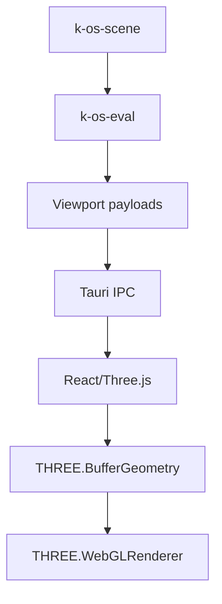
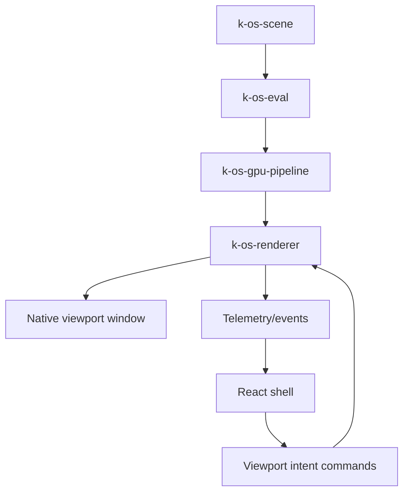

# Design Document: Native Renderer Migration

## Overview

K_OS currently evaluates mesh data through `k-os-scene` and `k-os-eval`, but final viewport rendering still lands in frontend-owned `THREE.BufferGeometry` and `THREE.WebGLRenderer`. That keeps canonical state and evaluation on the right side of the boundary, but leaves GPU residency, draw submission, and frame pacing on the wrong side.

This migration introduces a native renderer subsystem, `k-os-renderer`, for core DCC viewports. The renderer owns GPU resources, render passes, frame execution, and viewport surfaces. React remains the shell for editor chrome, panels, HUD, and tool overlays. Three.js remains available for non-critical apps and fallback paths.

The first production pilot is KSculpt.

## Hard Architectural Decisions

These decisions are locked for Phase A and Phase B.

### 1. Native viewport hosting model

Phase A/B will use a dedicated native viewport window/surface model, not true in-webview embedding.

Reason:
- This matches the existing `src-bevy` "leash" architecture direction.
- Tauri + webview DOM embedding is the riskiest and least specified boundary in the stack.
- Native window hosting gives the renderer direct ownership of the surface lifecycle, swapchain configuration, resize handling, and GPU pacing.

Implication:
- React controls the native viewport through commands and events.
- React overlays remain in the webview or companion shell UI.
- The first pilot must not promise a renderer rendered "inside a div".

### 2. Renderer-owned frame loop

The native renderer owns frame execution.

React does not call a per-frame `render_frame` command. React only sends:
- viewport lifecycle commands
- camera updates
- selection requests
- tool state updates
- redraw or invalidate hints

The renderer decides when to render, based on:
- dirty scene or tool state
- camera changes
- surface resize
- selection requests
- explicit redraw requests

### 3. Picking strategy for the pilot

Phase B KSculpt picking uses CPU ray/BVH picking against evaluator-derived mesh data.

GPU selection buffers are deferred to later phases.

Reason:
- KSculpt already depends on accurate brush hit tests.
- CPU BVH/raycast fits the current engine better than inventing a second GPU-side picking architecture during the pilot.
- This de-risks the first migration while preserving correct sculpt behavior.

### 4. Ownership boundaries

Ownership is strict:
- `k-os-scene`: canonical authored scene state
- `k-os-eval`: derived mesh and viewport-evaluable outputs
- `k-os-gpu-pipeline`: buffer allocation, upload planning, zero-repacking bridge rules
- `k-os-renderer`: viewport resources, render graph, frame execution, render handles
- React/Tauri frontend: UI, overlays, input intent, feature flags

`k-os-renderer` must not own canonical scene state.
React must not own native viewport GPU resources.

### 5. Benchmark policy

Performance numbers in this migration are benchmark targets, not unconditional guarantees.

Every performance target must be tied to:
- a benchmark scene definition
- a GPU class or test machine tier
- a shading mode
- a measurement method

The spec should not claim universal "60 FPS at X triangles" without a hardware matrix.

## Current State

### Current rendering path



### Current strengths

- Canonical scene state is already being separated into `k-os-scene`.
- A first mesh DAG exists in `k-os-eval`.
- `k-os-gpu-pipeline` now has a formal mesh bridge path.
- KSculpt can already consume evaluator-derived payloads.
- `src-bevy` already proves there is native viewport/window work in the repo.

### Current limitations

- GPU-resident viewport resources are still effectively recreated through frontend geometry updates.
- Viewport frame pacing still belongs to the frontend renderer path.
- Surface ownership is still legacy/Three-centric.
- KSculpt, retopo, and high-update tools still pay frontend geometry churn costs.

## Target State

### High-level architecture



### Hybrid strategy

- Core DCC viewports: native renderer
  - KSculpt
  - KRetopo
  - KInspect
  - Bake/material preview
- Tooling/experimental apps: Three.js can remain temporarily
- React remains the authoritative shell and overlay layer

## Main Runtime Workflow

### Viewport lifecycle

1. React opens a native viewport session through Tauri.
2. Tauri creates or routes to a native viewport window/surface.
3. `k-os-renderer` creates a `ViewportHandle` and owns the surface.
4. React associates overlays and tool state with that viewport handle.

### Mesh attachment

1. React requests mesh attachment by `MeshHandle`.
2. Renderer asks the bridge layer for evaluator-derived mesh resources.
3. `k-os-gpu-pipeline` allocates or reuses buffers.
4. Renderer creates or updates a `RenderMeshHandle`.
5. The mesh remains GPU-resident until detached or evicted.

### Mesh updates

1. Scene source changes mark nodes dirty in `k-os-eval`.
2. Renderer is notified through a bridge or invalidation channel.
3. Evaluator recomputes the required viewport output.
4. GPU bridge plans partial or full buffer uploads.
5. Renderer patches resident GPU resources before the next frame.

### Frame loop

1. Renderer thread detects a redraw condition.
2. Dirty resources are synchronized.
3. Draw packets are built or refreshed.
4. Render pass executes.
5. Telemetry is published to the shell.

### Picking

Phase B:
- renderer asks a CPU BVH/raycast path for hit results against evaluator-derived mesh data
- result is returned as a typed selection payload

Deferred:
- GPU ID buffer or depth picking

## Components and Interfaces

### Component 1: `k-os-renderer`

Purpose:
- native viewport renderer for core DCC viewports

Responsibilities:
- viewport window/surface lifecycle
- render mesh registry
- camera state
- frame loop
- render graph/draw packet execution
- telemetry publication

Interface:

```rust
pub struct Renderer {
    device: Arc<wgpu::Device>,
    queue: Arc<wgpu::Queue>,
    viewports: HashMap<ViewportHandle, ViewportRuntime>,
    meshes: HashMap<RenderMeshHandle, RenderMeshRuntime>,
    scene_to_render: HashMap<MeshHandle, Vec<RenderMeshHandle>>,
}

pub struct ViewportRuntime {
    handle: ViewportHandle,
    config: ViewportConfig,
    camera: CameraState,
    redraw_requested: bool,
}

pub struct RenderMeshRuntime {
    handle: RenderMeshHandle,
    scene_mesh: MeshHandle,
    gpu_buffers: GpuMeshBufferHandles,
    shading_mode: ShadingMode,
    dirty: bool,
}

impl Renderer {
    pub fn new(device: Arc<wgpu::Device>, queue: Arc<wgpu::Queue>) -> Self;
    pub fn create_viewport(&mut self, config: ViewportConfig) -> Result<ViewportHandle, RendererError>;
    pub fn attach_mesh(&mut self, viewport: ViewportHandle, mesh: MeshHandle) -> Result<RenderMeshHandle, RendererError>;
    pub fn detach_mesh(&mut self, viewport: ViewportHandle, mesh: RenderMeshHandle) -> Result<(), RendererError>;
    pub fn set_camera(&mut self, viewport: ViewportHandle, camera: CameraState) -> Result<(), RendererError>;
    pub fn request_redraw(&mut self, viewport: ViewportHandle) -> Result<(), RendererError>;
    pub fn request_selection(&mut self, viewport: ViewportHandle, ndc: [f32; 2]) -> Result<SelectionResult, RendererError>;
    pub fn dispose_viewport(&mut self, viewport: ViewportHandle) -> Result<(), RendererError>;
}
```

### Component 2: Renderer service thread

Purpose:
- isolate frame execution from frontend command pacing

Responsibilities:
- own the renderer event loop
- consume commands from Tauri
- publish telemetry/events

Interface:

```rust
pub enum RendererCommand {
    CreateViewport(ViewportConfig),
    AttachMesh { viewport: ViewportHandle, mesh: MeshHandle },
    DetachMesh { viewport: ViewportHandle, render_mesh: RenderMeshHandle },
    SetCamera { viewport: ViewportHandle, camera: CameraState },
    RequestRedraw { viewport: ViewportHandle },
    RequestSelection { viewport: ViewportHandle, ndc: [f32; 2] },
    DisposeViewport(ViewportHandle),
}
```

### Component 3: Tauri viewport API

Purpose:
- intent-based command boundary between React and native renderer

Required commands:

```rust
#[tauri::command]
async fn viewport_create(config: ViewportConfig) -> Result<ViewportHandle, String>;

#[tauri::command]
async fn viewport_attach_mesh(viewport: ViewportHandle, mesh: MeshHandle) -> Result<RenderMeshHandle, String>;

#[tauri::command]
async fn viewport_detach_mesh(viewport: ViewportHandle, render_mesh: RenderMeshHandle) -> Result<(), String>;

#[tauri::command]
async fn viewport_set_camera(viewport: ViewportHandle, camera: CameraState) -> Result<(), String>;

#[tauri::command]
async fn viewport_request_redraw(viewport: ViewportHandle) -> Result<(), String>;

#[tauri::command]
async fn viewport_request_selection(viewport: ViewportHandle, ndc_x: f32, ndc_y: f32) -> Result<SelectionResult, String>;

#[tauri::command]
async fn viewport_get_stats(viewport: ViewportHandle) -> Result<FrameStats, String>;
```

Not allowed:
- a required per-frame `viewport_render_frame` frontend command

### Component 4: React viewport controller

Purpose:
- manage viewport session state and overlays

Responsibilities:
- create/dispose native viewport sessions
- forward camera and tool input intent
- render HUD/brush cursor/selection overlays
- display telemetry
- feature-flag native vs Three.js paths

The React layer controls the viewport session, but does not own rendering resources.

### Component 5: Scene/eval/renderer bridge

Purpose:
- connect `k-os-scene` and `k-os-eval` outputs to `k-os-renderer` resources through `k-os-gpu-pipeline`

Interface shape:

```rust
pub trait EvaluatedMeshSource {
    fn viewport_payload(&self, mesh: MeshHandle) -> Result<ViewportBufferPayload, BridgeError>;
}

pub trait RendererUploadBridge {
    fn sync_mesh(&mut self, mesh: MeshHandle, render_mesh: RenderMeshHandle) -> Result<(), BridgeError>;
    fn mark_mesh_dirty(&mut self, mesh: MeshHandle);
}
```

Important decision:
- the bridge should depend on stable interfaces or service objects
- it should not directly expose `Arc<Mutex<SceneWorld>>` and `Arc<Mutex<EvalGraph>>` as the public architecture contract

## Data Models

### `ViewportConfig`

```rust
#[derive(Debug, Clone, Serialize, Deserialize)]
pub struct ViewportConfig {
    pub width: u32,
    pub height: u32,
    pub shading_mode: ShadingMode,
    pub background_color: [f32; 4],
    pub enable_selection: bool,
    pub enable_shadows: bool,
    pub msaa_samples: u32,
    pub renderer_mode: RendererMode,
}

#[derive(Debug, Clone, Copy, Serialize, Deserialize)]
pub enum RendererMode {
    Native,
    ThreeFallback,
}

#[derive(Debug, Clone, Copy, Serialize, Deserialize)]
pub enum ShadingMode {
    Solid,
    Wireframe,
}
```

Phase B only guarantees `Solid` and `Wireframe`.
`Matcap` and `Xray` are deferred.

### `CameraState`

```rust
#[derive(Debug, Clone, Serialize, Deserialize)]
pub struct CameraState {
    pub position: [f32; 3],
    pub target: [f32; 3],
    pub up: [f32; 3],
    pub fov_degrees: f32,
    pub near: f32,
    pub far: f32,
}
```

### `SelectionResult`

```rust
#[derive(Debug, Clone, Serialize, Deserialize)]
pub struct SelectionResult {
    pub hit: bool,
    pub mesh_handle: Option<MeshHandle>,
    pub face_index: Option<u32>,
    pub position: Option<[f32; 3]>,
    pub normal: Option<[f32; 3]>,
    pub distance: Option<f32>,
}
```

### `FrameStats`

```rust
#[derive(Debug, Clone, Serialize, Deserialize)]
pub struct FrameStats {
    pub frame_time_ms: f32,
    pub fps: f32,
    pub vertex_count: u32,
    pub face_count: u32,
    pub draw_calls: u32,
    pub gpu_upload_bytes: u64,
}
```

## Ownership and Lifecycle Rules

### Canonical state

- scene mesh data lives in `k-os-scene`
- derived mesh outputs live in `k-os-eval` cache/results
- renderer-visible upload plans are produced by `k-os-gpu-pipeline`

### GPU resources

- `k-os-renderer` owns the runtime handles for viewport resources
- `k-os-gpu-pipeline` owns buffer pooling and upload policy
- buffers must be allocated through the bridge/pool contract, not ad hoc renderer allocations unless the pool explicitly falls back

### Materials

Phase B material scope is intentionally narrow:
- single solid lit path
- optional wireframe debug path

Deferred:
- matcap
- xray
- full texture binding
- advanced material graph integration

## Integration Strategy

### Phase A: renderer boundary

Deliver:
- `k-os-renderer` crate skeleton
- renderer service thread
- viewport handles
- attach/detach camera APIs
- request_redraw API
- stats API

Do not deliver yet:
- full material system
- true overlay compositing
- non-KSculpt viewport migrations

### Phase B: KSculpt pilot

Deliver:
- native viewport window/session
- sculpt mesh attach/update path
- CPU BVH picking for brush hit testing
- brush cursor and HUD overlay coordination
- feature flag to toggle native/Three.js path

### Phase C: scene/eval/renderer auto-sync

Deliver:
- dirty propagation into renderer resource updates
- shared render mesh registry per `MeshHandle`
- multi-viewport updates for the same scene mesh

### Phase D: overlay and tool polish

Deliver:
- better overlay alignment
- camera and tool input routing cleanup
- telemetry and debug instrumentation

### Phase E: expand to more viewports

Priority:
1. KRetopo
2. KInspect
3. Bake/material preview

## Performance Policy

The following are benchmark targets, not unconditional cross-hardware promises.

Initial benchmark matrix must define:
- GPU tier:
  - minimum supported
  - recommended development machine
- scene:
  - 1M triangle sculpt benchmark scene
  - 10M triangle heavy scene
- shading mode:
  - solid
  - wireframe

Initial targets:
- KSculpt pilot scene on recommended GPU:
  - 60 FPS median in solid mode
- heavy 10M triangle scene on recommended GPU:
  - 30 FPS median in solid mode

Measurements must record:
- frame time
- upload bytes
- draw calls
- mesh sync time
- selection latency

## Existing Repo Alignment

This design intentionally aligns with the current repo:
- `src-bevy` already demonstrates native-window-oriented viewport work
- `k-os-scene` already owns canonical mesh state for the migrated path
- `k-os-eval` already has the first mesh DAG slice
- `k-os-gpu-pipeline` already has a mesh bridge path
- current workspace uses `wgpu = "26"` in the main rendering-related crates

If Bevy is used during the early pilot:
- it is an implementation accelerator, not the architecture itself
- `k-os-renderer` remains the target boundary

## Risks and Mitigations

### Risk 1: fake-native architecture

Risk:
- frontend still effectively drives frame rendering through IPC

Mitigation:
- ban per-frame `render_frame` frontend ownership from the architecture

### Risk 2: DOM embedding trap

Risk:
- spec assumes the renderer can be trivially embedded into a React `div`

Mitigation:
- commit Phase A/B to dedicated native viewport hosting

### Risk 3: too much pilot scope

Risk:
- pilot tries to ship advanced materials, GPU picking, and complete viewport parity at once

Mitigation:
- narrow Phase B to KSculpt core workflow only

### Risk 4: ownership bleed

Risk:
- renderer reaches back into scene/eval internals directly

Mitigation:
- require stable bridge traits/services between the layers

## Recommended Next Steps

1. Update the requirements spec to match these decisions.
2. Create `k-os-renderer` as a boundary crate with service-thread ownership.
3. Implement native viewport session lifecycle with `request_redraw`, not `render_frame`.
4. Pilot KSculpt using CPU BVH picking and solid/wireframe shading only.
