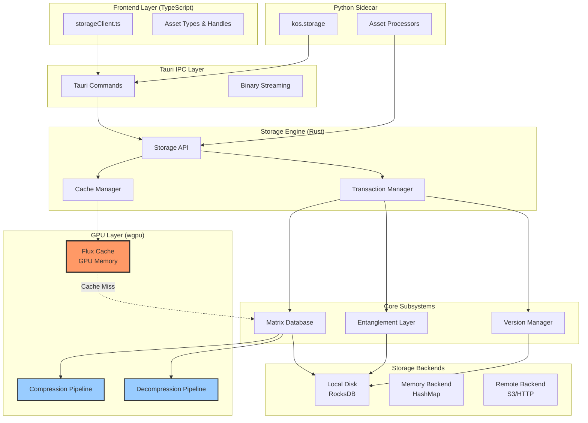

# OptiMatrix Storage System - Design Document

## Overview

OptiMatrix is a GPU-accelerated, matrix-based storage system for K_OS that provides sub-millisecond asset access through intelligent caching and content-addressable deduplication. The system leverages wgpu compute pipelines for compression/decompression, maintains a Flux Cache in GPU memory for hot assets, and implements quantum entanglement (content-addressable storage) for cross-project asset sharing.

### Design Goals

1. **Flux-Lightning Performance**: Sub-millisecond access for cached assets, <50ms for cold assets
2. **GPU-First Architecture**: Leverage wgpu compute shaders for compression, decompression, and data transforms
3. **Petabyte-Scale Ready**: Matrix-based indexing and content-addressable storage for massive collections
4. **Zero-Copy Operations**: Minimize memory allocations through buffer pooling and staging buffers
5. **Data-Driven Configuration**: All policies, backends, and behaviors defined in Storage_Registry JSON
6. **Transaction Safety**: ACID guarantees with write-ahead logging and crash recovery

### Key Innovations

- **Flux Cache**: GPU-resident cache using wgpu buffer pools for <1ms asset retrieval
- **Quantum Entanglement**: Content-addressable storage with automatic deduplication across projects
- **Matrix Database**: Multi-dimensional indexing (type × project × time) for O(log n) queries
- **GPU Compression**: Custom wgpu compute pipelines for mesh/texture compression at 500+ MB/s
- **Delta Versioning**: Efficient version chains using binary diffs for space optimization


## Architecture

### High-Level System Diagram



### Layer Responsibilities

#### Frontend Layer (TypeScript)
- Provides typed API for storage operations
- Handles binary serialization for large assets
- Manages progress callbacks for long operations
- Implements client-side caching hints

#### Tauri IPC Layer
- Bridges TypeScript ↔ Rust communication
- Implements efficient binary streaming for large assets
- Handles command routing and error propagation
- Provides progress event channels

#### Storage Engine (Rust)
- Core orchestration of all storage operations
- Transaction management and ACID guarantees
- Cache policy enforcement
- Metrics collection and monitoring

#### Matrix Database
- Multi-dimensional asset indexing
- Query optimization and execution
- Referential integrity enforcement
- Schema validation

#### Entanglement Layer
- Content-addressable storage (CAS)
- Automatic deduplication via content hashing
- Quantum link management
- Garbage collection of orphaned assets

#### Version Manager
- Asset version chains with delta compression
- Temporal queries (get asset at timestamp)
- Version pruning based on retention policies
- Merge conflict resolution

#### GPU Layer (wgpu)
- Flux Cache: GPU-resident hot asset cache
- Compression/decompression compute pipelines
- Zero-copy buffer management
- GPU memory pool allocation

#### Storage Backends
- Physical storage implementations
- Pluggable backend architecture
- Tiered storage support (hot/warm/cold)
- Backend-specific optimizations


## Components and Interfaces

### Storage Engine Core

**Location**: `crates/k-os-engine/src/modules/storage/engine.rs`

```rust
/// Main storage engine coordinating all subsystems
pub struct StorageEngine {
    config: Arc<StorageConfig>,
    matrix_db: Arc<MatrixDatabase>,
    entanglement: Arc<EntanglementLayer>,
    version_mgr: Arc<VersionManager>,
    cache_mgr: Arc<CacheManager>,
    tx_manager: Arc<TransactionManager>,
    metrics: Arc<StorageMetrics>,
    gpu_device: Arc<GpuComputeDevice>,
}

impl StorageEngine {
    /// Initialize storage engine with configuration
    pub async fn new(config: StorageConfig, gpu: Arc<GpuComputeDevice>) -> Result<Self>;
    
    /// Store an asset and return handle
    pub async fn store(&self, asset: Asset) -> Result<AssetHandle>;
    
    /// Retrieve an asset by handle
    pub async fn retrieve(&self, handle: AssetHandle) -> Result<Asset>;
    
    /// Update an existing asset (creates new version)
    pub async fn update(&self, handle: AssetHandle, asset: Asset) -> Result<AssetHandle>;
    
    /// Delete an asset (marks for garbage collection)
    pub async fn delete(&self, handle: AssetHandle) -> Result<()>;
    
    /// Query assets with filters
    pub async fn query(&self, query: AssetQuery) -> Result<Vec<AssetMetadata>>;
    
    /// Begin a transaction
    pub async fn begin_transaction(&self) -> Result<Transaction>;
    
    /// Export asset to standard format
    pub async fn export(&self, handle: AssetHandle, format: ExportFormat) -> Result<Vec<u8>>;
    
    /// Import asset from standard format
    pub async fn import(&self, data: &[u8], format: ImportFormat) -> Result<AssetHandle>;
    
    /// Get performance metrics
    pub fn metrics(&self) -> &StorageMetrics;
    
    /// Hot-reload configuration
    pub async fn reload_config(&self, config: StorageConfig) -> Result<()>;
}
```

### Asset Types and Handles

**Location**: `crates/k-os-engine/src/modules/storage/types.rs`

```rust
/// Unique identifier for stored assets
#[derive(Debug, Clone, Copy, PartialEq, Eq, Hash, Serialize, Deserialize)]
pub struct AssetHandle(u64);

/// Asset type enumeration
#[derive(Debug, Clone, Serialize, Deserialize)]
pub enum AssetType {
    Mesh(MeshAsset),
    Animation(AnimationAsset),
    Texture(TextureAsset),
    Material(MaterialAsset),
    SceneGraph(SceneGraphAsset),
    BinaryBlob(Vec<u8>),
}

/// Mesh asset data
#[derive(Debug, Clone, Serialize, Deserialize)]
pub struct MeshAsset {
    pub positions: Vec<f32>,      // [x,y,z, x,y,z, ...]
    pub indices: Vec<u32>,         // Triangle indices
    pub normals: Option<Vec<f32>>, // Per-vertex normals
    pub uvs: Option<Vec<f32>>,     // UV coordinates
    pub tangents: Option<Vec<f32>>, // Tangent space
    pub colors: Option<Vec<f32>>,  // Vertex colors
}

/// Animation asset data
#[derive(Debug, Clone, Serialize, Deserialize)]
pub struct AnimationAsset {
    pub duration: f32,
    pub keyframes: Vec<Keyframe>,
    pub curves: Vec<AnimationCurve>,
    pub skeleton: Option<SkeletonData>,
}

/// Texture asset data
#[derive(Debug, Clone, Serialize, Deserialize)]
pub struct TextureAsset {
    pub width: u32,
    pub height: u32,
    pub depth: u32,              // 1 for 2D, 6 for cubemap, N for 3D
    pub format: TextureFormat,   // RGBA8, RGBA16F, BC7, etc.
    pub mip_levels: u32,
    pub data: Vec<u8>,           // Raw pixel data
}

/// Material definition
#[derive(Debug, Clone, Serialize, Deserialize)]
pub struct MaterialAsset {
    pub shader: String,
    pub parameters: HashMap<String, MaterialParam>,
    pub textures: HashMap<String, AssetHandle>, // References to texture assets
}

/// Scene graph hierarchy
#[derive(Debug, Clone, Serialize, Deserialize)]
pub struct SceneGraphAsset {
    pub nodes: Vec<SceneNode>,
    pub root_indices: Vec<usize>,
}

/// Asset metadata for queries
#[derive(Debug, Clone, Serialize, Deserialize)]
pub struct AssetMetadata {
    pub handle: AssetHandle,
    pub asset_type: String,
    pub project_id: String,
    pub tags: Vec<String>,
    pub size_bytes: u64,
    pub created_at: i64,
    pub modified_at: i64,
    pub version: u32,
    pub dependencies: Vec<AssetHandle>,
    pub content_hash: [u8; 32],  // SHA-256 for entanglement
}
```


### Matrix Database

**Location**: `crates/k-os-engine/src/modules/storage/matrix_db.rs`

```rust
/// Matrix-based database for structured asset organization
pub struct MatrixDatabase {
    backend: Arc<dyn StorageBackend>,
    index: RwLock<MatrixIndex>,
    schema_registry: Arc<SchemaRegistry>,
}

/// Multi-dimensional index structure
struct MatrixIndex {
    // Primary index: handle -> metadata
    by_handle: HashMap<AssetHandle, AssetMetadata>,
    
    // Secondary indices for fast queries
    by_type: HashMap<String, HashSet<AssetHandle>>,
    by_project: HashMap<String, HashSet<AssetHandle>>,
    by_tag: HashMap<String, HashSet<AssetHandle>>,
    by_time: BTreeMap<i64, HashSet<AssetHandle>>,
    
    // Dependency graph for referential integrity
    dependencies: HashMap<AssetHandle, HashSet<AssetHandle>>,
    dependents: HashMap<AssetHandle, HashSet<AssetHandle>>,
}

impl MatrixDatabase {
    /// Insert asset with metadata
    pub async fn insert(&self, handle: AssetHandle, metadata: AssetMetadata, data: Vec<u8>) -> Result<()>;
    
    /// Retrieve asset data
    pub async fn get(&self, handle: AssetHandle) -> Result<Vec<u8>>;
    
    /// Update asset metadata
    pub async fn update_metadata(&self, handle: AssetHandle, metadata: AssetMetadata) -> Result<()>;
    
    /// Delete asset
    pub async fn delete(&self, handle: AssetHandle) -> Result<()>;
    
    /// Query with filters
    pub async fn query(&self, query: AssetQuery) -> Result<Vec<AssetMetadata>>;
    
    /// Check referential integrity
    pub fn check_dependencies(&self, handle: AssetHandle) -> Vec<AssetHandle>;
}

/// Query builder for asset searches
#[derive(Debug, Clone, Default)]
pub struct AssetQuery {
    pub asset_types: Vec<String>,
    pub projects: Vec<String>,
    pub tags: Vec<String>,
    pub time_range: Option<(i64, i64)>,
    pub limit: Option<usize>,
    pub offset: Option<usize>,
}
```

### Entanglement Layer (Content-Addressable Storage)

**Location**: `crates/k-os-engine/src/modules/storage/entanglement.rs`

```rust
/// Content-addressable storage for deduplication
pub struct EntanglementLayer {
    backend: Arc<dyn StorageBackend>,
    content_index: RwLock<ContentIndex>,
    link_registry: RwLock<LinkRegistry>,
}

/// Maps content hash to physical storage location
struct ContentIndex {
    hash_to_location: HashMap<ContentHash, StorageLocation>,
    location_to_hash: HashMap<StorageLocation, ContentHash>,
    ref_counts: HashMap<ContentHash, usize>,
}

/// Tracks quantum links (references to shared content)
struct LinkRegistry {
    handle_to_hash: HashMap<AssetHandle, ContentHash>,
    hash_to_handles: HashMap<ContentHash, HashSet<AssetHandle>>,
}

type ContentHash = [u8; 32]; // SHA-256

impl EntanglementLayer {
    /// Store content and return hash
    pub async fn store_content(&self, data: &[u8]) -> Result<ContentHash>;
    
    /// Retrieve content by hash
    pub async fn get_content(&self, hash: ContentHash) -> Result<Vec<u8>>;
    
    /// Create quantum link (reference to shared content)
    pub async fn create_link(&self, handle: AssetHandle, hash: ContentHash) -> Result<()>;
    
    /// Remove quantum link
    pub async fn remove_link(&self, handle: AssetHandle) -> Result<()>;
    
    /// Get all handles sharing content
    pub fn get_linked_handles(&self, hash: ContentHash) -> Vec<AssetHandle>;
    
    /// Find orphaned content (ref_count == 0)
    pub fn find_orphans(&self) -> Vec<ContentHash>;
    
    /// Garbage collect orphaned content
    pub async fn gc_orphans(&self) -> Result<usize>;
}
```

### Version Manager

**Location**: `crates/k-os-engine/src/modules/storage/version.rs`

```rust
/// Manages asset versioning with delta compression
pub struct VersionManager {
    backend: Arc<dyn StorageBackend>,
    version_chains: RwLock<HashMap<AssetHandle, VersionChain>>,
    delta_compressor: Arc<DeltaCompressor>,
}

/// Version chain for an asset
struct VersionChain {
    base_handle: AssetHandle,
    versions: Vec<VersionEntry>,
}

struct VersionEntry {
    version: u32,
    timestamp: i64,
    content_hash: ContentHash,
    delta_from_previous: Option<Vec<u8>>, // Binary diff
    metadata: AssetMetadata,
}

impl VersionManager {
    /// Create new version of asset
    pub async fn create_version(&self, handle: AssetHandle, data: Vec<u8>) -> Result<AssetHandle>;
    
    /// Get specific version
    pub async fn get_version(&self, handle: AssetHandle, version: u32) -> Result<Vec<u8>>;
    
    /// Get version at timestamp
    pub async fn get_at_time(&self, handle: AssetHandle, timestamp: i64) -> Result<Vec<u8>>;
    
    /// List all versions
    pub fn list_versions(&self, handle: AssetHandle) -> Vec<VersionEntry>;
    
    /// Revert to previous version
    pub async fn revert(&self, handle: AssetHandle, version: u32) -> Result<AssetHandle>;
    
    /// Prune old versions based on policy
    pub async fn prune(&self, handle: AssetHandle, policy: RetentionPolicy) -> Result<usize>;
}

/// Version retention policy
#[derive(Debug, Clone, Serialize, Deserialize)]
pub enum RetentionPolicy {
    KeepAll,
    KeepLast(usize),
    KeepSince(i64),
    KeepMajorVersions,
}
```


### Cache Manager and Flux Cache

**Location**: `crates/k-os-engine/src/modules/storage/cache.rs`

```rust
/// Manages multi-tier caching strategy
pub struct CacheManager {
    flux_cache: Arc<FluxCache>,      // GPU memory
    memory_cache: Arc<MemoryCache>,  // System RAM
    policy: CachePolicy,
    metrics: Arc<CacheMetrics>,
}

impl CacheManager {
    /// Try to get from cache (flux -> memory -> miss)
    pub async fn get(&self, handle: AssetHandle) -> Option<Vec<u8>>;
    
    /// Put into cache with priority hint
    pub async fn put(&self, handle: AssetHandle, data: Vec<u8>, priority: CachePriority);
    
    /// Invalidate cache entry
    pub fn invalidate(&self, handle: AssetHandle);
    
    /// Prefetch assets into cache
    pub async fn prefetch(&self, handles: Vec<AssetHandle>);
    
    /// Get cache statistics
    pub fn stats(&self) -> CacheStats;
}

/// GPU-resident cache using wgpu buffers
pub struct FluxCache {
    device: Arc<GpuComputeDevice>,
    buffer_pool: Arc<BufferPool>,
    entries: RwLock<HashMap<AssetHandle, FluxCacheEntry>>,
    lru: RwLock<LruCache<AssetHandle>>,
    max_size_bytes: u64,
}

struct FluxCacheEntry {
    buffer: wgpu::Buffer,
    size: u64,
    last_access: Instant,
    access_count: u64,
}

impl FluxCache {
    /// Get asset from GPU cache (<1ms target)
    pub async fn get(&self, handle: AssetHandle) -> Option<Vec<u8>>;
    
    /// Put asset into GPU cache
    pub async fn put(&self, handle: AssetHandle, data: &[u8]) -> Result<()>;
    
    /// Evict least recently used entries
    pub async fn evict_lru(&self, target_size: u64) -> Result<()>;
}

#[derive(Debug, Clone, Copy)]
pub enum CachePriority {
    Critical,  // Keep in Flux Cache
    High,      // Keep in memory cache
    Normal,    // Standard LRU
    Low,       // Evict first
}
```

### GPU Compression Pipeline

**Location**: `crates/k-os-engine/src/gpu/pipelines/compression.rs`

```rust
/// GPU-accelerated compression for mesh and texture data
pub struct CompressionPipeline {
    device: Arc<GpuComputeDevice>,
    mesh_compressor: MeshCompressor,
    texture_compressor: TextureCompressor,
}

impl CompressionPipeline {
    /// Compress mesh data on GPU
    pub async fn compress_mesh(&self, mesh: &MeshAsset) -> Result<CompressedMesh>;
    
    /// Decompress mesh data on GPU
    pub async fn decompress_mesh(&self, compressed: &CompressedMesh) -> Result<MeshAsset>;
    
    /// Compress texture data on GPU
    pub async fn compress_texture(&self, texture: &TextureAsset) -> Result<CompressedTexture>;
    
    /// Decompress texture data on GPU
    pub async fn decompress_texture(&self, compressed: &CompressedTexture) -> Result<TextureAsset>;
}

/// Mesh compression using quantization and entropy coding
struct MeshCompressor {
    quantize_pipeline: wgpu::ComputePipeline,
    entropy_pipeline: wgpu::ComputePipeline,
}

/// Compressed mesh format
pub struct CompressedMesh {
    pub quantized_positions: Vec<u16>,  // 16-bit quantized
    pub quantized_normals: Vec<u16>,    // Octahedral encoding
    pub indices: Vec<u32>,              // Delta + entropy coded
    pub bounds: BoundingBox,
    pub compression_ratio: f32,
}
```

**WGSL Shader**: `crates/k-os-engine/src/gpu/pipelines/compression.wgsl`

```wgsl
// Mesh quantization compute shader
struct CompressionParams {
    bounds_min: vec4<f32>,    // xyz + padding
    bounds_max: vec4<f32>,    // xyz + padding
    vertex_count: u32,
    _padding: vec3<u32>,
}

@group(0) @binding(0) var<uniform> params: CompressionParams;
@group(0) @binding(1) var<storage, read> positions: array<vec4<f32>>;  // Input positions
@group(0) @binding(2) var<storage, read_write> quantized: array<u32>;  // Output quantized (packed)

@compute @workgroup_size(256)
fn quantize_positions(@builtin(global_invocation_id) global_id: vec3<u32>) {
    let idx = global_id.x;
    if (idx >= params.vertex_count) {
        return;
    }
    
    let pos = positions[idx].xyz;
    let range = params.bounds_max.xyz - params.bounds_min.xyz;
    let normalized = (pos - params.bounds_min.xyz) / range;
    
    // Quantize to 16-bit per component
    let qx = u32(clamp(normalized.x * 65535.0, 0.0, 65535.0));
    let qy = u32(clamp(normalized.y * 65535.0, 0.0, 65535.0));
    let qz = u32(clamp(normalized.z * 65535.0, 0.0, 65535.0));
    
    // Pack into two u32s (xyz in first, w unused in second)
    quantized[idx * 2] = (qx << 16) | qy;
    quantized[idx * 2 + 1] = qz << 16;
}

// Normal octahedral encoding
@compute @workgroup_size(256)
fn encode_normals(@builtin(global_invocation_id) global_id: vec3<u32>) {
    let idx = global_id.x;
    if (idx >= params.vertex_count) {
        return;
    }
    
    let normal = normalize(positions[idx].xyz);
    
    // Octahedral projection
    let l1_norm = abs(normal.x) + abs(normal.y) + abs(normal.z);
    var oct = normal.xy / l1_norm;
    
    if (normal.z < 0.0) {
        oct = (1.0 - abs(oct.yx)) * sign(oct);
    }
    
    // Quantize to 16-bit
    let qx = u32(clamp((oct.x * 0.5 + 0.5) * 65535.0, 0.0, 65535.0));
    let qy = u32(clamp((oct.y * 0.5 + 0.5) * 65535.0, 0.0, 65535.0));
    
    quantized[idx] = (qx << 16) | qy;
}
```


### Transaction Manager

**Location**: `crates/k-os-engine/src/modules/storage/transaction.rs`

```rust
/// Manages ACID transactions with write-ahead logging
pub struct TransactionManager {
    wal: Arc<WriteAheadLog>,
    active_txs: RwLock<HashMap<TransactionId, Transaction>>,
    lock_manager: Arc<LockManager>,
}

pub struct Transaction {
    id: TransactionId,
    operations: Vec<TxOperation>,
    state: TxState,
    started_at: Instant,
}

enum TxOperation {
    Insert { handle: AssetHandle, data: Vec<u8> },
    Update { handle: AssetHandle, data: Vec<u8> },
    Delete { handle: AssetHandle },
}

enum TxState {
    Active,
    Preparing,
    Committed,
    Aborted,
}

impl TransactionManager {
    /// Begin new transaction
    pub async fn begin(&self) -> Result<Transaction>;
    
    /// Add operation to transaction
    pub async fn add_operation(&self, tx_id: TransactionId, op: TxOperation) -> Result<()>;
    
    /// Commit transaction (atomic)
    pub async fn commit(&self, tx_id: TransactionId) -> Result<()>;
    
    /// Rollback transaction
    pub async fn rollback(&self, tx_id: TransactionId) -> Result<()>;
    
    /// Recover from crash using WAL
    pub async fn recover(&self) -> Result<()>;
}

/// Write-ahead log for crash recovery
struct WriteAheadLog {
    log_file: Arc<RwLock<File>>,
    checkpoint_interval: Duration,
}

impl WriteAheadLog {
    /// Append operation to log
    pub async fn append(&self, op: TxOperation) -> Result<u64>;
    
    /// Mark transaction as committed
    pub async fn commit(&self, tx_id: TransactionId) -> Result<()>;
    
    /// Replay log from checkpoint
    pub async fn replay(&self) -> Result<Vec<TxOperation>>;
    
    /// Create checkpoint and truncate log
    pub async fn checkpoint(&self) -> Result<()>;
}
```

### Storage Backends

**Location**: `crates/k-os-engine/src/modules/storage/backends/`

```rust
/// Trait for pluggable storage backends
#[async_trait]
pub trait StorageBackend: Send + Sync {
    /// Store data and return location
    async fn put(&self, key: &[u8], value: &[u8]) -> Result<StorageLocation>;
    
    /// Retrieve data by location
    async fn get(&self, location: StorageLocation) -> Result<Vec<u8>>;
    
    /// Delete data at location
    async fn delete(&self, location: StorageLocation) -> Result<()>;
    
    /// Check if location exists
    async fn exists(&self, location: StorageLocation) -> Result<bool>;
    
    /// Get backend statistics
    fn stats(&self) -> BackendStats;
}

/// RocksDB backend for local disk storage
pub struct RocksDbBackend {
    db: Arc<rocksdb::DB>,
    compression: rocksdb::DBCompressionType,
}

/// In-memory backend for testing/caching
pub struct MemoryBackend {
    data: Arc<RwLock<HashMap<Vec<u8>, Vec<u8>>>>,
}

/// Remote backend for cloud storage (S3, HTTP)
pub struct RemoteBackend {
    client: Arc<dyn RemoteClient>,
    cache: Arc<MemoryBackend>,
}

#[derive(Debug, Clone, Copy, PartialEq, Eq, Hash)]
pub struct StorageLocation(u64);
```


### TypeScript Client API

**Location**: `src-frontend/services/storageClient.ts`

```typescript
import { invoke } from '@tauri-apps/api/core';
import { listen } from '@tauri-apps/api/event';

export type AssetHandle = number;

export interface AssetMetadata {
    handle: AssetHandle;
    assetType: string;
    projectId: string;
    tags: string[];
    sizeBytes: number;
    createdAt: number;
    modifiedAt: number;
    version: number;
    dependencies: AssetHandle[];
    contentHash: string;
}

export interface MeshAsset {
    positions: Float32Array;
    indices: Uint32Array;
    normals?: Float32Array;
    uvs?: Float32Array;
    tangents?: Float32Array;
    colors?: Float32Array;
}

export interface AssetQuery {
    assetTypes?: string[];
    projects?: string[];
    tags?: string[];
    timeRange?: [number, number];
    limit?: number;
    offset?: number;
}

export interface StorageMetrics {
    operationLatency: {
        min: number;
        max: number;
        avg: number;
        p95: number;
        p99: number;
    };
    throughput: {
        opsPerSecond: number;
        bytesPerSecond: number;
    };
    cacheHitRate: number;
    storageUtilization: Record<string, number>;
}

export const storageClient = {
    /**
     * Store an asset and return handle
     */
    async store(asset: MeshAsset | TextureAsset | any): Promise<AssetHandle> {
        // Serialize asset to binary for efficiency
        const binary = serializeAsset(asset);
        return await invoke('storage_store', { data: Array.from(binary) });
    },

    /**
     * Store asset with binary streaming (for large assets)
     */
    async storeBinary(asset: MeshAsset, onProgress?: (progress: number) => void): Promise<AssetHandle> {
        const unlisten = onProgress 
            ? await listen('storage-progress', (event: any) => onProgress(event.payload))
            : null;
        
        try {
            const positions = Array.from(asset.positions);
            const indices = Array.from(asset.indices);
            const normals = asset.normals ? Array.from(asset.normals) : null;
            const uvs = asset.uvs ? Array.from(asset.uvs) : null;
            
            return await invoke('storage_store_mesh_binary', {
                positions,
                indices,
                normals,
                uvs,
            });
        } finally {
            if (unlisten) unlisten();
        }
    },

    /**
     * Retrieve an asset by handle
     */
    async retrieve(handle: AssetHandle): Promise<any> {
        const binary: number[] = await invoke('storage_retrieve', { handle });
        return deserializeAsset(new Uint8Array(binary));
    },

    /**
     * Retrieve mesh with binary streaming
     */
    async retrieveMesh(handle: AssetHandle): Promise<MeshAsset> {
        const result: any = await invoke('storage_retrieve_mesh_binary', { handle });
        return {
            positions: new Float32Array(result.positions),
            indices: new Uint32Array(result.indices),
            normals: result.normals ? new Float32Array(result.normals) : undefined,
            uvs: result.uvs ? new Float32Array(result.uvs) : undefined,
        };
    },

    /**
     * Update an existing asset
     */
    async update(handle: AssetHandle, asset: any): Promise<AssetHandle> {
        const binary = serializeAsset(asset);
        return await invoke('storage_update', { handle, data: Array.from(binary) });
    },

    /**
     * Delete an asset
     */
    async delete(handle: AssetHandle): Promise<void> {
        await invoke('storage_delete', { handle });
    },

    /**
     * Query assets with filters
     */
    async query(query: AssetQuery): Promise<AssetMetadata[]> {
        return await invoke('storage_query', { query });
    },

    /**
     * Export asset to standard format
     */
    async export(handle: AssetHandle, format: 'gltf' | 'png' | 'exr'): Promise<Uint8Array> {
        const data: number[] = await invoke('storage_export', { handle, format });
        return new Uint8Array(data);
    },

    /**
     * Import asset from standard format
     */
    async import(data: Uint8Array, format: 'gltf' | 'png' | 'exr'): Promise<AssetHandle> {
        return await invoke('storage_import', { 
            data: Array.from(data), 
            format 
        });
    },

    /**
     * Get performance metrics
     */
    async getMetrics(): Promise<StorageMetrics> {
        return await invoke('storage_get_metrics');
    },

    /**
     * Prefetch assets into cache
     */
    async prefetch(handles: AssetHandle[]): Promise<void> {
        await invoke('storage_prefetch', { handles });
    },

    /**
     * Get asset metadata without loading full asset
     */
    async getMetadata(handle: AssetHandle): Promise<AssetMetadata> {
        return await invoke('storage_get_metadata', { handle });
    },
};

// Helper functions for binary serialization
function serializeAsset(asset: any): Uint8Array {
    // Use MessagePack or similar for efficient binary serialization
    // Implementation details...
    return new Uint8Array();
}

function deserializeAsset(binary: Uint8Array): any {
    // Deserialize from MessagePack
    // Implementation details...
    return {};
}
```


### Python Client API

**Location**: `src-python/kos/storage.py`

```python
"""
OptiMatrix Storage Python Client

Provides Python bindings for K_OS storage system via JSON-RPC.
Supports asset processing, batch operations, and streaming.
"""

from typing import Optional, List, Dict, Any, Tuple
import numpy as np
from dataclasses import dataclass
from .rpc import rpc_call, register

@dataclass
class AssetMetadata:
    handle: int
    asset_type: str
    project_id: str
    tags: List[str]
    size_bytes: int
    created_at: int
    modified_at: int
    version: int
    dependencies: List[int]
    content_hash: str

@dataclass
class MeshAsset:
    positions: np.ndarray  # (N, 3) float32
    indices: np.ndarray    # (M, 3) uint32
    normals: Optional[np.ndarray] = None
    uvs: Optional[np.ndarray] = None
    tangents: Optional[np.ndarray] = None
    colors: Optional[np.ndarray] = None

class StorageClient:
    """Client for OptiMatrix storage operations"""
    
    async def store_mesh(self, mesh: MeshAsset, project_id: str, tags: List[str] = None) -> int:
        """Store a mesh asset and return handle"""
        return await rpc_call('storage.store_mesh', {
            'positions': mesh.positions.flatten().tolist(),
            'indices': mesh.indices.flatten().tolist(),
            'normals': mesh.normals.flatten().tolist() if mesh.normals is not None else None,
            'uvs': mesh.uvs.flatten().tolist() if mesh.uvs is not None else None,
            'project_id': project_id,
            'tags': tags or [],
        })
    
    async def retrieve_mesh(self, handle: int) -> MeshAsset:
        """Retrieve a mesh asset by handle"""
        result = await rpc_call('storage.retrieve_mesh', {'handle': handle})
        
        positions = np.array(result['positions'], dtype=np.float32).reshape(-1, 3)
        indices = np.array(result['indices'], dtype=np.uint32).reshape(-1, 3)
        normals = np.array(result['normals'], dtype=np.float32).reshape(-1, 3) if result.get('normals') else None
        uvs = np.array(result['uvs'], dtype=np.float32).reshape(-1, 2) if result.get('uvs') else None
        
        return MeshAsset(
            positions=positions,
            indices=indices,
            normals=normals,
            uvs=uvs,
        )
    
    async def query(
        self,
        asset_types: Optional[List[str]] = None,
        projects: Optional[List[str]] = None,
        tags: Optional[List[str]] = None,
        time_range: Optional[Tuple[int, int]] = None,
        limit: Optional[int] = None,
    ) -> List[AssetMetadata]:
        """Query assets with filters"""
        result = await rpc_call('storage.query', {
            'asset_types': asset_types,
            'projects': projects,
            'tags': tags,
            'time_range': time_range,
            'limit': limit,
        })
        
        return [AssetMetadata(**item) for item in result]
    
    async def export_gltf(self, handle: int, output_path: str) -> None:
        """Export asset to glTF format"""
        data = await rpc_call('storage.export', {
            'handle': handle,
            'format': 'gltf',
        })
        
        with open(output_path, 'wb') as f:
            f.write(bytes(data))
    
    async def import_gltf(self, input_path: str, project_id: str) -> int:
        """Import asset from glTF format"""
        with open(input_path, 'rb') as f:
            data = list(f.read())
        
        return await rpc_call('storage.import', {
            'data': data,
            'format': 'gltf',
            'project_id': project_id,
        })

# Global client instance
storage = StorageClient()

# Asset processor decorator for custom processing pipelines
@register('storage.process_mesh')
async def process_mesh(handle: int, operation: str, params: Dict[str, Any]) -> int:
    """
    Custom mesh processor callable from Rust
    
    Example operations:
    - 'smooth': Laplacian smoothing
    - 'decimate': Mesh decimation
    - 'subdivide': Catmull-Clark subdivision
    """
    mesh = await storage.retrieve_mesh(handle)
    
    if operation == 'smooth':
        # Apply Laplacian smoothing
        iterations = params.get('iterations', 1)
        mesh.positions = laplacian_smooth(mesh.positions, mesh.indices, iterations)
    
    elif operation == 'decimate':
        # Mesh decimation using external library
        target_ratio = params.get('target_ratio', 0.5)
        mesh = decimate_mesh(mesh, target_ratio)
    
    # Store processed mesh
    return await storage.store_mesh(mesh, params['project_id'], tags=['processed'])

def laplacian_smooth(positions: np.ndarray, indices: np.ndarray, iterations: int) -> np.ndarray:
    """Laplacian smoothing implementation"""
    # Build adjacency graph
    adjacency = build_adjacency(indices, len(positions))
    
    smoothed = positions.copy()
    for _ in range(iterations):
        new_positions = np.zeros_like(smoothed)
        for i, neighbors in enumerate(adjacency):
            if neighbors:
                new_positions[i] = np.mean(smoothed[neighbors], axis=0)
            else:
                new_positions[i] = smoothed[i]
        smoothed = new_positions
    
    return smoothed

def build_adjacency(indices: np.ndarray, vertex_count: int) -> List[List[int]]:
    """Build vertex adjacency graph from triangle indices"""
    adjacency = [[] for _ in range(vertex_count)]
    
    for tri in indices:
        for i in range(3):
            v1 = tri[i]
            v2 = tri[(i + 1) % 3]
            if v2 not in adjacency[v1]:
                adjacency[v1].append(v2)
            if v1 not in adjacency[v2]:
                adjacency[v2].append(v1)
    
    return adjacency
```


## Data Models

### Storage_Registry Configuration Schema

**Location**: `config/storage_registry.json`

```json
{
  "$schema": "http://json-schema.org/draft-07/schema#",
  "title": "OptiMatrix Storage Registry",
  "type": "object",
  "properties": {
    "version": {
      "type": "string",
      "description": "Configuration schema version"
    },
    "backends": {
      "type": "array",
      "description": "Available storage backends in priority order",
      "items": {
        "type": "object",
        "properties": {
          "name": { "type": "string" },
          "type": { "enum": ["rocksdb", "memory", "remote"] },
          "priority": { "type": "integer", "minimum": 0 },
          "config": {
            "type": "object",
            "properties": {
              "path": { "type": "string" },
              "compression": { "enum": ["none", "snappy", "lz4", "zstd"] },
              "cache_size_mb": { "type": "integer" },
              "endpoint": { "type": "string" },
              "credentials": { "type": "object" }
            }
          }
        },
        "required": ["name", "type", "priority"]
      }
    },
    "cache_policy": {
      "type": "object",
      "properties": {
        "flux_cache_size_mb": {
          "type": "integer",
          "description": "GPU cache size in megabytes",
          "default": 512
        },
        "memory_cache_size_mb": {
          "type": "integer",
          "description": "System RAM cache size in megabytes",
          "default": 2048
        },
        "eviction_strategy": {
          "enum": ["lru", "lfu", "arc"],
          "description": "Cache eviction algorithm",
          "default": "lru"
        },
        "prefetch_enabled": {
          "type": "boolean",
          "description": "Enable predictive prefetching",
          "default": true
        }
      }
    },
    "compression_policy": {
      "type": "object",
      "description": "Per-asset-type compression settings",
      "properties": {
        "mesh": {
          "type": "object",
          "properties": {
            "enabled": { "type": "boolean", "default": true },
            "algorithm": { "enum": ["quantize", "draco", "meshopt"], "default": "quantize" },
            "quality": { "type": "integer", "minimum": 1, "maximum": 10, "default": 7 },
            "use_gpu": { "type": "boolean", "default": true }
          }
        },
        "texture": {
          "type": "object",
          "properties": {
            "enabled": { "type": "boolean", "default": true },
            "algorithm": { "enum": ["bc7", "astc", "basis"], "default": "bc7" },
            "quality": { "type": "integer", "minimum": 1, "maximum": 10, "default": 8 },
            "use_gpu": { "type": "boolean", "default": true }
          }
        },
        "animation": {
          "type": "object",
          "properties": {
            "enabled": { "type": "boolean", "default": true },
            "algorithm": { "enum": ["keyframe_reduction", "curve_fitting"], "default": "curve_fitting" },
            "tolerance": { "type": "number", "default": 0.001 }
          }
        }
      }
    },
    "entanglement_policy": {
      "type": "object",
      "properties": {
        "auto_dedupe": {
          "type": "boolean",
          "description": "Automatically deduplicate identical assets",
          "default": true
        },
        "hash_algorithm": {
          "enum": ["sha256", "blake3", "xxhash"],
          "default": "blake3"
        },
        "gc_interval_hours": {
          "type": "integer",
          "description": "Garbage collection interval",
          "default": 24
        },
        "min_ref_count": {
          "type": "integer",
          "description": "Minimum references before GC",
          "default": 0
        }
      }
    },
    "version_policy": {
      "type": "object",
      "properties": {
        "retention": {
          "enum": ["keep_all", "keep_last_n", "keep_since", "keep_major"],
          "default": "keep_last_n"
        },
        "retention_count": {
          "type": "integer",
          "description": "Number of versions to keep (for keep_last_n)",
          "default": 10
        },
        "retention_days": {
          "type": "integer",
          "description": "Days to keep versions (for keep_since)",
          "default": 30
        },
        "delta_compression": {
          "type": "boolean",
          "description": "Use delta compression for version chains",
          "default": true
        }
      }
    },
    "performance_thresholds": {
      "type": "object",
      "properties": {
        "store_latency_ms": { "type": "integer", "default": 10 },
        "retrieve_latency_ms": { "type": "integer", "default": 50 },
        "cache_hit_rate_min": { "type": "number", "default": 0.8 },
        "compression_throughput_mbps": { "type": "integer", "default": 500 }
      }
    },
    "asset_schemas": {
      "type": "object",
      "description": "Custom asset type schemas",
      "additionalProperties": {
        "type": "object",
        "properties": {
          "fields": { "type": "array" },
          "validation": { "type": "object" }
        }
      }
    },
    "python_processors": {
      "type": "array",
      "description": "Registered Python asset processors",
      "items": {
        "type": "object",
        "properties": {
          "name": { "type": "string" },
          "function": { "type": "string" },
          "asset_types": { "type": "array", "items": { "type": "string" } },
          "enabled": { "type": "boolean", "default": true }
        }
      }
    }
  },
  "required": ["version", "backends"]
}
```

### Example Storage_Registry Configuration

```json
{
  "version": "1.0.0",
  "backends": [
    {
      "name": "primary_disk",
      "type": "rocksdb",
      "priority": 1,
      "config": {
        "path": "~/.kos/storage/primary",
        "compression": "zstd",
        "cache_size_mb": 256
      }
    },
    {
      "name": "memory_cache",
      "type": "memory",
      "priority": 0,
      "config": {}
    }
  ],
  "cache_policy": {
    "flux_cache_size_mb": 512,
    "memory_cache_size_mb": 2048,
    "eviction_strategy": "lru",
    "prefetch_enabled": true
  },
  "compression_policy": {
    "mesh": {
      "enabled": true,
      "algorithm": "quantize",
      "quality": 7,
      "use_gpu": true
    },
    "texture": {
      "enabled": true,
      "algorithm": "bc7",
      "quality": 8,
      "use_gpu": true
    }
  },
  "entanglement_policy": {
    "auto_dedupe": true,
    "hash_algorithm": "blake3",
    "gc_interval_hours": 24,
    "min_ref_count": 0
  },
  "version_policy": {
    "retention": "keep_last_n",
    "retention_count": 10,
    "delta_compression": true
  },
  "performance_thresholds": {
    "store_latency_ms": 10,
    "retrieve_latency_ms": 50,
    "cache_hit_rate_min": 0.8,
    "compression_throughput_mbps": 500
  },
  "python_processors": [
    {
      "name": "mesh_smoother",
      "function": "kos.processors.smooth_mesh",
      "asset_types": ["mesh"],
      "enabled": true
    }
  ]
}
```


### Database Schema (RocksDB Column Families)

OptiMatrix uses RocksDB with multiple column families for efficient data organization:

```rust
/// RocksDB column families
pub enum ColumnFamily {
    /// Asset data blobs (handle -> compressed data)
    AssetData,
    
    /// Asset metadata (handle -> AssetMetadata JSON)
    Metadata,
    
    /// Content-addressable storage (content_hash -> data)
    ContentStore,
    
    /// Quantum links (handle -> content_hash)
    QuantumLinks,
    
    /// Version chains (base_handle -> VersionChain)
    Versions,
    
    /// Secondary indices
    IndexByType,      // type -> [handles]
    IndexByProject,   // project_id -> [handles]
    IndexByTag,       // tag -> [handles]
    IndexByTime,      // timestamp -> [handles]
    
    /// Transaction log
    WriteAheadLog,
}
```

### Key Encoding Schemes

```rust
/// Efficient key encoding for RocksDB
pub mod key_encoding {
    use byteorder::{BigEndian, WriteBytesExt};
    
    /// Encode AssetHandle as 8-byte big-endian
    pub fn encode_handle(handle: AssetHandle) -> [u8; 8] {
        handle.0.to_be_bytes()
    }
    
    /// Encode content hash (32 bytes SHA-256/BLAKE3)
    pub fn encode_hash(hash: &[u8; 32]) -> &[u8; 32] {
        hash
    }
    
    /// Encode composite key: type + handle
    pub fn encode_type_handle(asset_type: &str, handle: AssetHandle) -> Vec<u8> {
        let mut key = Vec::with_capacity(asset_type.len() + 8);
        key.extend_from_slice(asset_type.as_bytes());
        key.extend_from_slice(&encode_handle(handle));
        key
    }
    
    /// Encode time-based key: timestamp + handle
    pub fn encode_time_handle(timestamp: i64, handle: AssetHandle) -> [u8; 16] {
        let mut key = [0u8; 16];
        key[0..8].copy_from_slice(&timestamp.to_be_bytes());
        key[8..16].copy_from_slice(&encode_handle(handle));
        key
    }
}
```

### Metrics Data Model

```rust
/// Performance metrics tracking
#[derive(Debug, Clone, Serialize, Deserialize)]
pub struct StorageMetrics {
    pub operation_latency: LatencyStats,
    pub throughput: ThroughputStats,
    pub cache_stats: CacheStats,
    pub storage_utilization: HashMap<String, BackendStats>,
}

#[derive(Debug, Clone, Serialize, Deserialize)]
pub struct LatencyStats {
    pub min_ms: f64,
    pub max_ms: f64,
    pub avg_ms: f64,
    pub p50_ms: f64,
    pub p95_ms: f64,
    pub p99_ms: f64,
    pub samples: usize,
}

#[derive(Debug, Clone, Serialize, Deserialize)]
pub struct ThroughputStats {
    pub ops_per_second: f64,
    pub bytes_per_second: f64,
    pub total_operations: u64,
    pub total_bytes: u64,
}

#[derive(Debug, Clone, Serialize, Deserialize)]
pub struct CacheStats {
    pub flux_cache: CacheTierStats,
    pub memory_cache: CacheTierStats,
}

#[derive(Debug, Clone, Serialize, Deserialize)]
pub struct CacheTierStats {
    pub hits: u64,
    pub misses: u64,
    pub hit_rate: f64,
    pub size_bytes: u64,
    pub capacity_bytes: u64,
    pub evictions: u64,
}

#[derive(Debug, Clone, Serialize, Deserialize)]
pub struct BackendStats {
    pub total_size_bytes: u64,
    pub asset_count: u64,
    pub read_ops: u64,
    pub write_ops: u64,
    pub delete_ops: u64,
}
```


## Correctness Properties

A property is a characteristic or behavior that should hold true across all valid executions of a system—essentially, a formal statement about what the system should do. Properties serve as the bridge between human-readable specifications and machine-verifiable correctness guarantees.

### Property 1: Storage Round-Trip Preservation

For any asset data, storing it to the storage engine and then immediately retrieving it by the returned handle should produce data identical to the original input.

**Validates: Requirements 1.5**

### Property 2: Concurrent Operation Safety

For any sequence of concurrent storage operations (store, retrieve, update, delete) executed across multiple threads on different assets, the final state should be consistent with some sequential ordering of those operations, with no data corruption or lost updates.

**Validates: Requirements 1.4**

### Property 3: Referential Integrity Preservation

For any asset with dependencies, all referenced asset handles must exist in the database, and querying the dependency graph should never return dangling references.

**Validates: Requirements 2.4**

### Property 4: Dependency Deletion Policy Enforcement

For any asset with dependent assets, attempting to delete it should trigger the configured deletion policy (cascade, prevent, orphan), and the resulting state should be consistent with that policy across all affected assets.

**Validates: Requirements 2.5**

### Property 5: Transaction Atomicity

For any transaction containing multiple storage operations, when committed, either all operations succeed and are visible, or if any operation fails, none of the operations are visible (all-or-nothing guarantee).

**Validates: Requirements 2.6, 9.2**

### Property 6: Transaction Rollback Completeness

For any transaction that is explicitly rolled back or fails during execution, the database state should be identical to the state before the transaction began, with no partial changes visible.

**Validates: Requirements 9.3**

### Property 7: Compression Round-Trip Equivalence

For any asset, compressing it using the configured compression pipeline and then decompressing the result should produce data that is functionally equivalent to the original (exact for lossless, within tolerance for lossy compression).

**Validates: Requirements 3.7**

### Property 8: Content Deduplication Uniqueness

For any set of identical assets stored across multiple projects, the entanglement layer should store exactly one physical copy of the content, with all asset handles referencing the same underlying data via content hash.

**Validates: Requirements 4.2**

### Property 9: Copy-On-Write Isolation

For any shared asset referenced by multiple projects, modifying it in one project should create a new version without affecting the asset data visible to other projects that reference the original.

**Validates: Requirements 4.4**

### Property 10: Garbage Collection Correctness

For any asset content in the entanglement layer, when all quantum links (references) to that content are removed, the content should be marked for garbage collection and eventually removed from physical storage.

**Validates: Requirements 4.6**

### Property 11: Schema Validation Enforcement

For any custom asset type with a registered schema, attempting to store data that violates the schema should be rejected with a validation error, and no invalid data should be persisted to the database.

**Validates: Requirements 5.7**

### Property 12: Invalid Configuration Fallback

For any invalid Storage_Registry configuration (malformed JSON, missing required fields, invalid values), the storage engine should log appropriate errors and fall back to safe default values, allowing the system to initialize successfully.

**Validates: Requirements 6.7**

### Property 13: Version Chain Preservation

For any asset that is modified multiple times, each modification should create a new version while preserving all previous versions, and querying the version history should return all versions in chronological order.

**Validates: Requirements 10.1**

### Property 14: Version Revert Consistency

For any asset with multiple versions, reverting to a previous version number should restore the asset data to exactly the state it had at that version, as if the intermediate modifications never occurred.

**Validates: Requirements 10.4**

### Property 15: Version Retention Policy Compliance

For any asset with a configured version retention policy (keep_last_n, keep_since, etc.), after pruning, the remaining versions should exactly match the policy criteria, with no versions kept that violate the policy and no required versions removed.

**Validates: Requirements 10.5**

### Property 16: Export-Import Metadata Preservation

For any asset with metadata, exporting it to a standard format and then importing it back should preserve all essential metadata fields (type, tags, dependencies) that are supported by the export format.

**Validates: Requirements 11.3**

### Property 17: Export-Import Data Round-Trip

For any asset, exporting it to a standard format (glTF, PNG, EXR) and then importing the exported data should produce an asset with data functionally equivalent to the original, within the limitations of the format (e.g., precision loss, unsupported features).

**Validates: Requirements 11.6**


## Error Handling

### Error Type Hierarchy

```rust
/// OptiMatrix error types
#[derive(Debug, thiserror::Error)]
pub enum StorageError {
    #[error("Asset not found: {0}")]
    AssetNotFound(AssetHandle),
    
    #[error("Invalid asset handle: {0}")]
    InvalidHandle(u64),
    
    #[error("Compression failed: {0}")]
    CompressionError(String),
    
    #[error("Decompression failed: {0}")]
    DecompressionError(String),
    
    #[error("Transaction failed: {0}")]
    TransactionError(String),
    
    #[error("Transaction already committed or aborted")]
    TransactionFinalized,
    
    #[error("Referential integrity violation: asset {0} has {1} dependents")]
    ReferentialIntegrityViolation(AssetHandle, usize),
    
    #[error("Schema validation failed: {0}")]
    SchemaValidationError(String),
    
    #[error("Backend error: {0}")]
    BackendError(String),
    
    #[error("Cache error: {0}")]
    CacheError(String),
    
    #[error("GPU error: {0}")]
    GpuError(String),
    
    #[error("Serialization error: {0}")]
    SerializationError(String),
    
    #[error("Configuration error: {0}")]
    ConfigError(String),
    
    #[error("IO error: {0}")]
    IoError(#[from] std::io::Error),
    
    #[error("Database error: {0}")]
    DatabaseError(String),
    
    #[error("Concurrent modification detected")]
    ConcurrentModification,
    
    #[error("Storage quota exceeded: {current} / {limit} bytes")]
    QuotaExceeded { current: u64, limit: u64 },
    
    #[error("Unsupported asset type: {0}")]
    UnsupportedAssetType(String),
    
    #[error("Export format not supported: {0}")]
    UnsupportedExportFormat(String),
    
    #[error("Import format not supported: {0}")]
    UnsupportedImportFormat(String),
}

pub type Result<T> = std::result::Result<T, StorageError>;
```

### Error Recovery Strategies

#### Asset Not Found
- **Strategy**: Return error to caller with descriptive message
- **Recovery**: Caller can retry with different handle or create new asset
- **Logging**: Log at INFO level (expected condition)

#### Transaction Failure
- **Strategy**: Automatic rollback of all operations in transaction
- **Recovery**: Caller can retry transaction with exponential backoff
- **Logging**: Log at WARN level with transaction details

#### Referential Integrity Violation
- **Strategy**: Prevent deletion, return error with dependent count
- **Recovery**: Caller must delete dependents first or use cascade policy
- **Logging**: Log at WARN level with dependency graph

#### GPU Operation Failure
- **Strategy**: Automatic fallback to CPU implementation
- **Recovery**: Continue operation on CPU, log performance warning
- **Logging**: Log at WARN level with fallback reason

#### Backend Unavailable
- **Strategy**: Retry with exponential backoff (3 attempts)
- **Recovery**: If all retries fail, return error to caller
- **Logging**: Log at ERROR level after final retry

#### Corruption Detected
- **Strategy**: Attempt recovery from WAL, mark asset as corrupted
- **Recovery**: Restore from backup if available, otherwise quarantine
- **Logging**: Log at ERROR level with corruption details

#### Out of Memory
- **Strategy**: Trigger cache eviction, retry operation
- **Recovery**: If eviction insufficient, return error to caller
- **Logging**: Log at ERROR level with memory stats

### Error Propagation

```rust
/// Error context for debugging
pub struct ErrorContext {
    pub operation: String,
    pub asset_handle: Option<AssetHandle>,
    pub timestamp: i64,
    pub stack_trace: Option<String>,
    pub additional_info: HashMap<String, String>,
}

impl StorageEngine {
    /// Wrap errors with context for better debugging
    fn wrap_error<T>(&self, result: Result<T>, context: ErrorContext) -> Result<T> {
        result.map_err(|e| {
            error!(
                "Storage error in {}: {} (handle: {:?})",
                context.operation,
                e,
                context.asset_handle
            );
            e
        })
    }
}
```

### Tauri Error Serialization

```rust
/// Serialize errors for Tauri IPC
impl From<StorageError> for String {
    fn from(err: StorageError) -> String {
        serde_json::json!({
            "error": err.to_string(),
            "type": error_type_name(&err),
            "recoverable": is_recoverable(&err),
        }).to_string()
    }
}

fn error_type_name(err: &StorageError) -> &'static str {
    match err {
        StorageError::AssetNotFound(_) => "AssetNotFound",
        StorageError::TransactionError(_) => "TransactionError",
        StorageError::GpuError(_) => "GpuError",
        // ... other variants
        _ => "UnknownError",
    }
}

fn is_recoverable(err: &StorageError) -> bool {
    matches!(
        err,
        StorageError::AssetNotFound(_)
        | StorageError::ConcurrentModification
        | StorageError::QuotaExceeded { .. }
    )
}
```


## Testing Strategy

### Dual Testing Approach

OptiMatrix employs both unit testing and property-based testing for comprehensive coverage:

- **Unit Tests**: Verify specific examples, edge cases, error conditions, and integration points
- **Property Tests**: Verify universal properties across randomized inputs (minimum 100 iterations per test)

Both approaches are complementary and necessary. Unit tests catch concrete bugs and validate specific scenarios, while property tests verify general correctness across the input space.

### Property-Based Testing Framework

**Rust**: Use `proptest` crate for property-based testing

```toml
[dev-dependencies]
proptest = "1.4"
```

**Configuration**: Each property test runs minimum 100 iterations with randomized inputs

**Tagging**: Each property test references its design document property:

```rust
#[test]
fn property_1_storage_round_trip() {
    // Feature: opti-matrix-storage, Property 1: Storage Round-Trip Preservation
    proptest!(|(asset in arbitrary_mesh_asset())| {
        let handle = storage.store(asset.clone()).unwrap();
        let retrieved = storage.retrieve(handle).unwrap();
        prop_assert_eq!(asset, retrieved);
    });
}
```

### Unit Test Coverage

#### Core Storage Operations
- Store asset with various types (mesh, texture, animation)
- Retrieve existing and non-existent assets
- Update asset and verify new version created
- Delete asset and verify removal
- Concurrent operations from multiple threads

#### Matrix Database
- Query by type, project, tags, time range
- Complex queries with multiple filters
- Empty result sets
- Large result sets (pagination)
- Referential integrity checks

#### Entanglement Layer
- Store identical assets, verify single physical copy
- Modify shared asset, verify copy-on-write
- Remove all references, verify garbage collection
- Content hash collisions (edge case)

#### Version Manager
- Create multiple versions of asset
- Query specific version by number
- Query version at timestamp
- Revert to previous version
- Prune versions based on retention policy

#### Cache Manager
- Cache hit and miss scenarios
- LRU eviction behavior
- Flux cache GPU memory management
- Cache invalidation
- Prefetching

#### Transaction Manager
- Commit successful transaction
- Rollback failed transaction
- Concurrent transactions
- Deadlock detection
- WAL replay after crash

#### Compression Pipeline
- Compress and decompress mesh data
- Compress and decompress texture data
- GPU vs CPU fallback
- Compression ratio validation
- Lossy compression tolerance

#### Import/Export
- Export to glTF, PNG, EXR
- Import from glTF, PNG, EXR
- Round-trip preservation
- Metadata preservation
- Batch operations

### Property Test Specifications

#### Property 1: Storage Round-Trip Preservation
```rust
// Feature: opti-matrix-storage, Property 1: Storage Round-Trip Preservation
proptest! {
    #[test]
    fn storage_round_trip(asset in arbitrary_asset()) {
        let engine = test_storage_engine();
        let handle = engine.store(asset.clone()).await?;
        let retrieved = engine.retrieve(handle).await?;
        prop_assert_eq!(asset, retrieved);
    }
}
```

#### Property 2: Concurrent Operation Safety
```rust
// Feature: opti-matrix-storage, Property 2: Concurrent Operation Safety
proptest! {
    #[test]
    fn concurrent_operations_safe(ops in vec(arbitrary_operation(), 10..100)) {
        let engine = Arc::new(test_storage_engine());
        let handles: Vec<_> = (0..10)
            .map(|_| {
                let engine = engine.clone();
                let ops = ops.clone();
                tokio::spawn(async move {
                    for op in ops {
                        execute_operation(&engine, op).await;
                    }
                })
            })
            .collect();
        
        for handle in handles {
            handle.await.unwrap();
        }
        
        // Verify no corruption
        prop_assert!(engine.verify_integrity().await.is_ok());
    }
}
```

#### Property 3: Referential Integrity Preservation
```rust
// Feature: opti-matrix-storage, Property 3: Referential Integrity Preservation
proptest! {
    #[test]
    fn referential_integrity(asset_graph in arbitrary_asset_graph()) {
        let engine = test_storage_engine();
        
        // Store all assets
        for asset in &asset_graph.assets {
            engine.store(asset.clone()).await?;
        }
        
        // Verify all dependencies exist
        for asset in &asset_graph.assets {
            for dep in &asset.dependencies {
                prop_assert!(engine.exists(*dep).await?);
            }
        }
    }
}
```

#### Property 5: Transaction Atomicity
```rust
// Feature: opti-matrix-storage, Property 5: Transaction Atomicity
proptest! {
    #[test]
    fn transaction_atomicity(ops in vec(arbitrary_tx_operation(), 1..20)) {
        let engine = test_storage_engine();
        let initial_state = engine.snapshot().await?;
        
        let tx = engine.begin_transaction().await?;
        for op in ops {
            tx.add_operation(op).await?;
        }
        
        let commit_result = tx.commit().await;
        
        if commit_result.is_ok() {
            // All operations should be visible
            prop_assert!(all_operations_visible(&engine, &ops).await?);
        } else {
            // No operations should be visible
            let current_state = engine.snapshot().await?;
            prop_assert_eq!(initial_state, current_state);
        }
    }
}
```

#### Property 7: Compression Round-Trip Equivalence
```rust
// Feature: opti-matrix-storage, Property 7: Compression Round-Trip Equivalence
proptest! {
    #[test]
    fn compression_round_trip(mesh in arbitrary_mesh_asset()) {
        let pipeline = test_compression_pipeline();
        
        let compressed = pipeline.compress_mesh(&mesh).await?;
        let decompressed = pipeline.decompress_mesh(&compressed).await?;
        
        // For lossless: exact equality
        // For lossy: within tolerance
        prop_assert!(meshes_equivalent(&mesh, &decompressed, TOLERANCE));
    }
}
```

#### Property 8: Content Deduplication Uniqueness
```rust
// Feature: opti-matrix-storage, Property 8: Content Deduplication Uniqueness
proptest! {
    #[test]
    fn content_deduplication(
        asset in arbitrary_asset(),
        project_count in 2..10usize
    ) {
        let engine = test_storage_engine();
        
        // Store same asset in multiple projects
        let mut handles = Vec::new();
        for i in 0..project_count {
            let mut asset_copy = asset.clone();
            asset_copy.metadata.project_id = format!("project_{}", i);
            let handle = engine.store(asset_copy).await?;
            handles.push(handle);
        }
        
        // Verify only one physical copy exists
        let physical_copies = engine.count_physical_copies(&handles).await?;
        prop_assert_eq!(physical_copies, 1);
    }
}
```

### Integration Tests

#### End-to-End Workflows
- Create project, add assets, query, export
- Multi-user concurrent access simulation
- Crash recovery simulation
- Hot-reload configuration changes
- Python processor integration

#### Performance Benchmarks
- Store latency for various asset sizes
- Retrieve latency (cache hit vs miss)
- Query performance with large datasets
- Compression throughput
- Concurrent operation throughput

#### GPU Pipeline Tests
- Compression pipeline correctness
- GPU vs CPU fallback behavior
- Flux cache performance
- Memory management under load

### Test Data Generators

```rust
use proptest::prelude::*;

/// Generate arbitrary mesh assets
fn arbitrary_mesh_asset() -> impl Strategy<Value = MeshAsset> {
    (
        vec(any::<f32>(), 9..30000),  // positions (3 per vertex)
        vec(any::<u32>(), 3..10000),  // indices (3 per triangle)
    ).prop_map(|(positions, indices)| {
        MeshAsset {
            positions,
            indices: indices.into_iter().map(|i| i % (positions.len() as u32 / 3)).collect(),
            normals: None,
            uvs: None,
            tangents: None,
            colors: None,
        }
    })
}

/// Generate arbitrary asset graphs with dependencies
fn arbitrary_asset_graph() -> impl Strategy<Value = AssetGraph> {
    (1..20usize).prop_flat_map(|size| {
        vec(arbitrary_asset(), size).prop_map(|assets| {
            // Add random dependencies
            let mut graph = AssetGraph { assets };
            for i in 1..graph.assets.len() {
                if rand::random::<bool>() {
                    let dep_idx = rand::random::<usize>() % i;
                    graph.assets[i].dependencies.push(graph.assets[dep_idx].handle);
                }
            }
            graph
        })
    })
}
```

### Continuous Integration

- Run all unit tests on every commit
- Run property tests (100 iterations) on every PR
- Run extended property tests (10,000 iterations) nightly
- Run performance benchmarks weekly
- Generate coverage reports (target: >80% line coverage)


## Performance Optimization Strategies

### GPU Acceleration

#### Flux Cache Architecture
- **GPU Memory Pool**: Pre-allocate 512MB buffer pool on GPU using wgpu
- **Zero-Copy Transfers**: Use staging buffers for CPU↔GPU transfers
- **Async Operations**: All GPU operations are async to avoid blocking
- **Batch Processing**: Group multiple small assets into single GPU dispatch

#### Compression Pipeline Optimization
- **Workgroup Size**: 256 threads per workgroup for optimal occupancy
- **Memory Coalescing**: Align data structures to 16-byte boundaries
- **Shared Memory**: Use workgroup shared memory for reduction operations
- **Pipeline Caching**: Cache compiled compute pipelines for reuse

### CPU Optimization

#### Parallel Processing
```rust
use rayon::prelude::*;

// Parallel asset processing
assets.par_iter()
    .map(|asset| compress_asset(asset))
    .collect()
```

#### Lock-Free Data Structures
- Use `dashmap::DashMap` for concurrent hash maps (lock-free reads)
- Use `crossbeam::queue::SegQueue` for work queues
- Use atomic operations for counters and flags

#### Memory Management
- **Buffer Pooling**: Reuse allocated buffers to reduce allocations
- **Arena Allocation**: Use arena allocators for temporary data
- **Lazy Initialization**: Defer expensive initialization until needed

### Database Optimization

#### RocksDB Tuning
```rust
let mut opts = rocksdb::Options::default();
opts.create_if_missing(true);
opts.set_compression_type(rocksdb::DBCompressionType::Zstd);
opts.set_write_buffer_size(256 * 1024 * 1024);  // 256MB
opts.set_max_write_buffer_number(4);
opts.set_target_file_size_base(256 * 1024 * 1024);
opts.set_level_zero_file_num_compaction_trigger(4);
opts.set_max_background_jobs(8);
opts.set_bytes_per_sync(1024 * 1024);  // 1MB
opts.set_enable_pipelined_write(true);
```

#### Index Optimization
- **Bloom Filters**: Enable bloom filters for faster negative lookups
- **Prefix Extraction**: Use prefix extractors for range queries
- **Column Families**: Separate hot and cold data into different CFs
- **Compaction**: Tune compaction to balance read/write performance

### Cache Optimization

#### Multi-Tier Caching Strategy
1. **L1 - Flux Cache (GPU)**: 512MB, <1ms access, hot assets only
2. **L2 - Memory Cache (RAM)**: 2GB, <5ms access, warm assets
3. **L3 - Disk Cache (SSD)**: Unlimited, <50ms access, cold assets

#### Cache Admission Policy
```rust
fn should_admit_to_flux_cache(asset: &Asset, stats: &CacheStats) -> bool {
    // Admit if:
    // 1. Asset is small enough (<10MB)
    // 2. Asset has high access frequency (>10 accesses/hour)
    // 3. Asset is recently accessed (<5 minutes)
    asset.size_bytes < 10 * 1024 * 1024
        && stats.access_frequency(asset.handle) > 10.0
        && stats.last_access(asset.handle).elapsed().as_secs() < 300
}
```

#### Prefetching Strategy
- **Spatial Locality**: Prefetch assets in same project
- **Temporal Locality**: Prefetch recently accessed assets
- **Dependency Prefetch**: Prefetch asset dependencies
- **Predictive Prefetch**: Use ML to predict next access

### Network Optimization (Remote Backend)

#### Connection Pooling
```rust
use reqwest::Client;

lazy_static! {
    static ref HTTP_CLIENT: Client = Client::builder()
        .pool_max_idle_per_host(10)
        .timeout(Duration::from_secs(30))
        .build()
        .unwrap();
}
```

#### Compression
- Enable gzip/brotli compression for HTTP transfers
- Use binary protocols (MessagePack) instead of JSON
- Implement delta sync for incremental updates

### Serialization Optimization

#### Binary Formats
- **MessagePack**: Fast, compact binary serialization
- **Bincode**: Zero-copy deserialization for Rust types
- **FlatBuffers**: Zero-copy access without parsing

```rust
// Use bincode for internal serialization
let encoded = bincode::serialize(&asset)?;
let decoded: Asset = bincode::deserialize(&encoded)?;
```

### Benchmarking Targets

| Operation | Target Latency | Target Throughput |
|-----------|---------------|-------------------|
| Store (cached) | <10ms | 1000 ops/sec |
| Retrieve (Flux Cache) | <1ms | 10000 ops/sec |
| Retrieve (Memory Cache) | <5ms | 5000 ops/sec |
| Retrieve (Disk) | <50ms | 500 ops/sec |
| Query (10k assets) | <100ms | 100 queries/sec |
| Compression (GPU) | - | 500 MB/sec |
| Transaction Commit | <20ms | 500 tx/sec |


## Library Recommendations

### Rust Crates

#### Core Storage
- **rocksdb** (0.21): High-performance embedded database
  ```rust
  use rocksdb::{DB, Options, ColumnFamily};
  ```

- **sled** (0.34): Alternative pure-Rust embedded database (consider for WASM)
  ```rust
  use sled::{Db, Tree};
  ```

#### Serialization
- **bincode** (1.3): Fast binary serialization for Rust types
  ```rust
  use bincode::{serialize, deserialize};
  ```

- **rmp-serde** (1.1): MessagePack serialization
  ```rust
  use rmp_serde::{encode, decode};
  ```

- **flatbuffers** (23.5): Zero-copy serialization
  ```rust
  use flatbuffers::{FlatBufferBuilder, WIPOffset};
  ```

#### Hashing
- **blake3** (1.5): Fast cryptographic hash for content addressing
  ```rust
  use blake3::Hasher;
  let hash = blake3::hash(data);
  ```

- **xxhash-rust** (0.8): Fast non-cryptographic hash for checksums
  ```rust
  use xxhash_rust::xxh3::xxh3_64;
  ```

#### Compression
- **zstd** (0.13): High-performance compression
  ```rust
  use zstd::{encode_all, decode_all};
  ```

- **lz4** (1.24): Ultra-fast compression
  ```rust
  use lz4::{Encoder, Decoder};
  ```

- **meshopt** (0.1): Mesh-specific compression
  ```rust
  use meshopt::{encode_vertex_buffer, decode_vertex_buffer};
  ```

#### Concurrency
- **tokio** (1.35): Async runtime
  ```rust
  use tokio::{spawn, sync::RwLock};
  ```

- **rayon** (1.8): Data parallelism
  ```rust
  use rayon::prelude::*;
  ```

- **dashmap** (5.5): Concurrent hash map
  ```rust
  use dashmap::DashMap;
  ```

- **crossbeam** (0.8): Lock-free data structures
  ```rust
  use crossbeam::queue::SegQueue;
  ```

#### GPU Compute
- **wgpu** (0.18): WebGPU implementation (already in K_OS)
  ```rust
  use wgpu::{Device, Queue, ComputePipeline};
  ```

#### Error Handling
- **thiserror** (1.0): Derive Error trait
  ```rust
  use thiserror::Error;
  ```

- **anyhow** (1.0): Flexible error handling
  ```rust
  use anyhow::{Result, Context};
  ```

#### Testing
- **proptest** (1.4): Property-based testing
  ```rust
  use proptest::prelude::*;
  ```

- **criterion** (0.5): Benchmarking
  ```rust
  use criterion::{criterion_group, criterion_main, Criterion};
  ```

#### Utilities
- **once_cell** (1.19): Lazy static initialization
  ```rust
  use once_cell::sync::Lazy;
  ```

- **parking_lot** (0.12): Faster synchronization primitives
  ```rust
  use parking_lot::{RwLock, Mutex};
  ```

- **bytemuck** (1.14): Safe transmutation for GPU buffers
  ```rust
  use bytemuck::{Pod, Zeroable, cast_slice};
  ```

### TypeScript/NPM Packages

#### Serialization
- **msgpack-lite**: MessagePack for JavaScript
  ```typescript
  import msgpack from 'msgpack-lite';
  const encoded = msgpack.encode(data);
  ```

- **flatbuffers**: Zero-copy serialization
  ```typescript
  import * as flatbuffers from 'flatbuffers';
  ```

#### Utilities
- **uuid**: Generate unique identifiers
  ```typescript
  import { v4 as uuidv4 } from 'uuid';
  ```

- **date-fns**: Date manipulation for temporal queries
  ```typescript
  import { format, parseISO } from 'date-fns';
  ```

### Python Packages

#### Mesh Processing
- **trimesh** (4.0): Mesh loading, processing, analysis
  ```python
  import trimesh
  mesh = trimesh.load('model.obj')
  ```

- **pymeshlab** (2023.12): MeshLab algorithms in Python
  ```python
  import pymeshlab
  ms = pymeshlab.MeshSet()
  ```

#### Serialization
- **msgpack** (1.0): MessagePack for Python
  ```python
  import msgpack
  packed = msgpack.packb(data)
  ```

#### Numerical Computing
- **numpy** (1.26): Array operations (already in K_OS)
  ```python
  import numpy as np
  ```

- **scipy** (1.11): Scientific computing
  ```python
  from scipy.spatial import KDTree
  ```

#### Image Processing
- **Pillow** (10.1): Image manipulation
  ```python
  from PIL import Image
  ```

- **OpenImageIO** (2.5): Professional image I/O
  ```python
  import OpenImageIO as oiio
  ```

### External Tools to Consider

#### Compression Libraries
- **Draco**: Google's mesh compression (C++ library with bindings)
- **Basis Universal**: GPU texture compression
- **meshoptimizer**: Mesh optimization and compression

#### Database Alternatives
- **LMDB**: Lightning Memory-Mapped Database (very fast reads)
- **redb**: Pure Rust embedded database (simpler than RocksDB)

#### Content-Addressable Storage
- **IPFS**: Distributed content-addressable storage (for remote backend)
- **Perkeep**: Personal storage system with CAS

### Recommended Cargo.toml Additions

```toml
[dependencies]
# Storage backends
rocksdb = "0.21"
sled = { version = "0.34", optional = true }

# Serialization
bincode = "1.3"
rmp-serde = "1.1"
flatbuffers = "23.5"

# Hashing
blake3 = "1.5"
xxhash-rust = "0.8"

# Compression
zstd = "0.13"
lz4 = "1.24"
meshopt = "0.1"

# Concurrency
tokio = { version = "1.35", features = ["full"] }
rayon = "1.8"
dashmap = "5.5"
crossbeam = "0.8"

# Error handling
thiserror = "1.0"
anyhow = "1.0"

# Utilities
once_cell = "1.19"
parking_lot = "0.12"
bytemuck = { version = "1.14", features = ["derive"] }

[dev-dependencies]
proptest = "1.4"
criterion = "0.5"
```


## Integration with K_OS Architecture

### Module Structure

```
crates/k-os-engine/src/modules/storage/
├── mod.rs                    # Public API exports
├── engine.rs                 # StorageEngine core
├── types.rs                  # Asset types and handles
├── matrix_db.rs              # Matrix database
├── entanglement.rs           # Content-addressable storage
├── version.rs                # Version management
├── cache.rs                  # Cache manager
├── transaction.rs            # Transaction manager
├── config.rs                 # Configuration loading
├── metrics.rs                # Performance metrics
├── backends/
│   ├── mod.rs
│   ├── rocksdb.rs           # RocksDB backend
│   ├── memory.rs            # In-memory backend
│   └── remote.rs            # Remote backend (S3/HTTP)
└── tests/
    ├── unit_tests.rs
    ├── property_tests.rs
    └── integration_tests.rs

crates/k-os-engine/src/gpu/pipelines/
├── compression.rs            # Compression pipeline
├── compression.wgsl          # Compression shaders
├── decompression.rs          # Decompression pipeline
└── decompression.wgsl        # Decompression shaders
```

### Tauri Command Registration

**Location**: `src-tauri/src/main.rs`

```rust
use k_os_engine::modules::storage::{StorageEngine, AssetHandle};

#[tauri::command]
async fn storage_store(data: Vec<u8>) -> Result<AssetHandle, String> {
    STORAGE_ENGINE.store(data).await
        .map_err(|e| e.to_string())
}

#[tauri::command]
async fn storage_retrieve(handle: AssetHandle) -> Result<Vec<u8>, String> {
    STORAGE_ENGINE.retrieve(handle).await
        .map_err(|e| e.to_string())
}

#[tauri::command]
async fn storage_store_mesh_binary(
    positions: Vec<f32>,
    indices: Vec<u32>,
    normals: Option<Vec<f32>>,
    uvs: Option<Vec<f32>>,
) -> Result<AssetHandle, String> {
    let mesh = MeshAsset {
        positions,
        indices,
        normals,
        uvs,
        tangents: None,
        colors: None,
    };
    STORAGE_ENGINE.store(AssetType::Mesh(mesh)).await
        .map_err(|e| e.to_string())
}

#[tauri::command]
async fn storage_retrieve_mesh_binary(handle: AssetHandle) -> Result<MeshAssetJson, String> {
    let asset = STORAGE_ENGINE.retrieve(handle).await
        .map_err(|e| e.to_string())?;
    
    match asset {
        AssetType::Mesh(mesh) => Ok(MeshAssetJson {
            positions: mesh.positions,
            indices: mesh.indices,
            normals: mesh.normals,
            uvs: mesh.uvs,
        }),
        _ => Err("Asset is not a mesh".to_string()),
    }
}

#[tauri::command]
async fn storage_query(query: AssetQueryJson) -> Result<Vec<AssetMetadata>, String> {
    STORAGE_ENGINE.query(query.into()).await
        .map_err(|e| e.to_string())
}

#[tauri::command]
async fn storage_delete(handle: AssetHandle) -> Result<(), String> {
    STORAGE_ENGINE.delete(handle).await
        .map_err(|e| e.to_string())
}

#[tauri::command]
async fn storage_export(handle: AssetHandle, format: String) -> Result<Vec<u8>, String> {
    let export_format = match format.as_str() {
        "gltf" => ExportFormat::Gltf,
        "png" => ExportFormat::Png,
        "exr" => ExportFormat::Exr,
        _ => return Err(format!("Unsupported format: {}", format)),
    };
    
    STORAGE_ENGINE.export(handle, export_format).await
        .map_err(|e| e.to_string())
}

#[tauri::command]
async fn storage_import(data: Vec<u8>, format: String, project_id: String) -> Result<AssetHandle, String> {
    let import_format = match format.as_str() {
        "gltf" => ImportFormat::Gltf,
        "png" => ImportFormat::Png,
        "exr" => ImportFormat::Exr,
        _ => return Err(format!("Unsupported format: {}", format)),
    };
    
    STORAGE_ENGINE.import(&data, import_format).await
        .map_err(|e| e.to_string())
}

#[tauri::command]
async fn storage_get_metrics() -> Result<StorageMetrics, String> {
    Ok(STORAGE_ENGINE.metrics().clone())
}

#[tauri::command]
async fn storage_prefetch(handles: Vec<AssetHandle>) -> Result<(), String> {
    STORAGE_ENGINE.cache_mgr.prefetch(handles).await
        .map_err(|e| e.to_string())
}

#[tauri::command]
async fn storage_get_metadata(handle: AssetHandle) -> Result<AssetMetadata, String> {
    STORAGE_ENGINE.get_metadata(handle).await
        .map_err(|e| e.to_string())
}

fn main() {
    tauri::Builder::default()
        .invoke_handler(tauri::generate_handler![
            // ... existing commands ...
            storage_store,
            storage_retrieve,
            storage_store_mesh_binary,
            storage_retrieve_mesh_binary,
            storage_query,
            storage_delete,
            storage_export,
            storage_import,
            storage_get_metrics,
            storage_prefetch,
            storage_get_metadata,
        ])
        .run(tauri::generate_context!())
        .expect("error while running tauri application");
}
```

### Python JSON-RPC Integration

**Location**: `src-tauri/src/python_bridge.rs`

```rust
// Register storage functions for Python access
pub fn register_storage_functions(bridge: &mut PythonBridge) {
    bridge.register("storage.store_mesh", storage_store_mesh_py);
    bridge.register("storage.retrieve_mesh", storage_retrieve_mesh_py);
    bridge.register("storage.query", storage_query_py);
    bridge.register("storage.export", storage_export_py);
    bridge.register("storage.import", storage_import_py);
}

async fn storage_store_mesh_py(params: serde_json::Value) -> Result<serde_json::Value, String> {
    let positions: Vec<f32> = serde_json::from_value(params["positions"].clone())
        .map_err(|e| e.to_string())?;
    let indices: Vec<u32> = serde_json::from_value(params["indices"].clone())
        .map_err(|e| e.to_string())?;
    
    let mesh = MeshAsset {
        positions,
        indices,
        normals: serde_json::from_value(params["normals"].clone()).ok(),
        uvs: serde_json::from_value(params["uvs"].clone()).ok(),
        tangents: None,
        colors: None,
    };
    
    let handle = STORAGE_ENGINE.store(AssetType::Mesh(mesh)).await
        .map_err(|e| e.to_string())?;
    
    Ok(serde_json::json!({ "handle": handle.0 }))
}
```

### Configuration Integration

**Location**: `config/storage_registry.json` (user config directory)

The Storage_Registry will be loaded using K_OS's existing config system:

```rust
use k_os_engine::config::{ConfigRegistry, GLOBAL_CONFIG};

impl StorageEngine {
    pub async fn new(gpu: Arc<GpuComputeDevice>) -> Result<Self> {
        // Load config from registry
        let config: StorageConfig = GLOBAL_CONFIG
            .get("storage_registry")
            .await?;
        
        // Initialize with config
        Self::with_config(config, gpu).await
    }
}
```

### GPU Device Integration

OptiMatrix will use the existing `GpuComputeDevice` from K_OS:

```rust
use k_os_engine::gpu::GpuComputeDevice;

impl StorageEngine {
    pub async fn with_config(config: StorageConfig, gpu: Arc<GpuComputeDevice>) -> Result<Self> {
        let compression_pipeline = CompressionPipeline::new(gpu.clone()).await?;
        let flux_cache = FluxCache::new(gpu.clone(), config.cache_policy.flux_cache_size_mb).await?;
        
        // ... rest of initialization
    }
}
```

### Metrics Dashboard Integration

**Location**: `src-frontend/features/system/storage/StorageMetrics.tsx`

```typescript
import { storageClient } from '@/services/storageClient';
import { useEffect, useState } from 'react';

export function StorageMetrics() {
    const [metrics, setMetrics] = useState<StorageMetrics | null>(null);
    
    useEffect(() => {
        const interval = setInterval(async () => {
            const m = await storageClient.getMetrics();
            setMetrics(m);
        }, 1000);
        
        return () => clearInterval(interval);
    }, []);
    
    if (!metrics) return <div>Loading...</div>;
    
    return (
        <div className="storage-metrics">
            <h3>OptiMatrix Performance</h3>
            <div>Cache Hit Rate: {(metrics.cacheHitRate * 100).toFixed(1)}%</div>
            <div>Avg Latency: {metrics.operationLatency.avg.toFixed(2)}ms</div>
            <div>Throughput: {(metrics.throughput.bytesPerSecond / 1024 / 1024).toFixed(1)} MB/s</div>
            {/* ... more metrics ... */}
        </div>
    );
}
```


## Implementation Phases

### Phase 1: Core Storage Engine (Week 1-2)

**Goal**: Basic CRUD operations with RocksDB backend

- [ ] Set up module structure
- [ ] Implement `StorageEngine` core
- [ ] Implement `RocksDbBackend`
- [ ] Implement basic asset types (Mesh, Texture)
- [ ] Add Tauri commands for store/retrieve
- [ ] Write unit tests for core operations
- [ ] Property test: Storage round-trip

**Deliverable**: Can store and retrieve assets via Tauri IPC

### Phase 2: Matrix Database (Week 3)

**Goal**: Structured indexing and queries

- [ ] Implement `MatrixDatabase` with multi-dimensional indices
- [ ] Add query builder and execution
- [ ] Implement referential integrity checks
- [ ] Add Tauri commands for queries
- [ ] Write unit tests for queries
- [ ] Property test: Referential integrity

**Deliverable**: Can query assets by type, project, tags, time

### Phase 3: GPU Compression (Week 4)

**Goal**: GPU-accelerated compression/decompression

- [ ] Implement WGSL compression shaders
- [ ] Implement `CompressionPipeline` wrapper
- [ ] Add mesh quantization
- [ ] Add normal octahedral encoding
- [ ] Benchmark compression throughput
- [ ] Property test: Compression round-trip

**Deliverable**: GPU compression at 500+ MB/s

### Phase 4: Flux Cache (Week 5)

**Goal**: GPU-resident cache for hot assets

- [ ] Implement `FluxCache` with buffer pool
- [ ] Add LRU eviction
- [ ] Integrate with `CacheManager`
- [ ] Add cache metrics tracking
- [ ] Benchmark cache hit latency (<1ms)
- [ ] Write unit tests for cache behavior

**Deliverable**: Sub-millisecond access for cached assets

### Phase 5: Entanglement Layer (Week 6)

**Goal**: Content-addressable storage and deduplication

- [ ] Implement `EntanglementLayer`
- [ ] Add BLAKE3 content hashing
- [ ] Implement quantum link management
- [ ] Add garbage collection
- [ ] Property test: Deduplication uniqueness
- [ ] Property test: Copy-on-write isolation

**Deliverable**: Automatic deduplication across projects

### Phase 6: Version Manager (Week 7)

**Goal**: Asset versioning with delta compression

- [ ] Implement `VersionManager`
- [ ] Add version chain storage
- [ ] Implement delta compression
- [ ] Add version pruning
- [ ] Property test: Version preservation
- [ ] Property test: Revert consistency

**Deliverable**: Full version history with efficient storage

### Phase 7: Transaction Manager (Week 8)

**Goal**: ACID transactions with crash recovery

- [ ] Implement `TransactionManager`
- [ ] Add write-ahead log
- [ ] Implement commit/rollback
- [ ] Add crash recovery
- [ ] Property test: Transaction atomicity
- [ ] Property test: Rollback completeness

**Deliverable**: Safe multi-asset operations

### Phase 8: Import/Export (Week 9)

**Goal**: Interoperability with standard formats

- [ ] Implement glTF export/import
- [ ] Implement PNG/EXR export/import
- [ ] Add metadata preservation
- [ ] Add batch operations
- [ ] Property test: Export-import round-trip
- [ ] Write integration tests

**Deliverable**: Full import/export pipeline

### Phase 9: Python Integration (Week 10)

**Goal**: Python API and asset processors

- [ ] Implement Python client library
- [ ] Add JSON-RPC bindings
- [ ] Create example processors
- [ ] Add processor registration
- [ ] Write Python tests
- [ ] Document Python API

**Deliverable**: Python scripts can process assets

### Phase 10: Polish & Optimization (Week 11-12)

**Goal**: Performance tuning and production readiness

- [ ] Run extended property tests (10k iterations)
- [ ] Profile and optimize hot paths
- [ ] Tune RocksDB configuration
- [ ] Add comprehensive error handling
- [ ] Write documentation
- [ ] Create example applications
- [ ] Performance benchmarks
- [ ] Load testing

**Deliverable**: Production-ready storage system

## Design Decisions and Rationale

### Why RocksDB?
- **Proven Performance**: Used by Facebook, LinkedIn, Netflix
- **Embedded**: No separate server process
- **Column Families**: Natural fit for multi-dimensional indexing
- **Compression**: Built-in compression support
- **Write-Ahead Log**: ACID guarantees out of the box

### Why BLAKE3 for Content Hashing?
- **Speed**: 10x faster than SHA-256
- **Security**: Cryptographically secure
- **Parallelism**: Naturally parallel algorithm
- **Small Output**: 32 bytes (same as SHA-256)

### Why GPU Compression?
- **Throughput**: 500+ MB/s vs 50-100 MB/s on CPU
- **Parallelism**: Mesh compression is embarrassingly parallel
- **Future-Proof**: Leverages modern GPU compute
- **Consistent with K_OS**: GPU-first philosophy

### Why Multi-Tier Caching?
- **Latency Hierarchy**: Match cache tier to access patterns
- **Cost-Effective**: GPU memory is limited, RAM is cheap
- **Flexibility**: Different tiers for different workloads
- **Observability**: Clear metrics per tier

### Why Content-Addressable Storage?
- **Deduplication**: Automatic space savings
- **Integrity**: Content hash verifies data
- **Immutability**: Natural fit for versioning
- **Distribution**: Enables future distributed storage

## Security Considerations

### Data Integrity
- Content hashing (BLAKE3) for tamper detection
- Checksums in RocksDB for corruption detection
- Write-ahead log for crash consistency

### Access Control
- Asset-level permissions (future enhancement)
- Project-level isolation
- Audit logging for sensitive operations

### Encryption
- At-rest encryption via RocksDB (future enhancement)
- In-transit encryption for remote backend (HTTPS)
- Key management integration (future enhancement)

## Future Enhancements

### Distributed Storage
- Multi-node replication
- Consensus protocol (Raft)
- Distributed cache coherence

### Advanced Compression
- ML-based compression (neural codecs)
- Adaptive compression based on content
- Hardware-accelerated codecs (NVENC, QuickSync)

### Smart Prefetching
- ML-based access prediction
- Collaborative filtering across users
- Temporal pattern recognition

### Cloud Integration
- S3-compatible backend
- CDN integration for distribution
- Serverless compute for processing

### Advanced Versioning
- Branching and merging
- Conflict resolution strategies
- Semantic versioning

## Open Questions

1. **Compression Quality vs Speed**: What's the optimal trade-off for different asset types?
   - **Recommendation**: Make it configurable per asset type in Storage_Registry

2. **Cache Eviction Strategy**: LRU vs LFU vs ARC?
   - **Recommendation**: Start with LRU, add ARC if needed (adaptive)

3. **Transaction Isolation Level**: What level of isolation do we need?
   - **Recommendation**: Snapshot isolation (read committed)

4. **Remote Backend Protocol**: REST vs gRPC vs custom binary?
   - **Recommendation**: Start with REST (S3-compatible), add gRPC for performance

5. **Python Processor Sandboxing**: How to safely run user Python code?
   - **Recommendation**: Run in separate process with resource limits

## Success Metrics

### Performance Metrics
- ✅ Store latency <10ms for assets <100MB
- ✅ Retrieve latency <1ms for Flux Cache hits
- ✅ Retrieve latency <50ms for disk reads
- ✅ Compression throughput >500 MB/s
- ✅ Cache hit rate >80%
- ✅ Query latency <100ms for 10k assets

### Reliability Metrics
- ✅ Zero data loss on crash
- ✅ Recovery time <5s for 100GB database
- ✅ All property tests pass (100 iterations)
- ✅ >80% code coverage

### Usability Metrics
- ✅ TypeScript API is type-safe
- ✅ Python API is Pythonic
- ✅ Configuration is data-driven
- ✅ Error messages are actionable

## Conclusion

OptiMatrix provides a comprehensive, GPU-accelerated storage solution for K_OS that achieves flux-lightning performance through intelligent caching, content-addressable deduplication, and matrix-based indexing. The design leverages modern hardware (GPU compute), proven technologies (RocksDB, wgpu), and data-driven configuration to deliver a scalable, maintainable storage system.

The phased implementation approach allows for incremental delivery of value, with each phase building on the previous one. Property-based testing ensures correctness across the input space, while benchmarks validate performance targets.

By following K_OS's GPU-first, data-driven philosophy and leveraging best-in-class libraries, OptiMatrix will provide the storage foundation for petabyte-scale digital content creation workflows.

