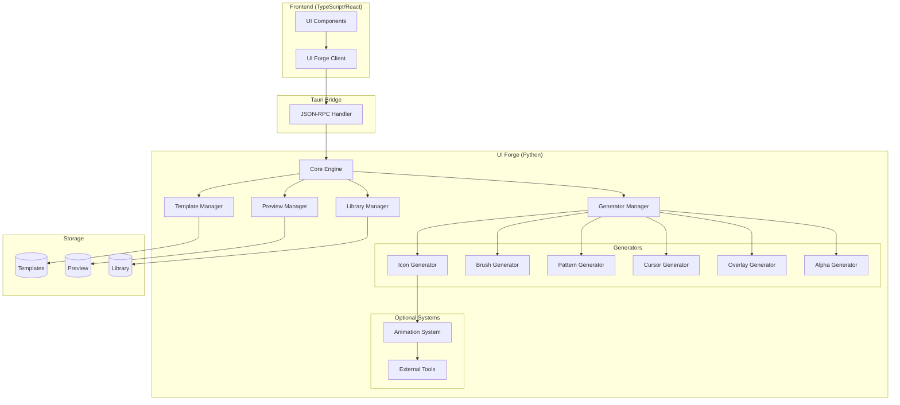

# Design Document: UI Forge

## Overview

UI Forge is a Python-based procedural UI asset generation system for the K_OS DCC Suite. It generates icons, brushes, patterns, cursors, and overlays through data-driven templates and procedural algorithms, with a preview-approval workflow before production integration.

### Design Goals

1. **Data-Driven Generation**: All visual properties defined in JSON/YAML templates, zero hardcoded values
2. **Library-First Architecture**: Leverage existing Python ecosystem (Pillow, numpy, cairosvg, svgwrite) over custom implementations
3. **Scalable Performance**: Parallel batch processing for thousands of assets with multiprocessing
4. **Quality Assurance**: Built-in validation, preview workflow, and round-trip testing
5. **Extensibility**: Auto-discovery plugin system for custom generators
6. **Tauri Integration**: JSON-RPC bridge for seamless frontend integration

### Key Features

- **Multi-format output**: PNG, SVG, JPEG, WebP, TIFF with arbitrary dimensions
- **Alpha channel support**: First-class alpha mask generation and compositing
- **Optional animation**: SMIL-based SVG animations and sprite sheet generation
- **Theme support**: Multi-variant generation for light/dark/high-contrast modes
- **External tool integration**: ImageMagick, Inkscape CLI, GIMP batch mode
- **Hot-reload**: Live generator updates without Python sidecar restart

## Architecture

### System Components



### Directory Structure

```
M:\K_OS\src-python\UI\
├── __init__.py                 # Package initialization
├── requirements.txt            # Python dependencies
├── README.md                   # Documentation
├── core.py                     # Core engine and orchestration
├── template_manager.py         # Template parsing and validation
├── generator_manager.py        # Generator discovery and execution
├── preview_manager.py          # Preview workflow and HTML generation
├── library_manager.py          # Asset library organization and indexing
├── tauri_bridge.py            # JSON-RPC decorators and handlers
├── validators.py              # Asset validation and quality checks
├── utils.py                   # Shared utilities
│
├── generators/                # Generator modules (auto-discovered)
│   ├── __init__.py
│   ├── base.py               # Base generator interface
│   ├── icon_generator.py     # Icon generation
│   ├── brush_generator.py    # Brush preview generation
│   ├── pattern_generator.py  # Pattern generation
│   ├── cursor_generator.py   # Cursor generation
│   ├── overlay_generator.py  # Overlay generation
│   └── alpha_generator.py    # Alpha mask generation
│
├── animation/                 # Optional animation system
│   ├── __init__.py
│   ├── motion_library.py     # Motion type implementations
│   ├── svg_animator.py       # SMIL animation generation
│   └── sprite_sheet.py       # Sprite sheet generation
│
├── external/                  # External tool wrappers
│   ├── __init__.py
│   ├── imagemagick.py        # ImageMagick CLI wrapper
│   ├── inkscape.py           # Inkscape CLI wrapper
│   └── gimp.py               # GIMP batch mode wrapper
│
├── templates/                 # Template storage
│   ├── icons/
│   ├── brushes/
│   ├── patterns/
│   ├── cursors/
│   └── overlays/
│
├── preview/                   # Preview staging area
│   └── [timestamp]/
│       ├── assets/
│       └── index.html
│
└── library/                   # Production asset library
    ├── icons/
    ├── brushes/
    ├── patterns/
    ├── cursors/
    ├── overlays/
    ├── index.json            # Library index
    └── metadata/             # Asset metadata files
```

### Technology Stack

**Core Libraries:**
- `Pillow (PIL)`: Image generation and manipulation
- `numpy`: High-performance array operations and GPU-friendly computations
- `svgwrite`: SVG generation with proper structure
- `cairosvg`: SVG to raster conversion
- `pyyaml`: YAML template parsing
- `jsonschema`: Template validation

**Optional Libraries:**
- `scikit-image`: Advanced image processing
- `opencv-python`: Computer vision operations
- `noise`: Perlin/simplex noise generation
- `colorsys`: Color space conversions

**External Tools (optional):**
- ImageMagick: Advanced format conversion and effects
- Inkscape CLI: SVG optimization and rendering
- GIMP: Batch processing for complex operations

### Data Flow

1. **Template Loading**: Template Manager parses JSON/YAML, validates schema
2. **Generator Selection**: Generator Manager selects appropriate generator based on template type
3. **Asset Generation**: Generator creates asset using numpy/Pillow operations
4. **Optional Animation**: Animation System applies motion if requested
5. **Validation**: Validators check output quality (alpha channel, file size, dimensions)
6. **Preview Staging**: Preview Manager stages asset with HTML gallery
7. **Approval**: User reviews and approves/rejects via frontend
8. **Library Integration**: Library Manager moves approved assets to production with metadata

## Components and Interfaces

### Core Engine

**Responsibilities:**
- Orchestrate generation pipeline
- Manage multiprocessing for batch operations
- Handle error recovery and logging
- Coordinate between managers

**Key Methods:**
```python
class UIForgeEngine:
    def generate_asset(self, template: Template) -> GenerationResult
    def batch_generate(self, templates: List[Template], parallel: bool = True) -> List[GenerationResult]
    def regenerate_changed(self, since: datetime) -> List[GenerationResult]
    def get_progress(self, batch_id: str) -> ProgressInfo
```

### Template Manager

**Responsibilities:**
- Parse JSON/YAML templates
- Validate against schema
- Support template inheritance
- Resolve color tokens and references

**Template Schema:**
```python
@dataclass
class Template:
    name: str
    description: str
    generator_type: str  # 'icon', 'brush', 'pattern', 'cursor', 'overlay'
    category: str
    tags: List[str]
    
    # Output configuration
    output_formats: List[str]  # ['png', 'svg', 'webp']
    dimensions: Dict[str, int]  # {'width': 64, 'height': 64}
    aspect_ratio: Optional[str]  # 'fixed', 'free', '16:9'
    
    # Visual properties
    colors: Optional[List[str]]  # Color palette or token references
    theme_variants: Optional[List[str]]  # ['light', 'dark', 'high-contrast']
    
    # Generator-specific parameters
    params: Dict[str, Any]
    
    # Alpha channel configuration
    alpha_mode: str  # 'embedded', 'separate', 'both', 'none'
    alpha_params: Optional[Dict[str, Any]]
    
    # Optional animation
    animation: Optional[AnimationConfig]
    
    # Metadata
    version: str
    parent_template: Optional[str]  # For inheritance
```

**Key Methods:**
```python
class TemplateManager:
    def load_template(self, path: str) -> Template
    def validate_template(self, template: Template) -> ValidationResult
    def resolve_inheritance(self, template: Template) -> Template
    def list_templates(self, category: Optional[str] = None) -> List[Template]
```

### Generator Manager

**Responsibilities:**
- Auto-discover generator modules
- Route templates to appropriate generators
- Manage generator lifecycle
- Support hot-reload

**Base Generator Interface:**
```python
class BaseGenerator(ABC):
    @abstractmethod
    def generate(self, template: Template) -> np.ndarray:
        """Generate asset as numpy array (H, W, C) with RGBA channels"""
        pass
    
    @abstractmethod
    def supported_params(self) -> Dict[str, type]:
        """Return supported parameter schema"""
        pass
    
    def validate_params(self, params: Dict[str, Any]) -> bool:
        """Validate parameters against schema"""
        pass
```

**Key Methods:**
```python
class GeneratorManager:
    def discover_generators(self) -> Dict[str, Type[BaseGenerator]]
    def get_generator(self, generator_type: str) -> BaseGenerator
    def reload_generator(self, generator_type: str) -> None
    def list_generators(self) -> List[GeneratorInfo]
```

### Icon Generator

**Capabilities:**
- Geometric primitives (circles, rectangles, polygons, paths)
- Layering with blend modes (normal, multiply, screen, overlay, add)
- Gradients (linear, radial, angular)
- Stroke and fill operations
- Anti-aliasing via supersampling
- SVG path generation with optimization

**Parameter Schema:**
```python
@dataclass
class IconParams:
    layers: List[Layer]
    background: Optional[Color]
    padding: int  # Safe area margin in pixels
    antialias_factor: int = 2  # Supersampling multiplier

@dataclass
class Layer:
    type: str  # 'circle', 'rect', 'polygon', 'path'
    geometry: Dict[str, Any]
    fill: Optional[FillStyle]
    stroke: Optional[StrokeStyle]
    blend_mode: str = 'normal'
    opacity: float = 1.0

@dataclass
class FillStyle:
    type: str  # 'solid', 'linear_gradient', 'radial_gradient', 'angular_gradient'
    colors: List[Color]
    stops: Optional[List[float]]  # For gradients
    angle: Optional[float]  # For linear/angular gradients

@dataclass
class StrokeStyle:
    color: Color
    width: float
    cap: str = 'round'  # 'butt', 'round', 'square'
    join: str = 'round'  # 'miter', 'round', 'bevel'
```

**Implementation Strategy:**
- Use numpy arrays for raster operations
- Implement custom anti-aliased drawing primitives
- Generate SVG via svgwrite for vector output
- Support both raster-first and vector-first workflows

### Brush Generator

**Capabilities:**
- Render representative brush strokes
- Support circular, square, custom shapes
- Texture overlay application
- Falloff curve visualization
- Multiple preview sizes (thumbnail and detail)

**Parameter Schema:**
```python
@dataclass
class BrushParams:
    shape: str  # 'circular', 'square', 'custom'
    size: int
    hardness: float  # 0.0 (soft) to 1.0 (hard)
    spacing: float
    texture: Optional[str]  # Path to texture image
    falloff_curve: str  # 'linear', 'smooth', 'sharp', 'custom'
    custom_curve: Optional[List[float]]  # For custom falloff
    stroke_preview: bool = True  # Render full stroke vs single stamp
```

### Alpha Generator

**Capabilities:**
- Gradient alpha (linear, radial, angular falloffs)
- Shape-based alpha with feathering
- Procedural patterns (Perlin noise, Voronoi, cellular)
- Alpha from luminance conversion
- Alpha from edge detection
- Alpha channel operations (invert, multiply, screen)

**Parameter Schema:**
```python
@dataclass
class AlphaParams:
    type: str  # 'gradient', 'shape', 'procedural', 'luminance', 'edge'
    
    # Gradient alpha
    gradient_type: Optional[str]  # 'linear', 'radial', 'angular'
    gradient_angle: Optional[float]
    gradient_center: Optional[Tuple[float, float]]
    
    # Shape alpha
    shape: Optional[str]  # 'circle', 'rect', 'polygon'
    feather: Optional[float]  # Feathering radius
    
    # Procedural alpha
    noise_type: Optional[str]  # 'perlin', 'simplex', 'voronoi', 'cellular'
    noise_scale: Optional[float]
    noise_octaves: Optional[int]
    
    # Operations
    invert: bool = False
    blend_mode: Optional[str]  # For compositing multiple alpha sources
```

### Animation System (Optional)

**Motion Library:**
Inspired by ProceduralMotion.ts, supports:
- **Classics**: orbit, float, pulse, shake, elastic
- **Intermediate**: pendulum, wobble, figure8, heartbeat, glitch
- **Physics**: bounce, tumble, strobe, corkscrew, shiver, sway
- **Complex**: lissajous, flip, tremor, scan, warp, drift

**Animation Configuration:**
```python
@dataclass
class AnimationConfig:
    enabled: bool
    motion_types: List[str]  # Can combine multiple motions
    duration: float  # Seconds
    fps: int = 30
    loop: bool = True
    easing: str = 'linear'  # 'linear', 'ease-in', 'ease-out', 'ease-in-out'
    
    # Motion-specific parameters
    motion_params: Dict[str, Dict[str, Any]]
    
    # Output configuration
    output_type: str  # 'svg_smil', 'sprite_sheet', 'both'
    sprite_sheet_layout: Optional[str]  # 'horizontal', 'vertical', 'grid'
```

**Implementation:**
- Generate keyframes by sampling motion functions
- For SVG: Generate SMIL `<animate>` and `<animateTransform>` elements
- For sprite sheets: Render each frame to numpy array, composite into grid
- Include metadata JSON with frame count, duration, loop info

### Preview Manager

**Responsibilities:**
- Stage generated assets in timestamped directories
- Generate HTML preview gallery with thumbnails
- Display asset metadata and validation results
- Support batch approval/rejection
- Handle feedback notes

**Preview Gallery Features:**
- Grid layout with hover zoom
- Alpha channel visualization (checkerboard background)
- Metadata display (dimensions, file size, generator used)
- Approve/reject buttons with keyboard shortcuts
- Filter by category, validation status
- Animation preview for animated assets

**Key Methods:**
```python
class PreviewManager:
    def stage_asset(self, asset: GeneratedAsset, template: Template) -> PreviewEntry
    def generate_gallery(self, preview_dir: str) -> str  # Returns HTML path
    def approve_assets(self, asset_ids: List[str]) -> None
    def reject_assets(self, asset_ids: List[str], feedback: Optional[str]) -> None
    def get_preview_status(self, preview_id: str) -> PreviewStatus
```

### Library Manager

**Responsibilities:**
- Organize approved assets by category, resolution, theme
- Generate and maintain library index
- Create asset metadata files
- Support semantic naming conventions
- Handle library queries and searches

**Asset Metadata:**
```python
@dataclass
class AssetMetadata:
    name: str
    description: str
    category: str
    tags: List[str]
    
    # Generation info
    generator: str
    template_source: str
    generation_timestamp: datetime
    
    # Technical properties
    dimensions: Tuple[int, int]
    format: str
    file_size: int
    color_mode: str  # 'RGBA', 'RGB', 'L'
    has_alpha: bool
    dpi: int
    
    # Theme info
    theme_variant: Optional[str]
    theme_group: Optional[str]  # Links related theme variants
    
    # Animation info
    is_animated: bool
    animation_type: Optional[str]
    frame_count: Optional[int]
    
    # Usage info
    usage_count: int = 0
    last_used: Optional[datetime] = None
```

**Library Index Structure:**
```json
{
  "version": "1.0",
  "generated": "2024-01-15T10:30:00Z",
  "total_assets": 1247,
  "categories": {
    "icons": {
      "count": 856,
      "subcategories": ["toolbar", "menu", "status"],
      "resolutions": [16, 24, 32, 48, 64, 128, 256]
    },
    "brushes": {
      "count": 234,
      "subcategories": ["sculpt", "paint", "texture"]
    }
  },
  "assets": [
    {
      "id": "icon-sculpt-clay-64",
      "path": "library/icons/toolbar/sculpt-clay-64.png",
      "metadata_path": "library/metadata/icon-sculpt-clay-64.json",
      "thumbnail": "library/icons/toolbar/.thumbs/sculpt-clay-64.png"
    }
  ],
  "theme_groups": {
    "sculpt-clay": ["icon-sculpt-clay-64-light", "icon-sculpt-clay-64-dark"]
  }
}
```

### Tauri Bridge

**JSON-RPC Interface:**
```python
from tauri_bridge import register

@register("ui_forge.generate_asset")
async def generate_asset_rpc(template_data: dict) -> dict:
    """Generate single asset from template data"""
    template = TemplateManager.parse_dict(template_data)
    result = engine.generate_asset(template)
    return result.to_dict()

@register("ui_forge.batch_generate")
async def batch_generate_rpc(template_paths: List[str]) -> dict:
    """Generate multiple assets in parallel"""
    batch_id = engine.start_batch(template_paths)
    return {"batch_id": batch_id, "status": "started"}

@register("ui_forge.get_progress")
async def get_progress_rpc(batch_id: str) -> dict:
    """Get batch generation progress"""
    progress = engine.get_progress(batch_id)
    return progress.to_dict()

@register("ui_forge.list_templates")
async def list_templates_rpc(category: Optional[str] = None) -> List[dict]:
    """List available templates"""
    templates = template_manager.list_templates(category)
    return [t.to_dict() for t in templates]

@register("ui_forge.approve_preview")
async def approve_preview_rpc(asset_ids: List[str]) -> dict:
    """Approve preview assets and move to library"""
    preview_manager.approve_assets(asset_ids)
    return {"approved": len(asset_ids)}

@register("ui_forge.get_library_index")
async def get_library_index_rpc() -> dict:
    """Get library index"""
    return library_manager.get_index()

@register("ui_forge.reload_generator")
async def reload_generator_rpc(generator_type: str) -> dict:
    """Hot-reload generator module"""
    generator_manager.reload_generator(generator_type)
    return {"status": "reloaded", "generator": generator_type}
```

### Validators

**Validation Checks:**
1. **Alpha Channel Validation**: Verify PNG/WebP have valid alpha, check for premultiplied alpha issues
2. **SVG Validation**: Parse SVG, check viewBox, validate paths, ensure no rendering glitches
3. **Dimension Validation**: Verify output matches template specifications
4. **File Size Validation**: Check against limits (icons < 100KB, brushes < 500KB, SVG < 50KB)
5. **Color Mode Validation**: Verify RGBA for transparency, RGB for opaque
6. **DPI Validation**: Ensure 72 DPI for screen assets
7. **Duplicate Detection**: Perceptual hashing to detect duplicates
8. **Quality Metrics**: Check for artifacts, banding, aliasing issues

**Validation Result:**
```python
@dataclass
class ValidationResult:
    passed: bool
    checks: Dict[str, bool]  # Check name -> pass/fail
    errors: List[str]
    warnings: List[str]
    metrics: Dict[str, Any]  # Quality metrics
```

## Data Models

### Template Inheritance

Templates support inheritance for shared configurations:

```yaml
# base_icon.yaml
name: "Base Icon Template"
generator_type: "icon"
dimensions:
  width: 64
  height: 64
output_formats: ["png", "svg"]
params:
  padding: 8
  antialias_factor: 2
  background: null

# sculpt_icon.yaml
parent_template: "base_icon.yaml"
name: "Sculpt Tool Icon"
category: "toolbar"
tags: ["sculpt", "tool"]
params:
  layers:
    - type: "circle"
      geometry: {cx: 32, cy: 32, r: 24}
      fill: {type: "solid", colors: ["$primary"]}
```

### Color Token System

Templates reference color tokens that resolve to theme-specific values:

```python
COLOR_TOKENS = {
    "light": {
        "$primary": "#2563eb",
        "$secondary": "#64748b",
        "$accent": "#f59e0b",
        "$background": "#ffffff",
        "$foreground": "#0f172a"
    },
    "dark": {
        "$primary": "#3b82f6",
        "$secondary": "#94a3b8",
        "$accent": "#fbbf24",
        "$background": "#0f172a",
        "$foreground": "#f1f5f9"
    }
}
```

### Generation Result

```python
@dataclass
class GenerationResult:
    success: bool
    asset_id: str
    template_name: str
    output_paths: Dict[str, str]  # format -> file path
    metadata: AssetMetadata
    validation: ValidationResult
    generation_time: float  # Seconds
    error: Optional[str] = None
    warnings: List[str] = field(default_factory=list)
```

### Batch Progress

```python
@dataclass
class ProgressInfo:
    batch_id: str
    total: int
    completed: int
    failed: int
    current_asset: Optional[str]
    percent_complete: float
    estimated_time_remaining: Optional[float]  # Seconds
    errors: List[Tuple[str, str]]  # (asset_name, error_message)
```

### External Tool Integration

```python
class ExternalTool(ABC):
    @abstractmethod
    def is_available(self) -> bool:
        """Check if tool is installed and accessible"""
        pass
    
    @abstractmethod
    def get_version(self) -> str:
        """Get tool version"""
        pass
    
    @abstractmethod
    def execute(self, command: List[str], input_path: str, output_path: str) -> bool:
        """Execute tool command"""
        pass

class ImageMagickTool(ExternalTool):
    def convert(self, input_path: str, output_path: str, options: Dict[str, Any]) -> bool:
        """Convert image with ImageMagick"""
        pass
    
    def composite(self, base: str, overlay: str, output: str, mode: str) -> bool:
        """Composite images"""
        pass

class InkscapeTool(ExternalTool):
    def optimize_svg(self, input_path: str, output_path: str) -> bool:
        """Optimize SVG file"""
        pass
    
    def svg_to_png(self, svg_path: str, png_path: str, width: int, height: int) -> bool:
        """Render SVG to PNG"""
        pass
```
