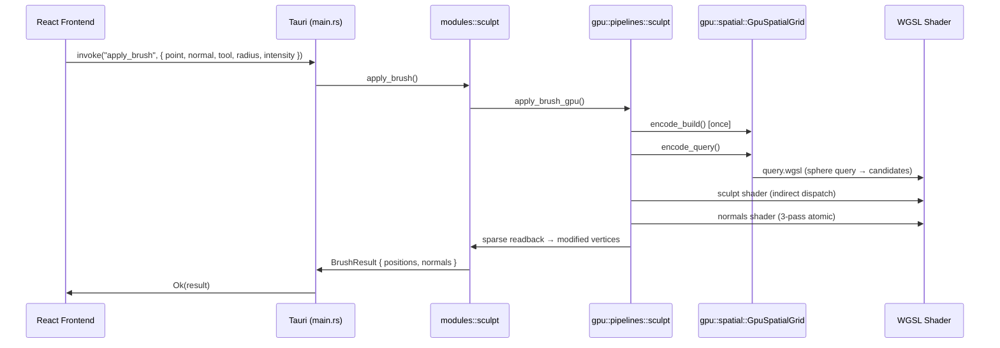

# src-tauri Architecture

The Rust backend for K_OS. This powers **both** the Tauri desktop shell and the sidecar Bevy 3D viewport.

## 📂 Directory Structure

```
src-tauri/
├── src/
│   ├── gpu/                 # WGPU Compute (shared by Tauri + Bevy)
│   │   ├── device.rs        # Singleton GPU device (wgpu::Device + Queue)
│   │   ├── pipelines/       # Compute shaders (sculpt, normals, pbr, subdivide, dynamesh)
│   │   ├── spatial/         # GPU Spatial Grid (O(1) radius queries)
│   │   ├── raycast/         # GPU BVH Raycast (Linear BVH + stackless traversal)
│   │   ├── svt/             # Sparse Virtual Textures (16K textures, 4K VRAM)
│   │   ├── brush/           # Alpha texture pool (universal brush alphas)
│   │   └── atlas/           # GPU UV atlas packing
│   │
│   ├── modules/             # Business Logic (CPU-side orchestration)
│   │   ├── sculpting/       # Brush kernels, mask, raycast, dynamics
│   │   ├── mesh/            # Subdivide, remesh, optimize, primitive_gen
│   │   ├── simulation/      # Physics (Rapier3D), Fluid (SPH), Quantum
│   │   ├── textures/        # Procedural, PBR generator, noise brush
│   │   ├── core/            # Linalg (CG solver), mesh_state, bridge
│   │   ├── rig/             # Skeleton, IK, skinning
│   │   └── atlas/           # UV unwrapping (xatlas)
│   │
│   ├── bevy/                # Bevy Engine (3D Viewport)
│   │   ├── main.rs          # Bevy app entry point
│   │   ├── tools/           # sculpt.rs, paint.rs, etc.
│   │   ├── ui/              # egui panels
│   │   └── viewport/        # Camera, selection, gizmos
│   │
│   ├── main.rs              # Tauri entry point (registers all commands)
│   ├── leash.rs             # IPC bridge (UDP sync with Bevy window)
│   └── python_bridge.rs     # Python sidecar launcher
│
└── Cargo.toml
```

---

## 🚀 GPU Infrastructure (`src/gpu/`)

All WGPU compute is centralized here. Both binaries (Tauri and Bevy) share these pipelines.

### Device (`device.rs`)

```rust
static GPU_DEVICE: OnceCell<Mutex<GpuComputeDevice>> = OnceCell::new();

pub struct GpuComputeDevice {
    pub device: wgpu::Device,
    pub queue: wgpu::Queue,
    pub adapter_info: wgpu::AdapterInfo,
}
```

- **Lazy Singleton**: Initialized on first GPU operation via `get_or_init_blocking()`.
- **Thread-Safe**: Uses `parking_lot::Mutex` for concurrent access.

---

### Pipelines (`pipelines/`)

| File | Pipeline | Purpose | WGSL Shaders |
|------|----------|---------|--------------|
| `sculpt.rs` | `GpuSculptCompute` | Brush deformation (Clay, Inflate, Flatten, etc.) | Embedded + external `.wgsl` |
| `normals.rs` | `GpuNormalCompute` | 3-pass incremental normal recalc | Fixed-point atomic accumulation |
| `subdivide.rs` | `GpuSubdivideEngine` | Loop subdivision | 4-pass (edge detect, smooth, edge vertex, tri gen) |
| `pbr.rs` | `GpuPbrEngine` | Texture baking (AO, curvature, normals) | Multi-pass image processing |
| `dynamesh.rs` | `GpuDynameshEngine` | Marching cubes remeshing | Isosurface extraction |

#### Sculpt Pipeline (`GpuSculptCompute`)

```rust
pub struct GpuSculptCompute {
    pipeline_all: wgpu::ComputePipeline,       // All vertices
    pipeline_candidates: wgpu::ComputePipeline, // Candidate-only
    pipeline_compact: wgpu::ComputePipeline,    // Sparse readback
    alpha_bind_group_layout: wgpu::BindGroupLayout,
    dummy_alpha_bind_group: wgpu::BindGroup,
    ...
}
```

**Key Methods:**

- `encode_apply_brush_all()` — Fallback: process all vertices
- `encode_apply_brush_indirect()` — **Primary**: Uses indirect dispatch from spatial grid
- `encode_compact_positions()` — Sparse readback (only modified vertices)

**WGSL Brush Operations (`SculptOp`):**

```
Clay, Inflate, Flatten, Pinch, Crease, Draw, Layer, Dam, HPolish, Rake,
SnakeHook, ClayStrips, Melt, Gravity, Twist, Repel, Magnet, Blob, Spike,
Crystallize, Terrace, Terra, Magma, Thermal, Erode, Growth, Bloom, Elastic,
VectorField, Hologram, Attractor
```

---

### Spatial Grid (`spatial/grid.rs`)

GPU-resident spatial hash grid for O(1) radius queries.

```rust
pub struct GpuSpatialGrid {
    pub cell_counts: wgpu::Buffer,
    pub cell_offsets: wgpu::Buffer,
    pub vertex_indices: wgpu::Buffer,
    pub candidates_buffer: wgpu::Buffer,  // Query output
    pub indirect_buffer: wgpu::Buffer,    // Indirect dispatch args
    ...
}
```

#### Build Process (4 passes)

1. **Clear** — Zero cell counts
2. **Count** — Atomic increment for each vertex's cell
3. **Prefix Sum** — Compute offsets
4. **Scatter** — Write vertex indices to sorted array

#### Query Process (3 passes)

1. **Clear** — Zero candidate count
2. **Sphere Query** — Test vertices against brush sphere
3. **Write Indirect** — Write workgroup count to `indirect_buffer`

#### Lazy Build Optimization

```rust
// Grid is built ONCE per session (topology is static)
if !mesh.gpu_grid_built {
    gpu_grid.encode_build(device, &mut encoder, &positions_buffer);
    mesh.gpu_grid_built = true;
}
// Query runs every stroke (cheap, 3 passes)
gpu_grid.encode_query(device, &mut encoder, &positions_buffer);
```

---

### Indirect Dispatch

The spatial grid writes directly to an indirect buffer:

```wgsl
// In query.wgsl
atomicStore(&indirect_args[0], (candidate_count + 255) / 256);  // workgroup_x
atomicStore(&indirect_args[1], 1);  // workgroup_y
atomicStore(&indirect_args[2], 1);  // workgroup_z
```

Then the sculpt shader uses:

```rust
pass.dispatch_workgroups_indirect(&indirect_buffer, 0);
```

**Zero CPU Stalls:** The GPU decides how many workgroups to launch without CPU readback.

---

### BVH Raycast (`raycast/bvh.rs`)

Linear BVH (LBVH) with Morton code sorting.

```rust
pub struct GpuBvhRaycast {
    pipeline: wgpu::ComputePipeline,
    ray_buffer: wgpu::Buffer,
    hit_buffer: wgpu::Buffer,
    staging_buffer: wgpu::Buffer,
}

pub struct BvhNode {       // 32 bytes, cache-aligned
    aabb_min: [f32; 3],
    left_or_first: u32,    // Child index OR primitive index
    aabb_max: [f32; 3],
    right_or_count: u32,   // Child index OR (count | 0x80000000)
}
```

**Traversal:** Stack-based (32 levels), front-to-back ordering.

---

### SVT Engine (`svt/engine.rs`)

Sparse Virtual Textures for 16K texture painting with 4K VRAM footprint.

```rust
pub const TILE_SIZE: u32 = 128;
pub const VIRTUAL_SIZE: u32 = 16384;   // 16K virtual
pub const PHYSICAL_SIZE: u32 = 4096;   // 4K physical cache

pub struct SvtEngine {
    pub page_table_texture: wgpu::Texture,  // 128×128 (Rg32Uint)
    pub physical_texture: wgpu::Texture,    // 4096×4096 (Rgba8Unorm)
    ...
}
```

**Lookup:** Virtual → Page Table → Physical offset → Sample.

---

### Alpha Pool (`brush/alpha_pool.rs`)

Global GPU texture cache for brush alphas.

```rust
pub static ALPHA_POOL: Lazy<RwLock<AlphaTexturePool>> = Lazy::new(...);

pub struct AlphaTexture {
    pub texture: wgpu::Texture,
    pub view: wgpu::TextureView,
    pub sampler: wgpu::Sampler,
    pub bind_group: wgpu::BindGroup,
}
```

Alphas are R8Unorm grayscale textures loaded from files or base64.

---

## 🔌 Modules (`src/modules/`)

CPU-side business logic that orchestrates GPU compute.

### Sculpting (`sculpting/`)

| File | Purpose |
|------|---------|
| `sculpt.rs` | Main brush application, mesh registry, GPU integration |
| `mask.rs` | Vertex masking system |
| `raycast.rs` | BVH raycast interface |
| `brush_dynamics.rs` | Stroke interpolation, symmetry |
| `brushes/` | New brush implementations sandbox |

#### Key Data Structures

```rust
pub struct SculptMesh {
    positions: Vec<f32>,
    normals: Vec<f32>,
    indices: Vec<u32>,
    grid: SpatialGrid,              // CPU spatial grid
    topology: MeshTopology,          // Vertex-face adjacency
    kdtree: KdTree<f32, u64, 3, 256, u16>,
    
    // GPU State
    gpu_buffers: Option<Box<dyn Any>>,
    gpu_spatial_grid: Option<GpuSpatialGrid>,
    gpu_grid_built: bool,
    sparse_readback: Option<SparseReadback>,
}
```

#### GPU Path Flow

```
apply_brush() Tauri Command
    ↓
apply_brush_gpu()
    ↓
1. Lazy-init GpuMeshBuffers + GpuSpatialGrid
2. encode_build() [once] + encode_query() [every stroke]
3. encode_apply_brush_indirect() [indirect dispatch]
4. recalculate_normals_gpu() [3-pass fixed-point]
5. encode_compact_positions() [sparse readback]
6. Read staging buffer → Update CPU mesh
```

---

### Mesh (`mesh/`)

| File | Purpose |
|------|---------|
| `subdivide.rs` | CPU Loop subdivision |
| `remesh.rs` | Marching cubes remeshing |
| `optimize.rs` | Mesh simplification, LOD generation |
| `primitive_gen.rs` | 25+ procedural primitives (QuadSphere, Torus, Head, etc.) |

---

### Simulation (`simulation/`)

| File | Purpose |
|------|---------|
| `physics.rs` | Rapier3D rigid body physics |
| `fluid.rs` | Salva3D SPH fluid simulation |
| `quantum.rs` | KQuantum particle physics (attractors, N-body) |

---

### Core (`core/`)

| File | Purpose |
|------|---------|
| `linalg.rs` | Sparse matrix CG solver (for physics/deformation) |
| `mesh_state.rs` | Shared mesh registry across apps |
| `bridge.rs` | Cross-module communication |

---

## 🎮 Bevy Integration (`src/bevy/`)

The Bevy sidecar renders the 3D viewport.

### Entry Point (`main.rs`)

```rust
fn main() {
    App::new()
        .add_plugins(DefaultPlugins.set(WindowPlugin { ... }))
        .add_plugins(EguiPlugin::default())
        .add_plugins(SculptPlugin)
        .insert_resource(LeashReceiver { dog })
        .add_systems(Update, follow_master)
        .run();
}
```

### Sculpt Tools (`tools/sculpt.rs`)

```rust
#[derive(Resource)]
pub struct BevyGpuSculpt {
    engine: Option<GpuSculptCompute>,
    mesh_buffers: HashMap<u64, GpuMeshBuffers>,
}

// Systems
fn local_mouse_brush_input_system(...) { ... }
fn apply_brush_system(...) { ... }
fn rebuild_bvh_system(...) { ... }
fn handle_undo_redo(...) { ... }
```

---

## 🔗 IPC: The Leash (`leash.rs`)

UDP fire-and-forget protocol syncing Tauri ↔ Bevy.

```rust
pub enum LeashCommand {
    Follow { rect: (i32, i32, u32, u32) },
    SetPosition { x: f32, y: f32, z: f32 },
    SetRotation { x: f32, y: f32, z: f32, w: f32 },
    SpawnModel { path: String },
    ...
}
```

**Window Sync:** Bevy window follows Tauri window position/size.

---

## 🔄 Data Flow: Sculpt Brush Stroke



---

## 🛠️ Tauri Commands

All commands are registered in `main.rs`:

```rust
tauri::generate_handler![
    // Sculpting
    modules::sculpt::init_sculpt_mesh,
    modules::sculpt::apply_brush,
    modules::sculpt::update_sculpt_positions,
    
    // GPU Raycast
    gpu::raycast::gpu_raycast_init,
    gpu::raycast::gpu_raycast,
    
    // Mesh
    modules::mesh::subdivide_mesh,
    modules::mesh::spawn_primitive,
    
    // Physics
    modules::simulation::create_physics_world,
    modules::simulation::step_physics,
    
    // Alpha Pool
    gpu::brush::load_alpha_from_file,
    gpu::brush::list_alphas,
    ...
]
```

---

## ⚡ Performance Optimizations

| Technique | Location | Benefit |
|-----------|----------|---------|
| **Lazy Grid Build** | `sculpt.rs` | Grid built once, not per-stroke |
| **Indirect Dispatch** | `spatial/grid.rs` | GPU decides workgroup count |
| **Sparse Readback** | `sculpt.rs` | Only read modified vertices |
| **Double-Buffered Staging** | `sculpt.rs` | Async CPU/GPU overlap |
| **Fixed-Point Atomics** | `normals.rs` | GPU atomic float accumulation |
| **Morton-Sorted BVH** | `raycast/bvh.rs` | Cache-friendly traversal |

---

## 📦 Key Dependencies

| Crate | Version | Purpose |
|-------|---------|---------|
| `wgpu` | 24.0 | GPU compute |
| `bevy` | 0.17 | 3D engine |
| `tauri` | 2.x | Desktop shell |
| `rapier3d` | 0.23 | Physics |
| `kiddo` | 4.x | KD-tree |
| `nalgebra` / `glam` | — | Math |
| `rayon` | 1.x | Parallel CPU |
| `bytemuck` | 1.x | Zero-copy casting |
