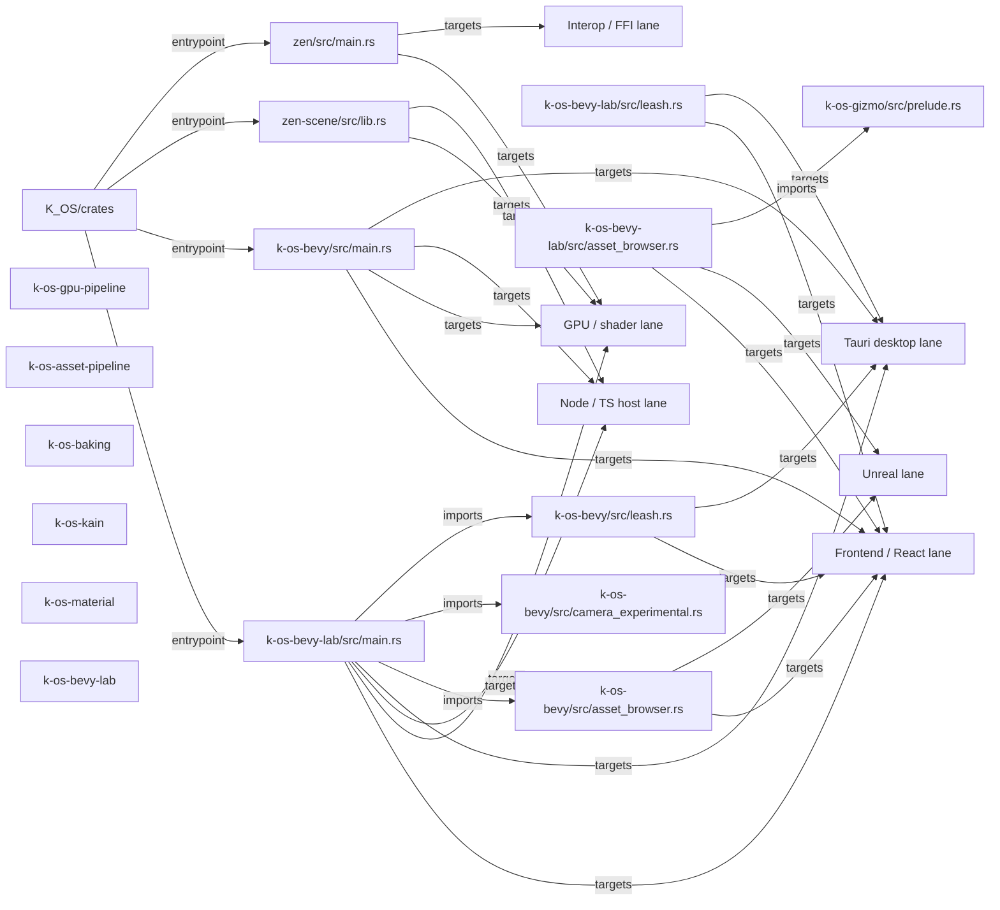

# K_OS/crates Flow Map

- Directory: `M:\K_OS\crates`
- Generated (UTC): `2026-03-27T20:00:27.321994+00:00`
- Languages: `JSON, Markdown, Rust, TOML`
- Entry files: `zen/src/main.rs, k-os-bevy/src/main.rs, k-os-bevy-lab/src/main.rs, zen-scene/src/lib.rs`
- Manifests: `cargo, cargo, cargo, cargo, cargo, cargo, cargo, cargo, cargo, cargo, cargo, cargo`
- Additional manifests omitted from markdown: `37`

## Manifest Summary
- `k-os-animation/Cargo.toml`: cargo, deps: 1
- `k-os-asset-pipeline/Cargo.toml`: cargo, deps: 12
- `k-os-baking/Cargo.toml`: cargo, deps: 13
- `k-os-bevy/Cargo.toml`: cargo, deps: 29
- `k-os-bevy-lab/Cargo.toml`: cargo, deps: 30
- `k-os-brushes/Cargo.toml`: cargo, deps: 12
- `k-os-config/Cargo.toml`: cargo, deps: 11
- `k-os-eval/Cargo.toml`: cargo, deps: 9
- `k-os-external/Cargo.toml`: cargo, deps: 4
- `k-os-game-ai/Cargo.toml`: cargo, deps: 3
- `k-os-game-camera/Cargo.toml`: cargo, deps: 3
- `k-os-game-framework/Cargo.toml`: cargo, deps: 3

## Edge Legend
- `entrypoint`: root directory to a main entry file or manifest.
- `supports`: root or file contributes to a lane or helper surface.
- `imports`: file-to-file or file-to-subdir reference discovered from source text.
- `targets`: file participates in a platform lane such as Tauri, Unreal, GPU, or Python.
- `emits sidecar`: file materializes a named artifact or sidecar bundle.
