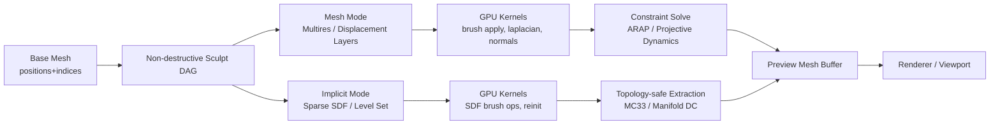
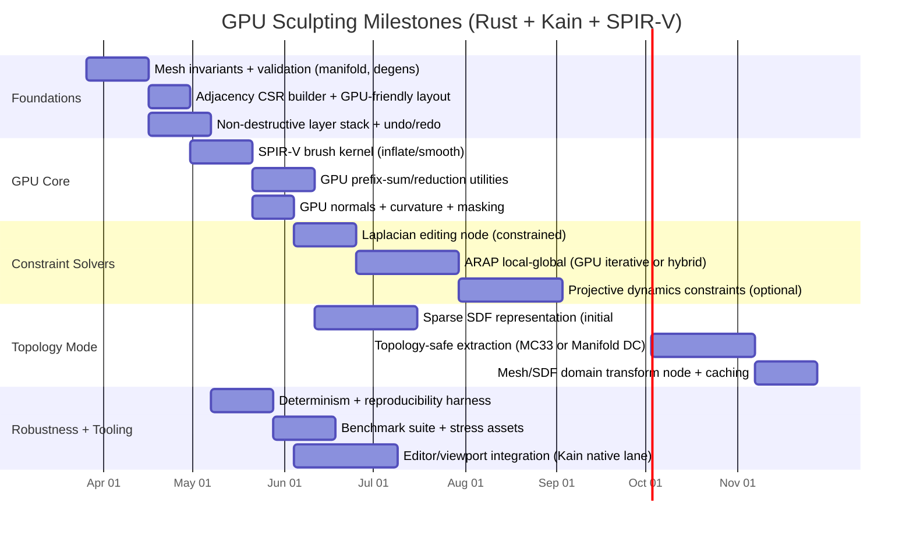

# GPU Sculpting with Mesh Integrity in Rust and Kain

## Executive summary

GPU sculpting that is **non-destructive** and “**more robust than ZBrush**” (interpreted as *deterministic, topology-safe when demanded, resistant to degeneracy/self-intersections, crash-tolerant via validation + recovery, and scalable to very large assets*) is best approached as a **hybrid system** rather than one single representation. The most reliable architecture is to keep a **stable “authoring topology”** (for UVs, rigging, predictable edits) while optionally maintaining a **volumetric/implicit “escape hatch”** for topology-changing operations (cuts, merges, filling holes) using a topology-preserving isosurface extraction method.

Within the constraints you gave (SPIR-V shaders allowed; target API unspecified; Kain interop unspecified), the strongest design is:

1. **Non-destructive sculpt stack** as a first-class DAG: base mesh → (optional remesh / reproject nodes) → multiple additive layers (vector displacement, normal displacement, masks, noise) + constraint solvers (ARAP / projective dynamics) + smoothing operators. This aligns with Kain’s overall “toolchain + runtime stack + multi-target + GPU artifacts + runtime bridges” design philosophy. fileciteturn19file0L1-L1

2. **Two canonical surface modes** (switchable per operation, both GPU-accelerated):
   - **Mesh + multires / displacement layers** for day-to-day sculpting (preserve vertex/face identity and topology; robust with constraints).
   - **Sparse SDF / implicit** (OpenVDB-like conceptually) for topology edits and remesh events, paired with **topology-preserving meshing** (e.g., Marching Cubes 33 / Manifold Dual Contouring) to preserve manifoldness and avoid cracks. citeturn5search5turn10search6turn10search0

3. **GPU dispatch via SPIR-V compute** (Vulkan-first, but portable): Kain already supports SPIR-V as a compile target and describes an artifact-bundling workflow (`gpu-artifacts`) and a Vulkan compute runtime executor (`kain-gpu-runtime`) designed to execute authored compute payloads. fileciteturn19file0L1-L1

4. **Mesh integrity preservation** becomes an explicit set of invariants + checks:
   - local deformation that preserves shape (ARAP/projective-dynamics style energies),
   - smoothing that avoids shrinkage (Taubin),
   - projection back to a manifold (either the original surface or the SDF iso-surface),
   - topology-safe remeshing criteria and error metrics (QEM for LOD; isotropic/field-aligned for quality). citeturn0search0turn6search1turn5search1turn5search3

Assumptions (explicit, per your request): **Kain interop model unspecified**, **target GPU API unspecified**, **mesh types unspecified**. Where choices differ by API or mesh representation, this report describes design forks rather than assuming one environment.

## What godkain already provides

The `ephemara/godkain` repository is already unusually aligned with what a robust GPU sculpt stack needs: a multi-target toolchain, GPU artifact packaging, runtime execution bridges, and a typed neutral buffer contract.

**SPIR-V-first GPU pipeline and compute plan metadata.** Kain explicitly supports a GPU backend set including **SPIR-V** and describes a GPU artifact bundling story intended to package SPIR-V binaries along with reflection JSON and host helpers. fileciteturn19file0L1-L1 The same README describes **authored compute plans** embedded in shader compile-time metadata (workgroup size, dispatch size, buffer/tensor bindings, etc.), emphasizing that this metadata is “compiler-owned truth,” intended for runtime consumption rather than host heuristics. fileciteturn19file0L1-L1

**Runtime-facing Vulkan compute executor.** The repo identifies `crates/kain-gpu-runtime` as a **Vulkan compute executor** that “executes authored compute payloads” as an “execution bridge.” fileciteturn19file0L1-L1 The `gpu_compute_surface_probe` smoke test shows the packaging model around a minimal native UI + viewport + authored compute shader, and lists expected build artifacts (shader bundle JSON, compute residency JSON + binaries, and a GPU runtime DLL). fileciteturn21file0L1-L1

**Neutral shared buffer/image contracts.** `crates/kain-interop` provides a shared buffer/image contract intended to move data across runtimes. fileciteturn11file0L1-L1 In the generated runtime contract for the GPU compute smoke, Kain explicitly calls out capabilities like `interop.shared-buffer` and describes compute shaders as working over GPU-visible buffers with tensor/storage-buffer semantics and explicit compute-plan metadata. fileciteturn22file0L1-L1

**Mesh materialization and explicit ownership semantics.** The DCC stdlib wrappers (`std::dcc`) explicitly distinguish **shared (zero-copy) backing** vs **owned detached copies** and surface the resulting ownership via info APIs. fileciteturn13file0L1-L1 This is a key lever for *non-destructive* sculpting: you can keep a base mesh owned/immutable and keep edits as separate layers/buffers, while still allowing “shared” views for interactive previews when safe. The DCC mesh wrapper shows the public Kain-level API calls for accessing and mutating vertices/faces. fileciteturn14file0L1-L1 Underneath, the Python bridge defines a `KainNativeGeometry` that supports vertex buffers and optional index buffers, with shape validation (vertices commonly expected as `[N, 2|3|4]`), and explicit shared-versus-owned materialization modes. fileciteturn16file0L1-L1

**Known risk area in-repo that impacts “robustness.”** The repo’s March 22, 2026 architecture review calls the GPU pipeline “transitional,” noting that some execution semantics (e.g., raw-native viewport compute state) may still be a placeholder rather than a deeply integrated SPIR-V → scene buffer pipeline. fileciteturn23file0L1-L1 For your sculpting effort, this implies you should plan for early milestones that prove correctness in isolation (compute kernels + buffer contracts + validation) before deep editor integration.

## Sculpting representations and state of the art

“GPU sculpting while preserving mesh integrity” is fundamentally about choosing *where truth lives* (mesh, volume, or hybrid) and *how edits are accumulated* (destructive overwrite vs non-destructive layers/ops). Below is a state-of-the-art view of the methods you listed (voxel, multires, dynamic remeshing, displacement, implicit, FEM/ARAP, mass-spring), focused on **topology/detail preservation** and **non-destructive feasibility**.

### Method comparison focused on mesh integrity and non-destructive edits

| Method family | Canonical representation | Topology changes | Mesh integrity strengths | Failure modes for integrity | Non-destructive fit | GPU fit notes |
|---|---|---|---|---|---|---|
| Multires + displacement layers | Base mesh + hierarchical refinement + detail encoding | Typically **no** (topology stable) | Preserves vertex identity; detail can be preserved through deformation (multires editing is explicitly about preserving high-frequency detail) citeturn5search4 | Limited by base topology; can cause stretching if base mesh is poorly parameterized; needs good solvers/constraints | **Excellent**: layers + masks + reorderable ops; can store deltas per level | Great for per-vertex compute; harder when solving global systems unless iterative GPU solver |
| Displacement maps (scalar or vector) | 2D texture(s) + base subdiv surface | No | Decouples high-res detail from mesh topology; vector displacement can represent arbitrary-direction detail better than normal-only displacement citeturn17search7turn17search0 | Requires UVs (or another parameterization); UV distortion can warp sculpt details | **Excellent** (stackable textures/layers) | Extremely GPU-friendly; sampling is trivial; but “sculpting into UV space” adds complexity |
| Dynamic remeshing (sculpt topology / dyntopo) | Mutable triangle mesh | Yes | Can add triangles where needed, avoiding extreme stretching | Easy to produce non-manifold edges, flipped triangles, degenerate elements if criteria are poor; correspondence is lost | **Hard**: topology change complicates edit history and layers | GPU remeshing is complex due to dynamic topology and synchronization; often hybrid CPU/GPU |
| Voxel / SDF sculpting | Dense or sparse grid storing signed distance | Yes (naturally) | Topology changes are robust; can guarantee watertight surfaces if extraction is robust | Memory cost; resolution limits detail; extraction can introduce artifacts if not topology-safe | **Excellent**: store CSG/brush ops as field edits; replayable | GPU-friendly for local SDF updates; meshing requires scans/compaction |
| Implicit surfaces (general) | Field function φ(x)=0 (SDF, metaballs, etc.) | Yes | Naturally supports merges/splits; level sets handle topology changes citeturn7search4turn7search1 | Converting to mesh can lose features; maintaining sharp features needs Hermite/QEF methods citeturn0search8 | **Excellent**: op stack on φ | GPU-friendly but meshing is the bottleneck |
| ARAP / Laplacian surface editing | Triangle mesh + constraints + energy minimization | No (primary use) | Strong at detail-preserving deformations; ARAP is a canonical “doesn’t destroy local shape” formulation citeturn0search0turn0search1 | Requires solving linear systems; can oversmooth if constraints wrong; may not prevent self-intersection unless constrained | **Good**: each op is a constrained solve; can be placed in graph | GPU iterative solvers possible; pre-factorization on CPU also common |
| FEM / projective dynamics | Tetra/triangle mesh + energy potentials | Can, but usually no | Robust stable solvers exist for interactive constraints (projective dynamics bridges FEM and PBD) citeturn9search2 | Requires careful material models, time steps, constraint formulation | **Good**: constraints are parameters; ops can be replayed | GPU possible; many implementations do local/global steps |
| Mass-spring / PBD | Particle constraints on surface/volume | Not inherently | Extremely stable and controllable; PBD avoids overshooting issues of explicit force integration citeturn9search0 | Less physically accurate; can cause volume loss unless corrected | **Good**: constraints are easy to store non-destructively | Very GPU-friendly; often local constraint projections |

### A practical “best” recommendation under your constraints

If your primary goal is **preserving mesh integrity** and being **non-destructive**, you get the most reliability by making **multires/displacement + constraint-based deformation** the default sculpt mode, and using **SDF/implicit** only when the artist requests topology change (boolean cuts, fusing parts, hole filling, voxel remesh).

This is consistent with:
- Multires editing’s emphasis on preserving detail via decomposition into base + detail and recomposition after deformation. citeturn5search4  
- The reality that topologically safe isosurface extraction is a specialized domain (e.g., MC33, manifold dual contouring) that you can invoke only when needed, reducing the chance that “every brush stroke” triggers remeshing complexity. citeturn10search6turn10search0

## Algorithms and mathematical formulations

This section gives the principal math you’ll need in implementation: discrete differential operators, PDE-based smoothing, ARAP energies, level sets/SDFs, and remeshing criteria. The emphasis is on formulations that are **stable**, **localizable**, and **suitable for GPU iteration**.

### Discrete Laplacian, smoothing, and curvature flow

Let the mesh be \( (V, E, F) \) with vertex positions \(x_i \in \mathbb{R}^3\). A common discrete Laplace–Beltrami operator uses **cotangent weights**:

\[
(Lx)_i = \sum_{j \in N(i)} w_{ij}(x_j - x_i),
\quad
w_{ij} = \tfrac{1}{2}(\cot \alpha_{ij} + \cot \beta_{ij}),
\]

where \(\alpha_{ij}, \beta_{ij}\) are the angles opposite edge \((i,j)\) in the two incident triangles (or just one angle on boundaries). A unified derivation and discussion of curvature/Laplacian operators for triangulated manifolds is given in Meyer et al. (2003). citeturn6search2

**Explicit Laplacian smoothing** (“umbrella operator” variant):

\[
x_i^{(t+1)} = x_i^{(t)} + \lambda (Lx^{(t)})_i
\]

shrinks surfaces (mean curvature flow behavior), because differential diffusion reduces area/volume.

**Implicit fairing / stable large time steps.** Desbrun et al. describe implicit integration for diffusion and curvature flow, designed for efficiency and stability on irregular meshes. citeturn8search6 A canonical implicit step resembles:

\[
(I - \lambda L)\, x^{(t+1)} = x^{(t)},
\]

which requires solving a sparse linear system for each coordinate (or a block system).

**Taubin smoothing** is a well-known technique to reduce shrinkage by applying two Laplacian smoothing steps with different signs (a low-pass filter construction). Taubin’s paper emphasizes “smoothing without shrinkage.” citeturn6search1

### Laplacian surface editing and detail coordinates

Laplacian Surface Editing (Sorkine et al.) represents local geometric detail via Laplacian (differential) coordinates and solves constrained optimization problems to perform edits while preserving details. citeturn0search1 At a high level:

- Define “detail” vectors \(\delta_i = (Lx)_i\) in the rest state.
- For a deformation with constraints (handles), solve for \(x'\) such that \(Lx' \approx \delta\) while meeting constraints.

This is a common foundation for **non-destructive sculpt nodes** like “Smooth,” “Relax,” “Inflate,” and “Move with detail preservation.”

### ARAP deformation energy and the classic local–global solve

ARAP (Sorkine & Alexa, 2007) is one of the most practical “mesh integrity” energies because it encourages each vertex neighborhood to undergo a rotation (rigid motion) rather than arbitrary shear/stretch. citeturn0search0

Given original positions \(p_i\) and deformed positions \(x_i\), define:

\[
E(\{R_i\}, x) = \sum_{(i,j)\in E} w_{ij}\,\left\| (x_i-x_j) - R_i (p_i-p_j)\right\|^2,
\]

where \(R_i \in SO(3)\) is a per-vertex rotation and \(w_{ij}\) are (e.g.) cotangent weights.

The standard ARAP algorithm alternates:

- **Local step**: for each vertex \(i\), compute \(R_i\) that best matches sets of edge vectors in least-squares sense. This is solved by SVD/polar decomposition of a \(3\times3\) covariance-like matrix.
- **Global step**: solve a sparse linear system for \(x\) (with constraints), because with \(R_i\) fixed the energy is quadratic in \(x\).

This is powerful for sculpting because a brush stroke can be represented as *constraints* (positional or directional) on a local handle set, while ARAP distributes deformation smoothly without tearing.

### Level sets and signed distance fields for topology-safe sculpting

A **signed distance field (SDF)** \(\phi(\mathbf{x})\) is defined so that \(\phi(\mathbf{x})=0\) is the surface; \(\phi < 0\) inside, \(\phi > 0\) outside. The signed distance function and SDF visualization examples are widely used in geometry processing references; an illustrative diagram is available on Wikimedia. citeturn15search2turn15search0

**Topology changes** happen naturally when evolving \(\phi\). Osher & Sethian’s level set formulation evolves fronts via a Hamilton–Jacobi PDE and naturally handles merging and breaking. citeturn7search4 A common curvature-flow level set evolution is:

\[
\frac{\partial \phi}{\partial t} = |\nabla \phi|\,\kappa,
\]

where \(\kappa\) is curvature (in 3D, mean curvature of the level set). For distance transforms and “fast updates” of monotonically advancing fronts (useful for brush dilation/erosion variants, or distance queries), Sethian’s fast marching method solves Eikonal-style problems efficiently. citeturn7search1

For sculpting, the core SDF operation is often a localized field modification, e.g.:

- Add material: \(\phi'(\mathbf{x}) = \min(\phi(\mathbf{x}), d(\mathbf{x}))\) where \(d\) is the brush primitive’s signed distance (CSG union).
- Subtract material: \(\phi'(\mathbf{x}) = \max(\phi(\mathbf{x}), -d(\mathbf{x}))\) (CSG difference).
- Smooth blend: use smooth-min / smooth-max operators.

Then (optionally) reinitialize \(\phi\) toward a true distance field to keep \(|\nabla \phi|\approx 1\) for numerical stability.

### Isosurface extraction and topology preservation

When converting SDFs/voxel fields back to a triangle mesh, **Marching Cubes** is the classic baseline, but standard MC can have ambiguity/topology issues. citeturn10search8

For integrity goals like “watertight, crack-free, and topologically correct,” two key directions show up in the literature:

- **Marching Cubes 33 correctness work.** “Practical considerations on Marching Cubes 33 topological correctness” addresses disambiguation issues and provides a corrected topologically correct implementation. citeturn10search6
- **Manifold Dual Contouring.** Schaefer, Ju, and Warren extend dual contouring to guarantee the generated mesh is a manifold even under adaptive simplification; they frame it as topology-preserving clustering on octrees. citeturn10search0  
  Dual contouring’s foundation is Hermite data (exact intersection points/normals) and QEF-based vertex placement. citeturn0search8

A marching-cubes case diagram is available on Wikimedia and is useful when implementing the case table / ambiguity handling (especially when building GPU tables). citeturn14search1turn14search0

### Remeshing and simplification criteria

**Quadric Error Metrics (QEM)** (Garland & Heckbert) is a standard simplification method and remains one of the strongest baselines for LOD generation and error-bounded reductions. citeturn5search1 The core idea is to maintain an error quadric \(Q\) per vertex so that contracting vertices into a new vertex \(v\) incurs error:

\[
\epsilon(v) = v^T Q v.
\]

**Instant Field-Aligned Meshes** provides a fast, robust remeshing pipeline that is “simple to implement and parallelize,” executing quickly even on large meshes and offering an implementation. citeturn5search3 For a sculpting system, this is especially valuable as a **non-destructive “Retopo/Remesh node”** that you can cache and then reproject displacements onto.

**Multiresolution remeshing approach** (Botsch & Kobbelt) explicitly frames multires modeling as decomposing a surface into smooth base + high-frequency details, and notes that using remeshing gives freedom to choose base connectivity for robustness/efficiency—highly relevant when you want “non-destructive retopo that preserves sculpt detail.” citeturn5search4

## GPU implementation patterns for SPIR-V-first pipelines

Your requirements strongly suggest a **SPIR-V compute** rendering/compute pipeline. Kain already lists SPIR-V as a target and describes a Vulkan compute executor. fileciteturn19file0L1-L1 This section summarizes the GPU patterns you’ll need, independent of whether your eventual API is Vulkan directly, wgpu, or CUDA.

### Dispatch and synchronization fundamentals

**Compute shader execution model.** SPIR-V is explicitly intended as a binary intermediate language for shaders and compute kernels across Khronos APIs. citeturn1search0turn1search4

**Vulkan synchronization matters for correctness.** If you update buffers in one dispatch and consume them in another, you must define memory dependencies (pipeline barriers / memory barriers). The Vulkan spec documentation describes `vkCmdPipelineBarrier2` and the semantics of memory barriers in `VK_KHR_synchronization2` / Vulkan 1.3. citeturn1search1turn1search2  

**Descriptor sets / storage buffers.** Storage buffers (`VK_DESCRIPTOR_TYPE_STORAGE_BUFFER`) are the canonical way to bind structured read-write buffers to shaders. citeturn4search3

### Core GPU patterns you will use repeatedly in sculpting

**Embarrassingly-parallel per-vertex kernels.** Many sculpt operators are per-vertex or per-sample:
- apply displacement deltas,
- compute normals,
- compute Laplacian sums,
- apply brush falloff to affected vertices.

This maps naturally to “one thread per vertex” compute shaders reading positions + adjacency.

**Stream compaction and prefix sums.** Any algorithm that outputs a variable number of elements per input (marching cubes triangles per cell, newly split edges, collision pairs, etc.) needs:
1. count pass,
2. prefix sum (exclusive scan) to compute offsets,
3. emit pass.

In Vulkan compute you typically do prefix sums as multiple dispatches (or use subgroup operations where available), with explicit barriers between passes.

**Parallel reduction.** Iterative solvers (CG) and statistics/metrics require parallel reductions (dot products, min/max, sums). Use warp/subgroup reductions where possible, then final reduction with atomics or multi-stage reduction.

**Atomic operations.** You will need atomics in a few targeted spots:
- writing into append buffers (if you use atomic counters rather than full scan),
- building histograms / occupancy grids,
- updating sparse voxel hash tables (if you implement sparse SDF on GPU).

Avoid atomics in dense per-vertex loops when possible; for ARAP/Laplacian stencils, prefer gather-based kernels.

### Rust integration options and tradeoffs

Because you have (a) an existing Vulkan compute runtime in-repo and (b) a desire for robustness and portability, the best approach is to architect your sculpt engine as “GPU backend pluggable,” even if you begin with Vulkan.

| Rust GPU stack | Best for | Why it fits sculpting | SPIR-V story | Key downside |
|---|---|---|---|---|
| **Vulkan + ash** | Maximum control, align with `kain-gpu-runtime` | Lowest-level access; best when you need custom barriers, memory budgeting, and vendor tooling | Direct SPIR-V modules; ash is a lightweight, “true Vulkan API” binding citeturn2search1turn2search7 | Higher complexity; correctness burden |
| **Vulkan + vulkano** | Safer Vulkan compute with decent ergonomics | Provides compute pipeline abstractions while staying Vulkan | Vulkano’s docs explicitly describe GLSL→SPIR-V compile-time and runtime pipeline creation citeturn3search5turn3search0 | Less control than ash; abstraction cost |
| **wgpu** | Cross-platform (Vulkan/Metal/DX12/WebGPU) | Great for portability and validation; has robust error reporting | `wgpu` states it can consume WGSL, SPIR-V, and GLSL (via features), and translates as needed citeturn16search1turn16search8 | WebGPU/WGSL constraints; translation edge cases |
| **CUDA via cust/cudarc** | NVIDIA-only high performance, mature profiling | Great for heavy solvers, sparse ops; rich ecosystem | Not SPIR-V: uses PTX/cubin; `cust` wraps the CUDA Driver API citeturn4search0turn4search1 | Vendor lock-in; separate shader toolchain |

Given your GitHub base, starting with **Vulkan+ash or Vulkan+vulkano** is the shortest path to integrating with `kain-gpu-runtime`. fileciteturn19file0L1-L1 If you want long-term portability, consider an adaptation layer to wgpu later; wgpu explicitly documents SPIR-V input support behind feature flags. citeturn16search1turn16search8

### How this maps onto Kain’s GPU/execution model

Kain’s runtime contract and smoke tests strongly suggest an intended design where:
- compute shaders operate over shared buffer contracts, fileciteturn22file0L1-L1
- compute plan metadata is emitted and consumed by the runtime rather than guessed, fileciteturn19file0L1-L1
- native app bundles package shader + residency + runtime artifacts together. fileciteturn21file0L1-L1

That is a good match for a sculpting engine where each brush stroke becomes a structured “compute job” with:
- input buffers (base mesh positions, masks, layer deltas),
- push constants / uniform parameters (brush radius, strength, falloff),
- output buffers (delta accumulation, optionally updated normals, caches).

## Strategies for non-destructive, topology-safe sculpting

This section is the core of “robustness beyond ZBrush,” expressed as explicit strategies you can implement and benchmark. None of these are magic alone; robustness comes from *layering them*.

### Non-destructive edit representation patterns

**Layer stacks (additive deltas).** The simplest reliable non-destructive representation for mesh-based sculpting is:

\[
x = x^{base} + \sum_{k=1}^L m_k \odot \Delta x^{(k)}
\]

where mask \(m_k\) can encode per-vertex weights (or texture weights for displacement maps) and \(\Delta x^{(k)}\) can be stored as:
- normal displacement (scalar \(d_i\) along normal),
- vector displacement (full 3D delta).

Vector displacement is used in production pipelines to represent high-resolution detail on a smooth base mesh, and is explicitly described as displacing along arbitrary directions (not only normals). citeturn17search7

**Operation DAG with caching.** For “edit history that stays editable,” store brush strokes and nodes as a DAG:
- nodes: BrushStroke, Smooth, Inflate, ARAPDeform, Remesh, BakeDisplacement, ConvertToSDF, ExtractMesh, ProjectToSurface, etc.
- edges: data dependencies (mesh/field in → out)
- cache: store intermediate results every N nodes or when an expensive node (remesh/extract) happens.

Kain already embraces orchestration across runtimes and explicit bundling of artifacts and execution state; architecturally, a sculpt DAG fits that mindset. fileciteturn19file0L1-L1

**Topology-changing operations as explicit “domain transforms.”** This is the key to combining mesh-integrity with topology edits:

- If a user requests topology change, insert a node:
  - Mesh → SDF (voxelize / compute SDF),
  - Apply field operations,
  - SDF → Mesh (topology-safe extraction),
  - optionally Remesh (field-aligned) and Project details.

Using topology-preserving extraction methods (MC33 or manifold dual contouring) directly targets manifoldness/mesh integrity. citeturn10search6turn10search0

### Constrained deformation to prevent “mesh damage”

For robustness, deformation should almost never be “just move vertices by brush vector.” Instead, treat the brush as constraints/targets and solve a controlled optimization.

**ARAP constraints for “Move/Grab.”** Turn brush region into soft constraints:
- handle points under the brush should move toward a target,
- boundary ring points have positional constraints (or reduced weights),
- solve ARAP to distribute deformation without collapse. citeturn0search0

**Implicit fairing and shrink-resistant smoothing.** Use Desbrun-style implicit smoothing for stable operations or Taubin filters for quick smoothing without shrinkage. citeturn8search6turn6search1

**Projective dynamics / PBD for interactive stability.** Projective dynamics explicitly bridges FEM and PBD and is presented as robust and efficient via alternating optimization. citeturn9search2 PBD emphasizes controllability and avoiding overshooting typical of explicit integration. citeturn9search0 For sculpting, this is useful for:
- “elastic” brushes,
- “cloth-like” surface behavior,
- collision/proximity constraints.

### Projection back to a manifold and self-intersection control

**Projection to reference surface / SDF.** After applying deltas or a solver step:
- if in mesh mode, project modified vertices back onto a reference surface patch (e.g., the base + displacement evaluation surface) to avoid drift;
- if in SDF mode, project vertices to \(\phi(\mathbf{x})=0\) by Newton steps:
  \[
  \mathbf{x}_{t+1} = \mathbf{x}_t - \frac{\phi(\mathbf{x}_t)}{\|\nabla \phi(\mathbf{x}_t)\|^2}\nabla \phi(\mathbf{x}_t)
  \]
  (approximate ∇φ via finite differences on a grid).

**Topology-preserving remeshing criteria.** If you remesh a mesh surface, enforce:
- edge length range (split/collapse),
- triangle quality constraints (aspect ratio),
- normal deviation thresholds,
- feature edge preservation (dihedral angle threshold),
- (optionally) manifoldness constraints (reject operations that produce non-manifold half-edges).

For “retopo/remesh” nodes, field-aligned remeshing methods are compelling because they are designed to be robust and fast at scale, with public implementations. citeturn5search3

### Benchmarks and test cases that actually measure robustness

If you want to claim “more robust than ZBrush,” you’ll need measurable criteria. Suggested benchmark suite:

**Correctness / integrity metrics**
- manifoldness rate after operations (number of non-manifold edges/vertices),
- min triangle quality (min angle, aspect ratio),
- self-intersection count (BVH-based triangle–triangle checks),
- volume drift under smoothing (relative volume change after N steps),
- feature preservation (Hausdorff distance to reference on sharp creases).

**Performance metrics**
- brush latency (ms per stroke update),
- throughput (vertices/s updated, voxels/s updated),
- GPU memory usage (buffers, scratch, caches),
- occupancy / wave efficiency proxies (API-specific; for Vulkan you can use vendor profilers),
- CPU↔GPU synchronization stalls (queue wait times).

**Canonical test assets**
- 1M–50M triangle scanned meshes (irregular, noisy) to stress smoothing and degeneracy handling,
- thin-shell meshes (ears, fins) to stress self-intersection,
- extreme aspect-ratio triangles to stress remeshing and solvers,
- topology change scenarios: boolean cuts; merging two surfaces; hole filling via SDF extraction.

## Implementation plan and code design patterns

This section provides a practical design that fits Rust + Kain + SPIR-V and the repo’s existing GPU runtime approach, plus pseudocode and a milestone timeline.

### High-level dataflow



This design mirrors Kain’s concept of compute shaders as first-class items with compiler-emitted dispatch/plan metadata and shared buffer contracts. fileciteturn22file0L1-L1

### Suggested module boundaries in Rust

A robust implementation usually keeps “data model,” “GPU backend,” and “edit semantics” separate:

- `sculpt_core`: DAG nodes, layer math, serialization, determinism, undo/redo.
- `mesh_core`: mesh topology (half-edge or indexed adjacency), validation, metrics.
- `implicit_core`: sparse SDF structure + extraction + reprojection utilities.
- `gpu_backend`: Vulkan (ash/vulkano) or wgpu backend; kernels; pipeline cache.
- `kain_integration`: Kain runtime contract bindings; shared buffer conversions; compute plan parsing (leveraging Kain’s emitted metadata). fileciteturn19file0L1-L1

### Rust-oriented pseudocode

```rust
/// Canonical authoring mesh (topology-stable).
pub struct Mesh {
    pub positions: Vec<[f32; 3]>,
    pub indices: Vec<[u32; 3]>,
    pub adjacency: AdjacencyCSR, // offsets + neighbors for GPU-friendly gathers
}

/// Non-destructive layer (can be vertex deltas or texture-space displacement).
pub enum SculptLayer {
    VertexDelta { delta: Vec<[f32; 3]>, mask: Vec<f32>, enabled: bool },
    NormalDelta { delta: Vec<f32>, mask: Vec<f32>, enabled: bool },
    // Optional: displacement textures if UVs available
    // TextureDelta { tex: GpuTexture, ... }
}

/// Brush stroke is stored as a replayable op (non-destructive).
pub struct BrushStroke {
    pub center_ws: [f32; 3],
    pub normal_ws: [f32; 3],
    pub radius: f32,
    pub strength: f32,
    pub falloff: FalloffCurve,
    pub mode: BrushMode, // Inflate, Smooth, Grab, Clay...
    pub layer_id: usize,
}

/// A node in the sculpt DAG.
pub enum SculptNode {
    ApplyBrush(BrushStroke),
    Smooth { iterations: u32, lambda: f32, taubin: bool },
    ARAPDeform { handles: Vec<(u32, [f32; 3])>, weight: f32 },
    RemeshFieldAligned { target_edge: f32 },
    ConvertToSdf { voxel_size: f32, bandwidth: f32 },
    ExtractMesh { method: ExtractMethod }, // MC33 or Manifold DC
    ProjectDetails { method: ProjectMethod },
}

/// Backend-agnostic compute dispatch interface.
pub trait GpuBackend {
    fn dispatch_brush_apply(&mut self, mesh: &Mesh, layer: &mut SculptLayer, brush: &BrushStroke);
    fn dispatch_laplacian(&mut self, mesh: &Mesh, out: &mut Vec<[f32; 3]>, lambda: f32);
    fn dispatch_normals(&mut self, mesh: &Mesh, out_normals: &mut Vec<[f32; 3]>);
    // Optional: iterative solver hooks for ARAP / projective dynamics.
}
```

This structure makes “non-destructive” a property of the *data model* rather than an afterthought.

### Kain-style pseudocode aligned to what exists in the repo

The repo’s DCC mesh wrappers expose vertex access/mutation and explicit ownership modes. fileciteturn13file0L1-L1 For a real sculpt stack, you likely **won’t** mutate the base mesh directly; instead copy to an owned “authoring mesh” once, then apply layers.

```kain
use std::dcc::mesh

// Pseudocode: build a non-destructive sculpt object from a Python trimesh.
pub fn sculpt_object_from_trimesh(tri: Any) -> Any:
    let base = dcc_mesh_from_python_owned(tri)   // detach; keep base immutable
    let info = dcc_mesh_info(base)
    return {
        base_mesh: base,
        layers: [],
        stack: []
    }

// Pseudocode: record a stroke instead of destructively editing.
pub fn sculpt_add_stroke(obj: Any, center: Any, radius: Float, strength: Float):
    let stroke = { center: center, radius: radius, strength: strength }
    obj.stack.push({ kind: "ApplyBrush", data: stroke })

// Pseudocode: evaluate stack (in practice, you’d call into GPU runtime / shaders).
pub fn sculpt_evaluate(obj: Any) -> Any:
    let result = clone(obj.base_mesh)
    for node in obj.stack:
        if node.kind == "ApplyBrush":
            // placeholder: would call GPU compute kernel via shared buffers
            // node.data has brush params
            pass
    return result
```

This matches Kain’s explicit “owned vs shared” semantics at the DCC boundary. fileciteturn13file0L1-L1

### Milestones and timeline



This plan reflects repo realities: Kain’s GPU runtime is improving but still “transitional,” so proving compute correctness, determinism, and buffer contracts early reduces downstream integration risk. fileciteturn23file0L1-L1

### Risks and alternatives

Key risks and mitigations:

- **GPU “dynamic topology” complexity risk.** Full dynamic remeshing on GPU is synchronization-heavy. Mitigation: keep dynamic remesh as an explicit non-destructive node (possibly CPU) and focus GPU effort on per-vertex and SDF kernels; later optimize. Field-aligned remeshing methods are fast and have reference implementations that can run as offline/background nodes. citeturn5search3

- **WebGPU/WGSL portability risk.** If you later target WebGPU, SPIR-V → WGSL translation has known mismatches and limitations (documented in Tint SPIR-V reader docs). citeturn16search0 Mitigation: keep the core shading subset conservative, or plan a WGSL backend.

- **Integrator gap risk in Kain’s runtime pipeline.** The repo itself calls out that some compute execution semantics are still not fully “deeply routed” into scene buffers/materials. fileciteturn23file0L1-L1 Mitigation: treat sculpt compute as its own validated service first; integrate into viewport after core correctness is proven.

## Annotated bibliography

Primary papers and references (selected for direct implementability and relevance to integrity + GPU feasibility):

- **Sorkine & Alexa (2007), As-Rigid-As-Possible Surface Modeling.** Defines the ARAP energy and an iterative mesh editing scheme that is detail-preserving and practical—excellent for “move/grab” brushes with constraints. citeturn0search0  
- **Sorkine et al. (2004), Laplacian Surface Editing.** Foundational for detail coordinates and constrained surface editing via Laplacian representations; underlies many “preserve detail while deforming” sculpt operations. citeturn0search1  
- **Meyer et al. (2003), Discrete Differential-Geometry Operators for Triangulated 2-Manifolds.** Provides derivations and practical formulas for curvature and Laplacian operators (cotangent weights, Voronoi areas), essential for stable smoothing and feature detection. citeturn6search2  
- **Desbrun et al. (1999), Implicit Fairing of Irregular Meshes using Diffusion and Curvature Flow.** Stable “implicit” smoothing suitable for large time steps and robust fairing on irregular triangulations. citeturn8search6  
- **Taubin (1995), Curve and surface smoothing without shrinkage.** A classic shrinkage-resistant smoothing reference. citeturn6search1  
- **Osher & Sethian (1988), curvature-dependent speed fronts / level set framework.** Core reference for level sets and topology-changing surface evolution. citeturn7search4  
- **Sethian (1996), Fast marching level set method.** Efficient solution methods for Eikonal-type distance propagation relevant to distance fields and some brush propagation models. citeturn7search1  
- **Lorensen & Cline (1987), Marching Cubes.** The baseline isosurface extraction method; important mainly as a stepping stone to topology-safe variants. citeturn10search8  
- **Custodio et al. / MC33 correctness references.** Practical topological correctness work for Marching Cubes 33; useful if you implement topology-safe extraction. citeturn10search6  
- **Schaefer, Ju, Warren (2007), Manifold Dual Contouring.** Explicitly targets manifoldness guarantees and crack-free adaptive contouring—highly aligned with “mesh integrity.” citeturn10search0  
- **Ju et al. (2002), Dual Contouring of Hermite Data.** Basis for QEF/Hermite extraction that preserves sharp features. citeturn0search8  
- **Garland & Heckbert (1997), Quadric Error Metrics.** Standard simplification/LOD method and often used inside dual contouring/simplification pipelines. citeturn5search1  
- **Jakob et al. (2015), Instant Field-Aligned Meshes.** Robust remeshing method with an implementation; useful for retopo/remesh nodes and background mesh quality repair. citeturn5search3  
- **Botsch & Kobbelt (2004), A Remeshing Approach to Multiresolution Modeling.** Bridges multires editing and remeshing; directly relevant to maintaining detail across topology/mesh changes. citeturn5search4  
- **Museth / OpenVDB references.** Sparse volumetric data structure approach (conceptually useful even if you don’t adopt OpenVDB directly on GPU). citeturn5search5  
- **Pixar OpenSubdiv.** High-performance subdivision evaluation on CPU/GPU with static topology at interactive rates; relevant to a multires + displacement strategy that preserves base topology. citeturn17search0turn17search1  
- **Bouaziz et al. (2014), Projective Dynamics.** Alternating local/global solver that bridges FEM and PBD; a strong option for robust interactive constraint-based deformation. citeturn9search2  
- **Müller et al. (2007), Position Based Dynamics.** Stable, controllable constraint-based dynamics; useful for interactive, “unbreakable” brushes and collision constraints. citeturn9search0  
- **Khronos SPIR-V specification.** Essential reference for shader module structure and capabilities (SPIR-V 1.6 unified spec). citeturn1search0  
- **Khronos Vulkan synchronization chapter + descriptor sets.** Practical correctness references for barriers and resource binding, crucial for ensuring “robustness” at the GPU memory model level. citeturn1search1turn4search3  
- **wgpu shading language support.** Documents SPIR-V input support behind feature flags and translation behavior, relevant if you later want portability. citeturn16search1turn16search8  

In-repo sources you should treat as *primary integration truth*:

- Kain system + GPU runtime and compute plan concepts are described at the top level and reinforced by the GPU compute smoke and runtime contract artifacts. fileciteturn19file0L1-L1 fileciteturn21file0L1-L1 fileciteturn22file0L1-L1  
- DCC mesh handling and ownership contracts are explicitly designed for shared vs owned payload management—directly useful for non-destructive sculpt pipelines. fileciteturn13file0L1-L1