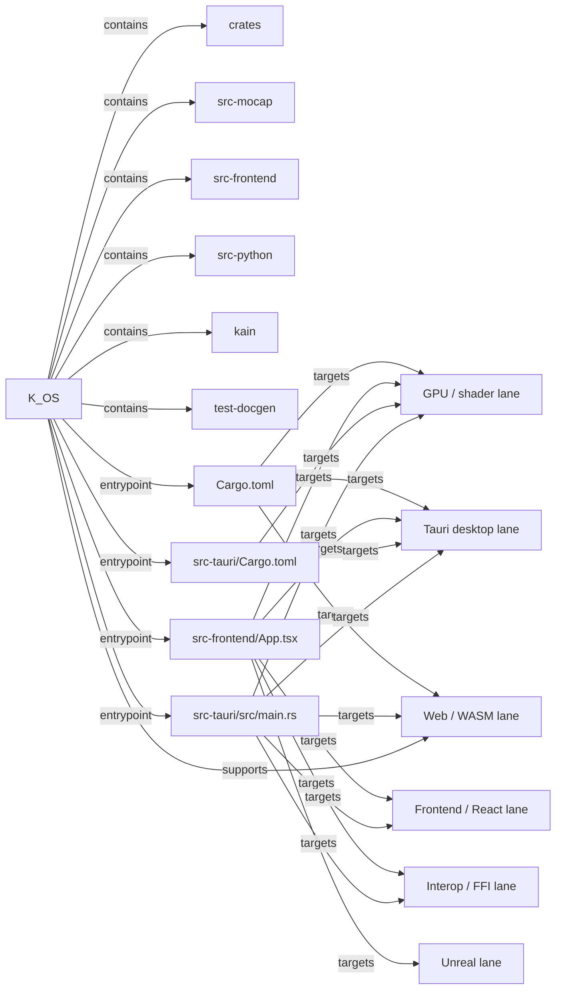

# K_OS Flow Map

- Directory: `M:\K_OS`
- Generated (UTC): `2026-04-07T04:00:08.926301+00:00`
- Languages: `JSON, Markdown, Python, Rust, TOML, TSX, TypeScript`
- Entry files: `src-frontend/App.tsx, src-tauri/src/main.rs, Cargo.toml, src-tauri/Cargo.toml`
- Manifests: `cargo, cargo, npm, cargo, npm, cargo, cargo, cargo, cargo, cargo, cargo, cargo`
- Additional manifests omitted from markdown: `41`

## Manifest Summary
- `Cargo.toml`: cargo, workspace members: 45, deps: 0
- `src-tauri/Cargo.toml`: cargo, deps: 42
- `package.json`: npm, deps: 152, scripts: 19
- `test-docgen/Cargo.toml`: cargo, deps: 3
- `public/wasm/package.json`: npm, deps: 0, scripts: 0
- `crates/k-os-animation/Cargo.toml`: cargo, deps: 1
- `crates/k-os-asset-pipeline/Cargo.toml`: cargo, deps: 12
- `crates/k-os-baking/Cargo.toml`: cargo, deps: 13
- `crates/k-os-bevy/Cargo.toml`: cargo, deps: 29
- `crates/k-os-bevy-lab/Cargo.toml`: cargo, deps: 30
- `crates/k-os-brushes/Cargo.toml`: cargo, deps: 12
- `crates/k-os-config/Cargo.toml`: cargo, deps: 11

## Edge Legend
- `entrypoint`: root directory to a main entry file or manifest.
- `supports`: root or file contributes to a lane or helper surface.
- `imports`: file-to-file or file-to-subdir reference discovered from source text.
- `targets`: file participates in a platform lane such as Tauri, Unreal, GPU, or Python.
- `emits sidecar`: file materializes a named artifact or sidecar bundle.
