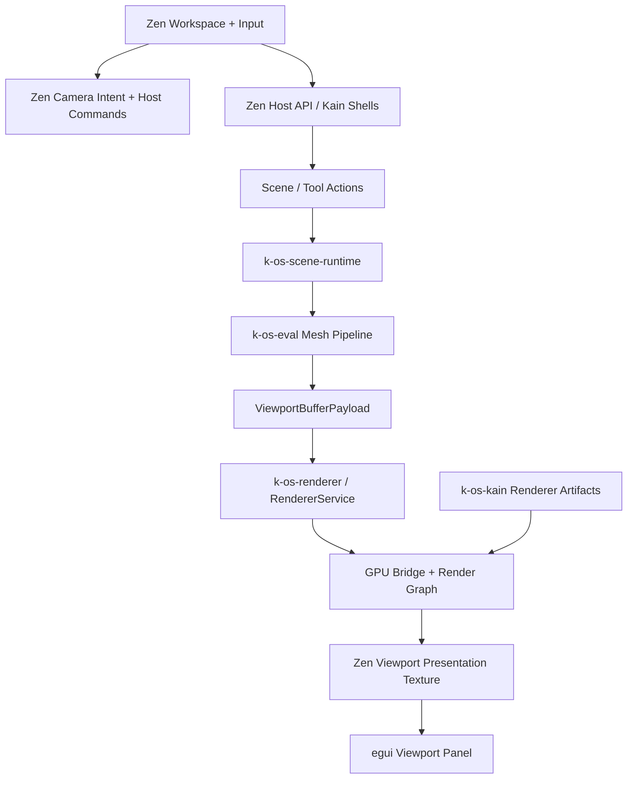

# Zen Renderer Unification

> Status: Atlas architecture note for the `Glass Foundry` swarm.
>
> Purpose: Map the current Zen native renderer ownership model, define the target crate boundaries, and pin the exact cut points required to unify Zen around the shared renderer and evaluation stack.

## Decision Summary

Zen should become the native host and presentation shell for the shared renderer pipeline. It should not remain a second renderer implementation.

The target ownership model is:

- `zen`: native window, WGPU surface, egui shell, input handling, viewport presentation, and DCC workspace orchestration
- `zen-host` and `zen-kain-modules`: data-driven host API and Kain shell/module resolution
- `k-os-scene-runtime`: canonical native scene/runtime ownership for renderer-facing mesh state
- `k-os-eval`: derivation of `ViewportBufferPayload` from scene state
- `k-os-renderer`: viewport lifecycle, mesh sync, selection, stats, GPU bridge, and render-graph execution contract
- `k-os-kain`: shader catalogs, generated artifacts, and optional renderer-domain dispatch

`crates/zen/src/main.rs` should stop owning scene-mesh build logic, per-mesh vertex/index buffer creation, scene picking, and direct scene-pass truth. Those responsibilities belong in the shared renderer path.

## Current Ownership Map

## Zen Host-Local Ownership Today

`crates/zen/src/main.rs` currently owns too much renderer truth:

- inline WGSL scene, shadow, and background shaders
- direct scene mesh generation through `ZenScene::build_render_mesh()`
- direct vertex/index buffer creation through `create_scene_buffers(...)`
- local viewport/depth/shadow target ownership
- local selection and raycast flow through `screen_ray(...)` and `scene.pick(...)`
- local mesh rebuild on selection mutations
- local camera uniform update path
- post-processing and viewport texture handoff into egui

This is visible in:

- `SCENE_SHADER_WGSL`, `SHADOW_SHADER_WGSL`, and `BACKGROUND_SHADER_WGSL` in `crates/zen/src/main.rs`
- `scene.build_render_mesh()` and `create_scene_buffers(...)`
- `rebuild_scene_buffers(...)`, `screen_ray(...)`, and selection code paths

The result is that Zen is both a host and a renderer implementation.

## Shared Renderer Ownership Already Present

`crates/k-os-renderer` already provides the reusable renderer contract Zen should be built around:

- viewport handles and config
- render-mesh handles
- camera state contract
- redraw and selection requests
- `RendererService` thread boundary
- source-driven mesh sync
- GPU upload bridge through `PipelineRendererUploadBridge`
- frame stats and render-graph execution context

`crates/k-os-eval` already provides the native mesh derivation pipeline:

- source
- edit stack
- subdivision
- normals
- viewport payload

`crates/k-os-scene-runtime` already provides a usable renderer-facing bridge:

- shared mesh registration
- global native scene ownership via `SCENE_WORLD`
- `evaluate_viewport_payload(mesh_handle)`
- GPU bridge summaries

## Zen Host Composition Is Already Good Enough

Zen is already in decent shape as a DCC host shell:

- `zen/resources/runtime.toml` is manifest-driven
- `zen/resources/host_api.toml` defines host actions and viewport/tool bindings
- `zen/resources/modules.toml` defines Kain shells
- `zen/resources/workspace_ui.toml` defines workspace presets, viewports, and editor tabs
- `zen/src/kain_ui_host.rs` already owns dock state, persisted layouts, document state, inspectors, viewport requests, hot reload, and asset import

This means the composition problem is not the main blocker anymore. Renderer ownership is.

## Target Boundary Proposal

## `zen`

Keep in `zen`:

- native window and surface creation
- egui shell and DCC workspace presentation
- input capture and camera intent generation
- viewport texture presentation into egui
- optional post-process presentation wrapper
- runtime shell/status composition

Remove from `zen` over the migration:

- scene mesh build as renderer truth
- authoritative vertex/index buffer creation for scene drawing
- authoritative selection/picking implementation
- renderer-local mesh counts and draw truth

## `zen-scene`

`zen-scene` should become an editor-facing scene facade, not the native renderer truth layer.

It may still own:

- workspace object semantics
- scene editing helpers
- selection intent and editor semantics
- scene serialization helpers

It should stop being the place that the renderer depends on for final draw buffers.

## `k-os-scene-runtime`

`k-os-scene-runtime` should be the canonical renderer-facing scene/runtime boundary for native Zen rendering.

It should own:

- shared mesh/runtime registration
- canonical scene mesh handles for renderer sync
- viewport payload evaluation entrypoints
- shared raycast/picking acceleration data when renderer-native picking is not yet complete

## `k-os-eval`

`k-os-eval` remains the derivation layer. It should not know about Zen, egui, or presentation.

Its job is:

- take canonical scene/runtime state
- derive viewport-ready payloads
- preserve deterministic dependency flow

## `k-os-renderer`

`k-os-renderer` should be the only renderer contract Zen uses for:

- viewport creation and lifecycle
- camera application
- mesh attach/sync/detach
- redraw flow
- selection requests
- stats collection
- GPU bridge orchestration
- render-graph execution contract

If Zen still needs direct WGPU objects for surface/presentation reasons, that should be a presentation seam, not a second scene-rendering truth path.

## `k-os-kain`

Kain should remain an augmentation layer until the shared path is stable.

That means:

- keep Kain artifact discovery and catalog validation
- keep optional renderer-domain dispatch
- do not make Kain the owner of basic scene draw truth during the first cutover

## Exact Cut Points

## 1. Camera Ownership

Current:

- `FlyCamera` in `zen/src/main.rs` owns camera state and directly feeds shader uniforms.

Target:

- Zen keeps input and camera controller logic.
- Zen emits `CameraState` into `k-os-renderer`.
- `k-os-renderer` becomes the render-facing owner of applied camera state.

Why:

- Zen should own intent and UX.
- The shared renderer should own render-facing camera application and downstream selection/stats coherence.

## 2. Mesh Payload Sync

Current:

- Zen builds a `SceneMesh` through `ZenScene::build_render_mesh()`.
- Zen creates GPU buffers directly with `create_scene_buffers(...)`.

Target:

- Zen resolves renderer-facing mesh handles from `k-os-scene-runtime`.
- `k-os-renderer` consumes `ViewportBufferPayload` produced by `k-os-eval`.
- Buffer creation and upload move behind `RendererService` and the GPU bridge.

Why:

- This is the core duplicate-ownership seam. It must move first.

## 3. Selection And Picking

Current:

- Zen computes a screen ray locally and calls `scene.pick(...)`.

Target:

- Zen keeps cursor-to-viewport coordinate conversion.
- Zen sends NDC or camera-space selection intent to `k-os-renderer::request_selection(...)`.
- Renderer selection becomes authoritative for viewport-facing selection hits.

Fallback seam:

- Keep CPU/shared-mesh picking as a transitional backend behind the shared renderer contract until renderer-native or unified picking is complete.

## 4. Viewport Texture Handoff

Current:

- Zen renders into a local `ViewportTarget`.
- Zen hands `viewport_target.view` to egui.

Target:

- Zen still owns the egui texture handoff.
- The scene image feeding that handoff must come from the shared renderer path, not the old local scene pass.

Why:

- This is a presentation concern and can remain in Zen.
- It does not justify preserving local scene-render ownership.

## 5. Post-Processing

Current:

- Zen owns `ZenPostProcessor` and wraps the viewport render target locally.

Target:

- Phase 1: keep post-processing in Zen as a presentation wrapper around shared renderer output if that reduces migration risk.
- Phase 2: move stable passes into renderer-owned render-graph execution only after the core viewport path is unified.

Why:

- Post is not the first ownership problem. Scene draw truth is.

## 6. Frame Stats And Runtime Status

Current:

- Zen still displays host-local counts and local runtime status derived from direct scene ownership.

Target:

- Frame and mesh stats come from `k-os-renderer`.
- Kain runtime status remains additive.
- Zen shell panels become consumers of shared runtime contracts rather than reconstructing renderer state locally.

## Target Runtime Data Flow

## Migration Sequence

## Phase 1: Introduce The Shared Zen Renderer Session

Deliverables:

- a Zen-owned adapter object that talks to `RendererService`
- a concrete `EvaluatedMeshSource` or equivalent scene-runtime bridge
- viewport creation and mesh sync routed through the shared renderer

Keep:

- Zen window/surface ownership
- egui viewport texture presentation
- temporary post-process wrapper if required

## Phase 2: Cut Selection And Stats Over

Deliverables:

- selection requests routed through the shared renderer contract
- renderer-derived stats shown in Zen runtime panels
- removal of local selection truth as the viewport authority

## Phase 3: Reduce Local Scene Pass Ownership

Deliverables:

- host-local scene-pass code isolated behind compatibility seams or removed
- `ZenScene::build_render_mesh()` no longer required as the main draw source
- local scene buffer rebuilds removed from normal viewport updates

## Phase 4: Revisit Kain Renderer Dispatch

Deliverables:

- Kain dispatch evaluated as a renderer augmentation over the shared path
- optional render-graph integration strengthened only after the base path is stable

## Hard Blockers And Migration Hazards

- `zen/src/main.rs` currently combines windowing, renderer setup, scene draw, selection, post, and UI in one file. Forge will need to split ownership carefully.
- `zen-scene` is still carrying render-facing responsibilities such as `build_render_mesh()` that should move behind scene-runtime/eval/renderer boundaries.
- egui viewport texture handoff is tightly coupled to the local `ViewportTarget`; this needs a clean replacement seam before the old path can be deleted.
- Kain dispatch is staged and disabled by default. That is correct for now, but it means Kain cannot be treated as proof that the unified renderer path is already live.
- Current post-processing assumes local viewport target ownership. It should be treated as a wrapper seam, not as justification for keeping local scene draw ownership.

## Recommended Work Split After Atlas

- `Forge`: build the shared Zen renderer session, scene-runtime bridge, and viewport cutover.
- `Vector`: formalize host contracts, registry metadata, and recommended Zen-facing entrypoints.
- `Delta`: rewire Zen host/UI/tool surfaces to consume the new shared contracts once Forge and Vector stabilize.
- `Aegis`: define the proof criteria and invariant checks needed to safely delete duplicate renderer code.

## Non-Goals For The First Cutover

- do not redesign every editor feature
- do not make Kain the mandatory owner of basic scene rendering
- do not replace egui shell ownership
- do not block the migration on perfect renderer-native post-processing
- do not keep duplicate scene-render truth paths longer than necessary

## Final Atlas Conclusion

The architecture gap is now narrow and explicit.

Zen already has enough manifest, shell, registry, and host-API structure to be the composition root for the wider crate platform. The main obstacle is that `zen` still behaves like a renderer implementation instead of a native host over the shared renderer stack.

The program should therefore proceed with a biased plan:

1. move scene draw truth into `k-os-renderer` fed by `k-os-scene-runtime` and `k-os-eval`
2. keep Zen as the native window, egui, and DCC shell
3. preserve only minimal compatibility seams for presentation and post
4. delete duplicate host-local renderer ownership once the shared path is proven
